# GoLang基础三

## 1. 数组

### 1.1 定义数组

​	数组可以存放**多个同一类型数据**，数组是**值类型**。

​	var 数组名 [数组长度]类型

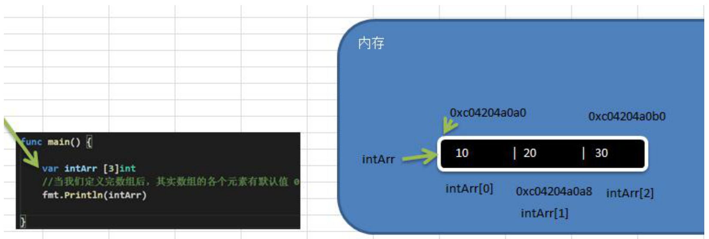

​	（1）数组的地址可以通过**数组名来获取&intArr**
​	（2）数组的**第一个元素的地址，就是数组的首地址**
​	（3）数组的各个元素的地址间隔是依据数组的类型决定（类型所占的字节数），比如int64->8 int32->4

```go
// 数组的地址是连续的，用地址取值是最快的
var intArr [3]int //int占8个字节
//当我们定义完数组后，其实数组的各个元素有默认值 0
fmt.Println(intArr)
fmt.Printf("intArr的地址=%p intArr[0] 地址%p intArr[1] 地址%p intArr[2] 地址%p\n", 
		&intArr, &intArr[0], &intArr[1], &intArr[2])
// intArr的地址=0xc0000b6000 intArr[0] 地址0xc0000b6000 intArr[1] 地址0xc0000b6008 intArr[2] 地址0xc0000b6010
```

数组初始化方式：

```go
// 1
var numArr01 [3]int = [3]int{1, 2, 3}
numArr01[0] = 10
fmt.Println("numArr01", numArr01)

// 2
var numArr02 = [3]int{1, 2, 3}
fmt.Println("numArr02", numArr02)

// 3
var numArr03 = [...]int{1, 2, 3}
fmt.Println("numArr03", numArr03)

// 4
var numArr04 = [...]int{1: 200, 2: 300, 0: 100}
fmt.Println("numArr04", numArr04) //[100 200 300]

// 5 类型推导
strArr05 := [...]string{1: "tom", 2: "jerry", 0: "jack"}
fmt.Println("strArr05", strArr05)
```

### 1.2 遍历数组

```go
func forFun() {
	heroes := [...]string{"宋江", "吴用", "卢俊义"}
	for index, value := range heroes {
		fmt.Printf("index=%v value=%v\n", index, value)
	}
}
// index=0 value=宋江
// index=1 value=吴用
// index=2 value=卢俊义
```

### 1.3 数组注意细节

​	（1）数组定义后，**长度是固定的，数据类型是相同、固定的**，不能动态变化

​	（2）数组的类型可以是任何数据类型，但是不能混用

​	（3）数组创建后，如果没有赋值，有默认值
  			 数值型 -> 0，字符串 -> ""， 布尔值 -> false

​	（4）数组定义后就开辟了内存空间，只是没赋值

​	（5）数组是**值类型**，默认情况下是值传递，因此会进行值拷贝，相当于再新建一个数组，**数组间不会相互影响**

​	（6）引用传递数组，使用指针

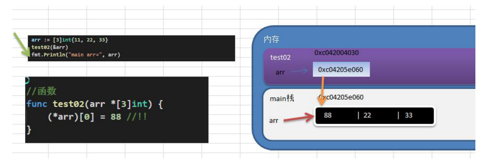

```go
func main()  {
	arr := [...]int{1, 2, 3}
	test01(&arr)
	fmt.Println("arr", arr)
  // [10 2 3]
}

func test01(arr *[3]int)  {
	(*arr)[0] = 10
  // 或者arr[0] = 10
}
```

​	（7）**长度是数组类型的一部分**，在传递数字参数时需要考虑数组的长度

### 1.4 数组和切片的区别

​	[]int 没有定义长度的是切片，[...]int或指定长度则是数组

### 1.5 二维数组

​	二维数组相当于数组中的元素再套数组

```go
func main() {
	/*
		0 0 0 0 0 0
		0 0 1 0 0 0
		0 2 0 3 0 0
		0 0 0 0 0 0
	*/
	var arr [4][6]int //4行6列
	arr[1][2] = 1
	arr[2][1] = 2
	arr[2][3] = 3
	fmt.Println(arr) // [[0 0 0 0 0 0] [0 0 1 0 0 0] [0 2 0 3 0 0] [0 0 0 0 0 0]]
	// 遍历二维数组
	for _, v := range arr {
		for _, j := range v {
			fmt.Print(j, " ")
		}
		fmt.Println()
	}
}
```

### 1.6 字符串数组

字符串数组存储格式是len+str（字符串结构体），字符串数组每个元素占16个字节，每个地址相差16个字节。

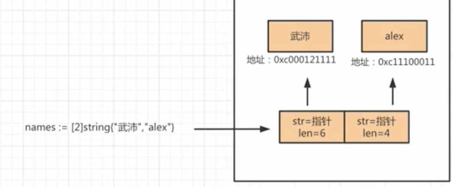

```go
names := [2]string{"tom", "cat"}
// 数组存储字符串的结构，每个元素的指针指向真正的字符串
type stringStruct struct {
	str unsafe.Pointer
	len int
}
```

### 1.7 可变和拷贝

可变：数组的元素可以被更改（**长度和类型不可修改**）

```go
name := [2]string{"tom", "cat"}
name[1] = "jerry"
```

拷贝：重新拷贝

```go
name1 := [2]string{"tom", "cat"}
name2 := name1

name1[1] = "jerry"
// name1 >> tom jerry
// name2 >> tom cat
```

## 2. 切片

### 为什么使用切片

在Go语言中几乎在所有的场景中，使用切片来代替数组

弥补数组的不足：

1.数组的容量是固定，不能自动扩展

2.值传递，数组作为函数参数时，将整个数组值拷贝一份给形参

切片的本质：不是一个数组的指针，是一种新数据结构，用来操作数组内部元素。

### 2.1 定义切片

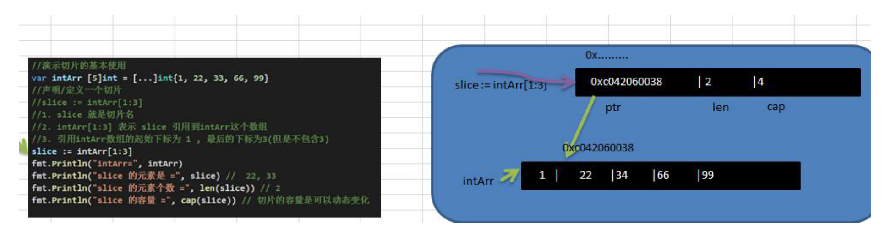

切片是**引用类型**，是一个可以动态变化的数组

```go
var 切片名 []类型
var a []int //与数组不同的是不用事先定义长度
```

**切片的容量默认是切片起始位置到底层数组的末位位置**

```go
a := [...]int{1, 2, 3, 4, 5, 6, 7, 8, 9, 10}
slice2 := a[1:3]
fmt.Println("切片的容量（可动态变化）", cap(slice2)) // 9

var intArr [5]int = [...]int{1, 2, 3, 4, 5}
slice1 := intArr[1:3]
fmt.Println("切片的容量（可动态变化）", cap(slice1)) // 4
```

**slice从底层来说，其实就是一个数据结构（struct结构体）**

```go
type slice struct{
	ptr *[2]int // 数据存储的地址
	len int // 存储数据个数
  cap int // 容量
}
```

**切片修改后，其引用的数组对应的值也会修改**

```go
var intArr [5]int = [...]int{1, 22, 33, 66, 99}
slice[1] = 34
fmt.Println("intArr=", intArr)
fmt.Println("slice 的元素是 =", slice) //  22, 33
// intArr= [1 22 34 66 99]
// slice 的元素是 = [22 34]
```

### 2.2 切片的创建方式

（1）切片去引用已经创建好的数组

```go
var intArr [5]int = [...]int{1, 2, 3, 4, 5}
var slice1 []int
slice1 = intArr[1:3] // [2 3]
```

（2）通过make来创建

	- 通过make方式创建切片可以指定切片的大小和容量
	- 如果没有给切片的各个元素赋值，默认值是0、""、false
	- 通过make方式创建的切片对应的数组是由make底层维护，对外不可见，只能通过slice去访问各个元素
	- make创建切片时也会创建一个数组，切片指向创建的数组
	- 不指定容量时，容量默认等于长度

```go
var 切片名 []make(type, len, [cap]) // 数据类型 长度 容量
//cap如果写了则必须大于等于len
// 示例
var slice []float64 = make([]float64, 5, 10)
slice[1] = 10
slice[2] = 20
fmt.Println("切片的容量", cap(slice)) // 10
fmt.Println("切片的长度", len(slice)) // 5

s3 := make([]int, 5)
fmt.Println(len(s3)) // 5
fmt.Println(cap(s3)) // 5
```

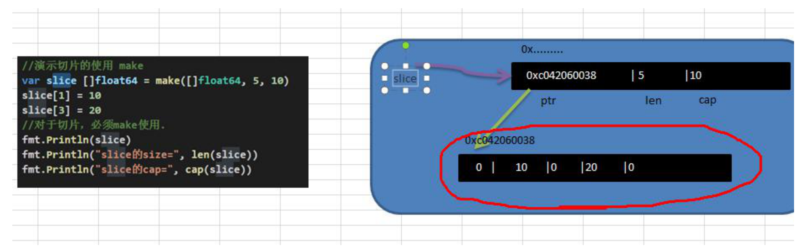

（3）直接定义，自动推导

```go
slice := []string{"tom", "jack", "jerry"}
fmt.Println("切片的容量", cap(slice)) // 3
fmt.Println("切片的长度", len(slice)) // 3
```

### 2.3 切片的遍历

```go
func main() {
	arr := [...]int{10, 20, 30, 40, 50}
	slice := arr[1:4]
  // 1
	for i := 0; i < len(slice); i++ {
		fmt.Printf("slice[%v]=%v\n", i, slice[i])
	}
	// 2
	for i, v := range slice{
		fmt.Printf("slice[%v]=%v\n", i, v)
	}
}
```

### 2.4 切片注意细节

（1）切片定义完后，要**引用一个数组**或者**make一个空间**后才能使用

（2）切片还可以继续切片，切片后的切片容量跟随底层数组

```go
slice1 := []int{1,2,3,4,5}
slice2 := slice1[1:2]
// 修改切片的值 会修改到底层的数组 指向的数据空间是同一块
```

（3）当切片的值发生改变时，与其关联的数组和切片的值也发生变化

### 2.5 append

append操作如果超过了容量就会扩容，重新拷贝一个新数组，没有超过容量在原来的数组上修改

```go
// append
slice := []int{100, 200, 300}
fmt.Printf("地址%p\n", &slice) // 0xc0000a6020
fmt.Printf("地址slice[0]%p\n", &slice[0]) // 0xc0000b8000
slice = append(slice, 400, 500)
fmt.Printf("地址%p\n", &slice) // 0xc0000a6020
fmt.Printf("slice[0]%p\n", &slice[0]) // 0xc0000ac030

// 切片追加切片
slice = append(slice, slice...)
```

### 2.6 copy

拷贝的数据空间是独立的，互不影响

```go
// 切片类型才能copy
slice := []int{1, 2, 3, 4, 5}
var sliceBak = make([]int, 10)
fmt.Println(slice)
copy(sliceBak, slice)
fmt.Println("拷贝的数组sliceBak", sliceBak) //[1 2 3 4 5 0 0 0 0 0]

data := [...]int{0,1,2,3,4,5,6,7,8,9}
s1 := data[8:]
s2 := data[:5]
copy(s2, s1)
s3 := make([]int, 1)
fmt.Println(s2) // [8 9 2 3 4]
copy(s3, s2)
fmt.Println(s3) // [8] 
```

### 2.7 string和slice

（1）string底层是一个byte数组，因此string也可以进行切片处理

（2）string是不可变的，不能通过索引下标进行修改

```go
str := "hello world"
str[0] = "z" //报错
```

（3）修改字符串，先将字符串**转换成切片**，修改完成后再抓换成字符串

```go
arr := []byte(str) // 转换成byte切片
arr[0] = 'z'
str = string(arr)
// 修改中文字符串 一个汉字占三个字节
arr := []rune(str)
arr[0] = '北'
str = string(arr)
```

### 2.8 自定扩容

```go
v1 := make([]int, 1, 3)
v2 = append(v1, 66)
fmt.Println(v1) // [0]
fmt.Println(v2) // [0 66]
// v1和v2引用的地址都是同一个
```

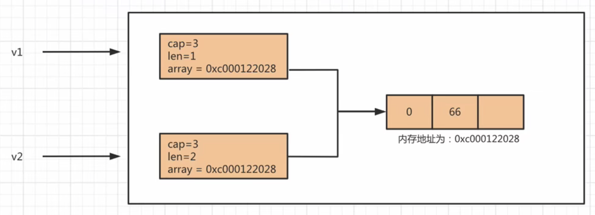

```go
v1 := []int{11, 22, 33}
v2 = append(v1, 44) // 扩容内存地址发生变化
```

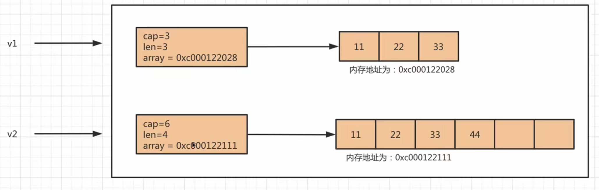

扩容规则：

https://blog.csdn.net/weixin_37509194/article/details/112001014

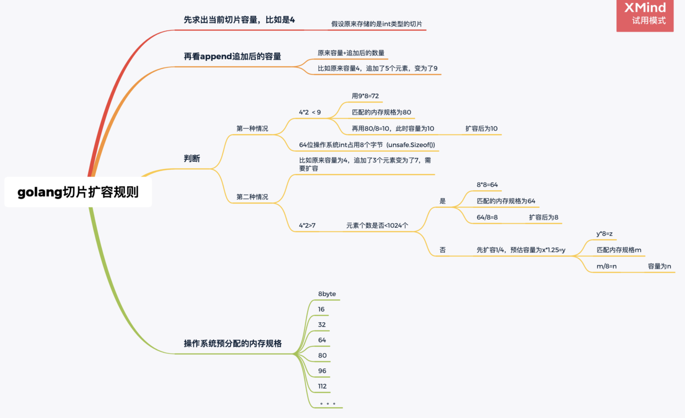

切片扩容规则和你追加的元素个数有关
切片扩容和你匹配的操作系统分配的内存规格有关（32 48 64） 间隔16
和你定义的切片类型有关

```go
package main

import (
	"fmt"
)
func main() {
	arr1 := [4]int{1,2,3,4}
	//此时slice1为[1,2,3] 长度为3，容量为4
	slice1 :=arr1[:3]
	fmt.Println(slice1,len(slice1),cap(slice1))
	slice1 = append(slice1,5000,6000)
	fmt.Println(slice1,len(slice1),cap(slice1))
}
// 此时容量由原来的4扩容到了8
// 原来的容量为4，追加了5000,6000后变为了6个，此时
// 4*2>6,满足了脑图中的第二种情况，并且元素个数小于1024，先扩容2倍
// 由于64位操作系统下，一个int类型占8个字节，所以8*8=64
// 此时匹配操作系统预先分配好的内存规格，规则正好匹配了64，所以用64/8=8，所以扩容后的容量为8
```

## 3. 排序和查找

### 3.1 交换排序

​	交换排序分为：冒泡排序、快速排序

#### 3.1.1 冒泡排序

当前面的一个数比后面的一个数大的时候，就进行了交换。一共会经过len-1次的轮数比较，每一轮确定一个数的位置。

```go
func main() {
	// 定义数组
	arr := [...]int{24, 69, 80, 57, 13}
	BubbleSort(&arr)
}

// 冒泡排序
func BubbleSort(arr *[5]int) {
	// 传来的arr是指针 *arr取值
	fmt.Println("排序前arr=", *arr) //[24 69 80 57 13]
	// 判断len-1轮
	for i := 0; i < len(*arr)-1; i++ {
		for j := 0; j < len(*arr)-i-1; j++ {
			if (*arr)[j] > (*arr)[j+1] {
				(*arr)[j], (*arr)[j+1] = (*arr)[j+1], (*arr)[j]
			}
		}
	}
	fmt.Println("排序后arr=", *arr) //[13 24 57 69 80]
}
```

### 3.2 二分查找

arr是有序数组并且是从小到大**有序的**

```go
func main() {
	//请对一个有序数组进行二分查找{1，8， 10， 89， 1000， 1234}，输入一个数看看该数组是否存
	//在此数，并且求出下标，如果没有就提示"没有这个数"。【 会使用到递归】
	arr := [...]int{1, 8, 10, 89, 1000, 1234}
	num := 0
	fmt.Println("请输出数字")
	fmt.Scanln(&num)
	BinarySearch(&arr, 0, len(arr)-1,num)
}

// 二分查找
func BinarySearch(arr *[6]int, leftIndex int, rightIndex int, findValue int) {
	middleIndex := (leftIndex + rightIndex) / 2
	if leftIndex > rightIndex {
		fmt.Println("没找到")
		return
	}
	// 左边查找
	if (*arr)[middleIndex] > findValue {
		BinarySearch(arr, leftIndex, middleIndex-1, findValue)
	// 右边查找
	}else if (*arr)[middleIndex] < findValue {
		BinarySearch(arr, middleIndex+1, rightIndex, findValue)
	}else {
		// (*arr)[middleIndex] == findValue
		fmt.Println("找到了, 下标为", middleIndex)
		return
	}
}
```

## 4. map

特点：

1.查找速度非常快，因为底层是基于哈希表存储的。

- 以**取模+拉链法**实现哈希表存储原理。
- **根据key可以直接**快速找到数据存放的位置。计算key的hash值可以直接定位到数据的位置，再次的话再去链表中查找。
- 如果取模后索引与已有数据相等，则在他后面通过链表在添加一个位置存放数据。（也就是拉链法）

2.**key必须可哈希**，是不可变类型。int、bool、float、string、array等。

- 如果键是数组嵌套切片或者map，也是不允许的，会报错，键必须是可hash的

### 1. 定义

- map是key-value数据结构，又称字段或者关联数组。
- key的类型：bool、数字、string、指针、channel、结构、结构体、数组，**不能是slice、map和function**
- value的类型：与key基本一样，可以是map
- **map使用前要make内存空间**
- **map的key不能重复**，类似字典
- value可以相同
- key-value是**无序的**

```go
var a map[string]string // var只是声明 而没有创建初始化空间 需要make才能初始化
a = make(map[string]string, 10)  // make进行初始化开辟空间
a["no1"] = "宋江"
a["no2"] = "吴用"
fmt.Println(a)
// map[no1:宋江 no2:吴用]
```

```go
// 使用new声明map类型 也需要make进行初始化创建
	value := new(map[string]string)
	data := make(map[string]string)
	value = &data
```

### 2. 使用方式

```go
// 1.声明 就直接make
cities := make(map[string]string)
cities["no1"] = "北京"
cities["no2"] = "天津"
cities["no3"] = "上海"
// 2.声明时 直接赋值
heroes := map[string]string{
		"hero1": "宋江",
		"hero2": "吴用", // 注意逗号
}
```

### 3. 使用案例

```go
// map[stu01:map[age:男 name:tom] stu02:map[age:女 name:mary]]
func mapExec()  {
	studentMap := make(map[string]map[string]string)
	// 注意map要make
	studentMap["stu01"] = make(map[string]string, 2)
	studentMap["stu01"]["name"] = "tom"
	studentMap["stu01"]["age"] = "男"

	studentMap["stu02"] = make(map[string]string, 2)
	studentMap["stu02"]["name"] = "mary"
	studentMap["stu02"]["age"] = "女"
	fmt.Println(studentMap)
}
```

### 4. map的增删改查

```go
// /Users/yutang/Documents/go_test_project/src/gocode/project_07/map_demo/mapCrud.go
// 添加 修改
func createMap()  {
	cities := make(map[string]string)
	cities["no1"] = "北京"
	cities["no2"] = "天津"
	cities["no3"] = "上海"
	fmt.Println(cities) // map[no1:北京 no2:天津 no3:上海]
	cities["no3"] = "深圳"
	fmt.Println(cities) // map[no1:北京 no2:天津 no3:深圳]
}

// 删除
func deleteMap()  {
  cities := map[string]string{
		"no1": "北京",
		"no2": "天津",
		"no3": "上海",
	}
	// 删除不存在的key 也不会报错
	delete(cities, "no1")
	delete(cities, "no1")
	fmt.Println(cities)
	// map没有一次性删除key的方法
	// 1.可以遍历删除
	// 2.重新make一个新map
	cities = make(map[string]string)
}

// 查询
func mapRetrieve()  {
  cities := map[string]string{
		"no1": "北京",
		"no2": "天津",
		"no3": "上海",
	}
  // findRet是查询结果，返回值为true false
	val, findRet := cities["no1"]
	if findRet {
		fmt.Println("cities[\"no1\"]", val)
	}else {
		fmt.Println("没有找到")
	}
}
```

### 5. 遍历

```go
for k, v := range cities {
		fmt.Printf("key=%v, value=%v\n", k, v)
}
// 只能用for range 因为map的key不一定是数字且不一定连续
```

### 6. 长度

```go
len(cities)
```

### 7. map切片

```go
// 要求：使用一个map来记录monster的信息name 和age，
// 也就是说一个monster 对应一个map，并且妖怪的个数可以动态的增加=> map切片
func main() {
	// make切片
	monsters := make([]map[string]string, 2)
	// make map
	if monsters[0] == nil {
		monsters[0] = make(map[string]string, 2)
		monsters[0]["name"] = "牛魔王"
		monsters[0]["age"] = "500"
	}
	if monsters[1] == nil {
		monsters[1] = make(map[string]string, 2)
		monsters[1]["name"] = "红孩儿"
		monsters[1]["age"] = "100"
	}
	// 动态增加切片
	newMonster := map[string]string{
		"name": "火云邪神",
		"age":  "200",
	}
	monsters = append(monsters, newMonster)

	fmt.Println(monsters)
}
```

### 8. 排序

​	最新的golang中map的默认是按照key从小到大排序的

### 9. map的注意细节

（1）map是引用类型

```go
func main()  {
	map1 := make(map[int]int)
	map1[1] = 90
	map1[2] = 88
	map1[10] = 1
	map1[20] = 2
	modifyMap(map1)
	fmt.Println(map1) // map[1:90 2:88 10:900 20:2]
}

func modifyMap(map1 map[int]int)  {
	map1[10] = 900
}
```

（2）map的容量达到后，会自动扩容，不会报错，**切片则需要append**

- 无论是否扩容都指向同一个地址，切片扩容后，地址会发生变化

```go
map1 := make(map[int]int, 1)
map1[1] = 90
map1[2] = 88
map1[10] = 1
```

（3）map的value经常会使用到struct结构体

```go
// 定义结构体
type Stu struct {
	Name    string
	Age     int
	Address string
}

func main() {
	// map的value为结构体
	students := make(map[string]Stu, 10)
	stu1 := Stu{Name: "tom", Age: 18, Address: "北京"}
	stu2 := Stu{"mary", 20, "上海"}
	students["no1"] = stu1
	students["no2"] = stu2
	fmt.Println(students) // map[no1:{tom 18 北京} no2:{mary 20 上海}]
	for k, v := range students{
		fmt.Println(k, v.Name, v.Age, v.Address)
	}
}

// no1 tom 18 北京
// no2 mary 20 上海
```

### 10. map底层原理

b站：https://www.bilibili.com/video/BV1u5411W79w?p=65&spm_id_from=pageDriver

其核心是有**hmap**和**bmap**两个结构体实现。

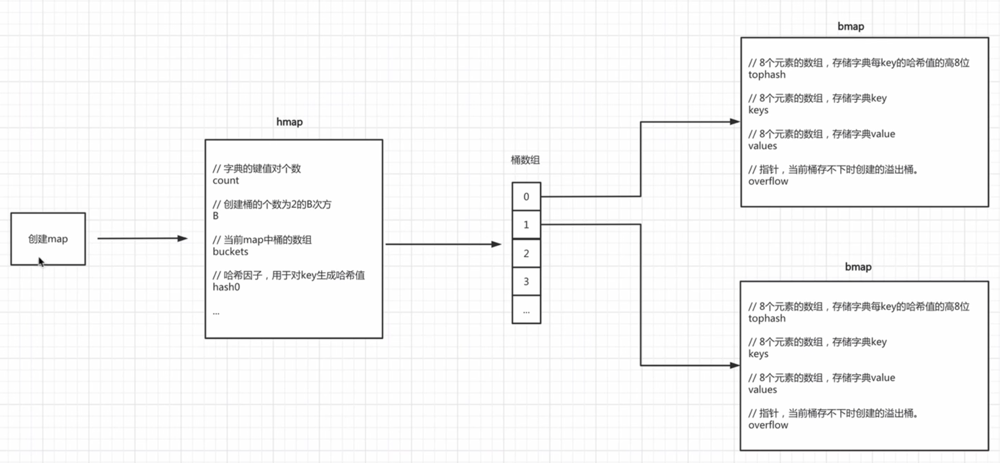

bmap是真正存储键值对的地方。每个bmap可以**存储8个键值对**。

hmap负责记录**键值对个数**和**bmap个数**等信息。

buckets bmap数组

B创建多少个bmap桶，2**B

#### 10.1 初始化

```go
// 初始化一个可容纳10个元素的map
info = make(map[string]string, 10)
```

- 第一步：创建一个hmap结构体对象
- 第二步：生成一个哈希因子hash0并赋值到hmap对象中（用于后续为key创建哈希值）
- 第三步：根据hint=10，并根据算法规则来创建B，当前B应该为1，也就是会创建2个bmap桶。

- 第四步：根据B去创建桶（bmap对象）并存放在buckets数组中，当前bmap的数量应为2。

  ​	当B<4时，根据B创建桶的个数的规则为：`2**B`（标准桶）

  ​	当B>=4时，根据B创建桶的个数的规则为：`2**B + 2**(B-4)`（标准桶+溢出桶）

  ​	注意：每个bmap中可以存储8个键值对，当不够存储时需要使用溢出桶，并将当前bmap桶中的overflow字段指向溢出桶的位置。

#### 10.2 写入数据

```go
info["name"] = "ty"
```

在map中写入数据时，内部的执行流程为：

- 第一步：结合哈希因子和键 name 生成哈希值 `011011100011111110111011011`
- 第二步：获取哈希值的后B位，并根据后B位的值来决定将此键值对存放到哪个桶中（bmap）。
- 第三步：在上一步确定桶之后，接下来就是在桶中写入数据。

```go
获取哈希值的tophash（即：哈希值的`高8位`），将tophash、key、value分别写入到桶中的三个数组中。
如果桶已满，则通过overflow找到溢出桶，并在溢出桶中继续写入。
注意：以后再桶中查找数据时，会基于tophash来找（tophash相同则再去比较key）
```

- 第四步：hmap的个数count++

#### 10.3 读取数据

```go
value := info["name"]
```

在map中读取数据时，内部的执行流程为：

- 第一步：结合哈希因子和键 name 生成哈希值。
- 第二步：获取哈希值的后B位，并根据后B位的值来决定将去哪个桶读取。
- 第三步：确定桶之后，在根据key的哈希值计算出tophash（高8位），根据tophash和key去桶中tophash数组和key、value数组中查找数据。

```go
当前桶如果没有找到，则根据overflow再去溢出桶中找，均未找到则表示key不存在。
```

#### 10.4 扩容

在向map中添加数据时，当达到某个条件，则会引发字典扩容。

扩容条件：

- map中数据总个数 / 桶个数 > 6.5，引发翻倍扩容。

- 使用太多了溢出桶（溢出桶使用的太多会导致map处理速度降低）。

  ​	B <= 15，已使用的溢出桶个数 >= `2**B`时，引发等量扩容。（等量扩容桶的个数不变，只是重新整理数据）

  ​	B > 15，已使用的溢出桶个数 >= `2**15`时，引发等量扩容。

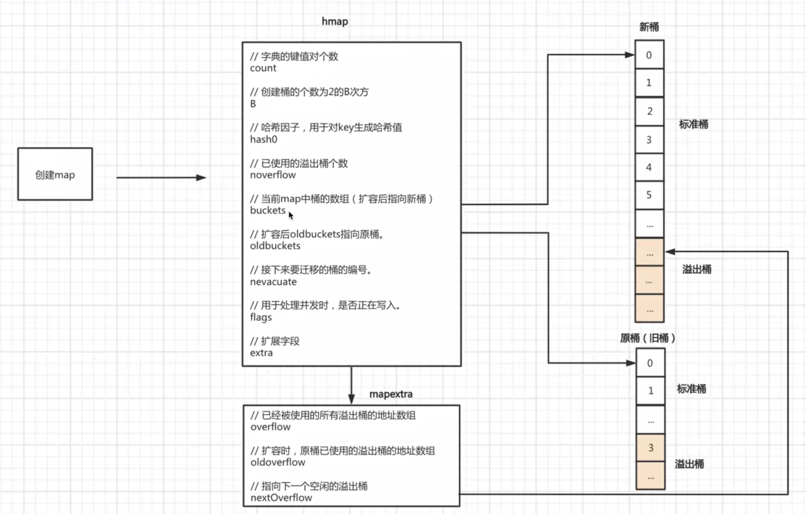

#### 10.5 迁移

扩容之后，必然要伴随着数据的迁移，即：将旧桶中的数据要迁移到新桶中。

**翻倍扩容**

如果是翻倍扩容，那么迁移规则就是将旧桶中的数据分流至新的两个桶中（比例不定），并且桶编号的位置为：同编号位置和翻倍后对应编号位置。翻倍扩容后，B会加1。

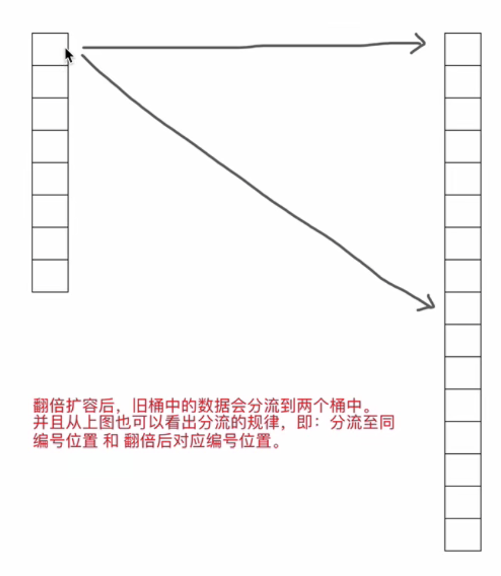

首先，我们要知道如果翻倍扩容（数据总个数 / 桶个数 > 6.5），则新桶个数是旧桶的2倍，即：map中的B的值要+1（因为桶的个数等`2**B`，而翻倍之后的新桶的个数就是`2**B * 2`）

迁移时会遍历某个旧桶中所有的key（包括溢出桶），并根据key重新生成哈希值，根据哈希值的**低B位**来决定将此键值对分流到哪个新桶中。

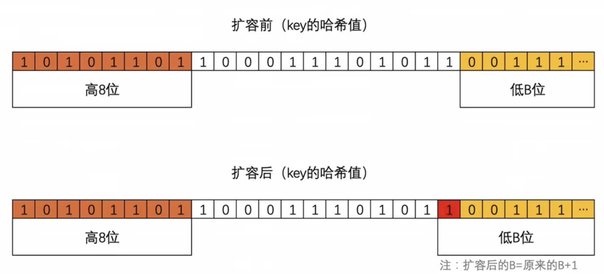

扩容后，B的值在原来的基础上已加1，也就意味着通过多1位来计算此键值对要分流到新桶的位置，如上图：

- 当新增的位（红色）的值为0，则数据会迁移到与旧桶编号一致的位置。
- 当新增的位（红色）的值为1，则数据会迁移到翻倍后对应编号位置。

```go
同一个桶中key的哈希值的低8位一定是相同的。
```

**等量扩容**

如果是等量扩容（溢出桶太多引发的扩容），不会创建新桶，就是将旧桶（含溢出桶）中的值迁移到新桶中。是为了将溢出桶的数据迁移到标准桶中，比如删除较多标准桶的数据后，标准桶存在空余键值对。

这种扩容和迁移的意义在于：当溢出桶比较多而每个桶中的数据又不多时，可以通过等量扩容和迁移让数据更加紧凑，从而减少溢出桶。

## 5. 结构体

### 1. 定义

- 结构体也就是对象。
- golang不是纯粹的面向对象语言，所以我们说golang支持面向对象编程（oop）特性。
- struct类似class的概念。
- golang仍有**继承、封装、多态**的特性。
- golang中**面向接口编程**是非常重要的特性。
- 耦合度非常低。
- 结构体是**值类型**。是一种数据类型，等价于 int byte bool string
- **结构体传参是值拷贝传递，但几乎不用，内存消耗大，效率低**

### 2. 使用

```go
type Person1 struct {
		Name    string
		Age     int
	}

func main() {	
	// 方式1
	var person Person1
	person.Name = "ty"
	person.Age = 20
  fmt.Println("方式1", person) //{"ty" 20}
	// 方式2 必须初始化完整
	p2 := Person1{"ty", 20}
	fmt.Println("方式2", p2)

	// 方式3 p3是一个指针
	//p3 := new(Person)
	var p3 *Person1 = new(Person1)
	(*p3).Name = "smith" // 可以这样写 p3.Name = "smith"  Go底层做了转换 
	p3.Age = 30
	fmt.Println("方式3", *p3)

  // 方式4 返回结构体的指针类型
	var p4 *Person1 = &Person1{}
	p4.Name = "smith"
	p4.Age = 30
	fmt.Println("方式4", *p4)
  
  // 方式5 返回结构体的指针类型
  var p5 = &Person1{"ty", 19}
  p6 := &Person1{"ty", 19}
}
```

（1）结构体是自定义的**数据类型**

（2）结构体变量是具体的，代表一个具体变量

（3）结构体是**值类型**

（4）结构体的字段可以是基本数据类型、数组、也可以是引用类型

```go
// 定义一个cat结构体 大写表示其他包也可以用
type Cat struct {
	Name  string
	Age   int
	Color string
	Hobby string
  Score [3]int // 数组
}

func main() {
	var cat1 Cat
	cat1.Name = "小白"
	cat1.Age = 3
	cat1.Color = "白色"
	cat1.Hobby = "fish"
	fmt.Println(cat1) // {小白 3 白色 fish}
}
```

（5）结构体的**字段是指针、slice、map**的零值是nil，指针是**new**，使用时要**make**，分配内存空间 

```go
type Person struct {
	Name string
	Age int
	Score [5]float64
	ptr *int
	slice []int
	map1 map[string]string
}

func main()  {
	// 定义结构体变量
	var p1 Person
	fmt.Println(p1)
	
	// 切片 使用时要make
	p1.slice = make([]int, 10)
	p1.slice[0] = 100
	
  // map 使用时要make
	p1.map1 = make(map[string]string, 2)
	p1.map1["key"] = "tom"
	fmt.Println(p1)
}
```

（6）不同结构体的变量的字段是独立的，互不影响，一个结构体变量字段的更改不影响另外一个。

```go
// 默认情况下是值拷贝 
p2 := p1
fmt.Printf("p1%p\n", &p1) // p10xc0000b8000
fmt.Printf("p2%p\n", &p2) // p20xc0000b8150
```

### 3. 结构体内存分布

```go
func main() {
	var p1 Person
	p1.Age = 10
	p1.Name = "小明"
	var p2 *Person = &p1 //这里是关键-->画出示意图

	fmt.Println((*p2).Age)
	fmt.Println(p2.Age)
	p2.Name = "tom~"
	fmt.Printf("p2.Name=%v p1.Name=%v \n", p2.Name, p1.Name)    // tom~ tom~
	fmt.Printf("p2.Name=%v p1.Name=%v \n", (*p2).Name, p1.Name) // tom~ tom~

	fmt.Printf("p1的地址%p\n", &p1)
	fmt.Printf("p2的地址%p p2的值%p\n", &p2, p2)
	// p1的地址0xc00000c060
 // p2的地址0xc00000e028 p2的值0xc00000c060
}
```

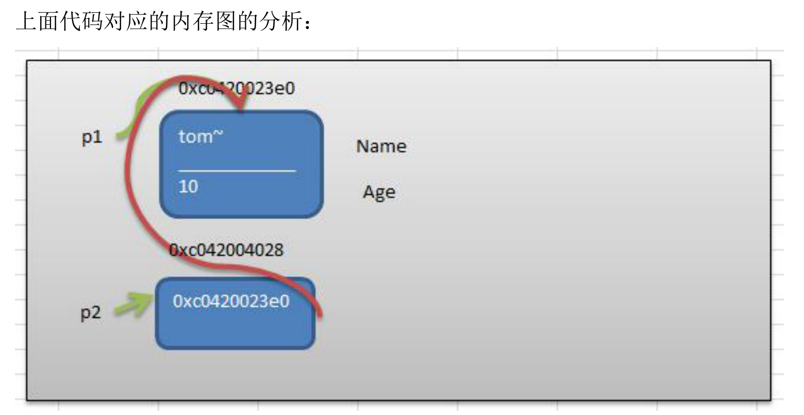

p2存的值为p1的地址并指向p1，p2本身也有地址

### 4. 注意细节

（1）结构体所有字段在**内存中是连续的**

结构体的地址与结构体首个元素地址相等

```go
//结构体
type Point struct {
	x int
	y int
}

//结构体
type Rect struct {
	leftUp, rightDown Point
}

//结构体
type Rect2 struct {
	leftUp, rightDown *Point
}

func main() {
	r1 := Rect{Point{1,2}, Point{3,4}} 
	//r1有四个int, 在内存中是连续分布
	fmt.Printf("r1.leftUp.x 地址=%p r1.leftUp.y 地址=%p r1.rightDown.x 地址=%p r1.rightDown.y 地址=%p \n", 
	&r1.leftUp.x, &r1.leftUp.y, &r1.rightDown.x, &r1.rightDown.y)
	// 0xc0000140e0 0xc0000140e8 0xc0000140f0 0xc0000140f8
  
	//r2有两个 *Point类型，这个两个*Point类型的本身地址也是连续的，
	//但是他们指向的地址不一定是连续
	r2 := Rect2{&Point{10,20}, &Point{30,40}} 

	//打印地址
	fmt.Printf("r2.leftUp 本身地址=%p r2.rightDown 本身地址=%p \n", 
		&r2.leftUp, &r2.rightDown)
	// r2.leftUp 本身地址=0xc000010200 r2.rightDown 本身地址=0xc000010208 
  
	//他们指向的地址不一定是连续...， 这个要看系统在运行时是如何分配
	fmt.Printf("r2.leftUp 指向地址=%p r2.rightDown 指向地址=%p \n", 
		r2.leftUp, r2.rightDown)
  // r2.leftUp 指向地址=0xc000016090 r2.rightDown 指向地址=0xc0000160a0 
}
```

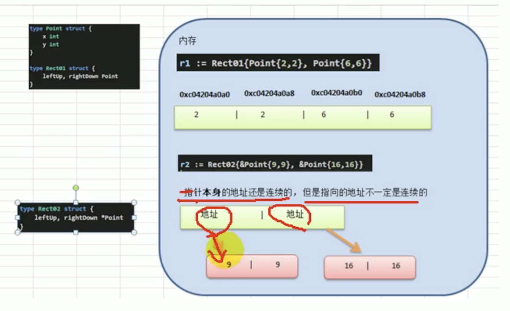

（2）结构体是用户单独定义的类型，和其他类型进行转换时需要有**完全相同的字段**

```go
type A struct {
	Num int
}

type B struct {
	Num int
}
// 字段名 字段个数 字段类型都要相同
func main() {
	var a A
	var b B
	a = A(b) //需要强转，只要type了就是新的数据类型
	fmt.Println(a, b)
}
```

（3）struct的每个字段上，可以写一个tag，该tag可以通过**反射机制**获取，常见的使用场景就是**序列化和反序列化**

```go
import "encoding/json"
type Monster1 struct {
  // 可以使名字变成小写 {"name":"牛魔王","age":500,"skill":"芭蕉扇"}
	Name  string `json:"name"`
	Age   int    `json:"age"`
	Skill string `json:"skill"`
}

func structTag() {
	monster := Monster1{"牛魔王", 500, "芭蕉扇"}
	// 序列化monster 称为json字符串 jsonStr为byte数组
	jsonStr, err := json.Marshal(monster)
	if err != nil {
		fmt.Println("json处理错误")
	}
	fmt.Println("json字符串", string(jsonStr)) 
  fmt.Printf("%T", jsonStr)
  // json序列化后 jsonStr {"name":"牛魔王","age":500,"skill":"芭蕉扇~"}
  // 未定义 `json:"name"`时 json字符串 {"Name":"牛魔王","Age":500,"Skill":"芭蕉扇"}
  fmt.Println("monster", monster)
  // monster {牛魔王 500 芭蕉扇~}
}
```

## 6. 方法

### 1. 方法的声明

```go
func (receiver type) methodName(参数列表) （返回列表）{
  方法体
  return 返回值
}
// 示例
func (mu MethodUtils) area(len float64, width float64) (float64) {
	return len * width
}
```

（1）参数列表：表示方法输入

（2）recevier type：表示这个方法和type这个类型进行绑定，或者说该方法作用于type类型

（3）receiver type：type可以是结构体，也可以其它的自定义类型

（4）receiver：就是type类型的一个变量（实例），比如：Person结构体的一个变量（实例）

（5）返回值列表：表示返回的值，可以多个

（6）方法主体：表示为了实现某一功能代码块

（7）retur语句不是必须的

###2. 基本介绍

方法是指作用在**指定数据类型**上的，因此**自定义类型都可以有方法**，而不仅仅是struct。方法是绑定在数据类型上的。

```go
type Person struct {
	name string
}
// 给Person类型绑定一个方法
func (p Person) test()  {
	fmt.Println("test() ", p.name)
}

func main() {
	var p Person
	p.name = "ty"
	p.test() // test()  ty
}
```

注：
（1）test方法和Person类型绑定，**表示结构体Person有一个方法名为test**
（2）test()方法**只能通过Person类型的变量来调用**，不能直接调用，也不能使用其他类型来调用
（3）传参是**值拷贝**，是不会修改外面的值的，定义方法是地址则会修改到

```go
func (person Person) test() {
	person.Name = "jack"
	fmt.Println("test() name=", person.Name) // 输出jack
}

// 会修改到外面
func (person *Person) test1() {
	person.Name = "tangyu"
	fmt.Println("test() name=", person.Name) // 输出tangyu
}

func main() {
	var p Person
	p.Name = "tom"
	p.test() //调用方法
  // p.test1() // p.Name 为tangyu
	fmt.Println("main() p.Name=", p.Name) //输出 tom
}
```

（4）在通过一个变量去调用方法时，其调用机制和函数一样
（5）不一样的地方是，变量调用方法时，该变量本身也会作为一个参数传递到方法中（如果**变量是值类型，结构体是值类型，则进行值拷贝；如果是引用类型，则进行地址拷贝**）

```go
func (c Circle) area() float64 {
	c.radius = 18
	return 3.14 * c.radius * c.radius
}

//为了提高效率，通常我们方法和结构体的指针类型绑定
func (c *Circle) area2() float64 {
	//因为 c是指针，因此我们标准的访问其字段的方式是 (*c).radius
	//return 3.14 * (*c).radius * (*c).radius
	// (*c).radius 等价  c.radius 
	fmt.Printf("c 是  *Circle 指向的地址=%p", c)
	c.radius = 10
	return 3.14 * c.radius * c.radius
}
```

###3. 使用

```go
// speak方法
func (person Person) speak() {
	fmt.Println(person.name, "是个好人")
}

// 运算方法
func (person Person) sum() {
	res := 0
	for i := 1; i < 1000; i++{
		res +=1
	}
	fmt.Println(person.name, "计算结果是", res)
}

// 接收参数
func (person Person) sum2(n int) {
	res := 0
	for i := 1; i < n; i++{
		res +=1
	}
	fmt.Println(person.name, "计算结果是", res)
}

// 有返回值
func (person Person) getSum(n1, n2 int) int {
	return n1 + n2
}

func main() {
	var p Person
	p.name = "ty"
	p.test()
	p.speak()
	p.sum()
	p.sum2(10)
	res := p.getSum(10, 20)
	fmt.Println("getSum", res)
}
```

###4. 注意细节

（1）如果要在方法中修改变量的值，可以通过结构体指针的方式来处理

（2）**为了提高效率，通常将方法和结构体的指针进行绑定**

```go
func main() {
	// 创建结构体变量
	var c Circle
	c.radius = 4.0
	//res2 := (&c).area2()
	//编译器底层做了优化  (&c).area2() 等价 c.area()
	//因为编译器会自动的给加上 &c
	res2 := c.area2()
	fmt.Println("面积是=", res)
}

type Circle struct {
	radius float64
}

func (c *Circle) area2() float64 {
	// 标准的取值是 (*c).radius
	return 3.14 * c.radius * c.radius
}
```

（3）**自定义的数据类型也有方法**，而不仅仅是struct，int、float32也有方法

```go
type integer int

func (i integer) print() {
	println("这是自定义方法", i)
}

func main()  {
	var i integer = 10
	i.print()
}
```

（4）方法的访问范围控制的规则，和函数一样。方法名首字母小写，只能在本包访问，方法首字母大写，可以在本包和其它包访问。

（5）如果一个类型实现了String()这个方法，那么fmt. Println默认会调用这个变量的String（）进行输出

```go
type student struct {
	name string
	age int
}

func (stu *student) String() string {
	str := fmt.Sprintf("name=[%v] age=[%v]", stu.name, stu.age)
	return str
}

func main()  {
	stu := student{
		name : "ty",
		age : 18,
	}
  // 如果实现了*student类型的 String方法 fmt.Println就会自动调用String方法
	fmt.Println(&stu) //name=[ty] age=[18]
}
```

### 4. 方法和函数的区别

（1）调用方式不一样
	函数的调用方式： 函数名（实参列表）
	方法的调用方式： 变量.方法名（实参列表）

（2）对于普通函数，接收者为值类型时，不能将指针类型的数据直接传递，反之亦然

```go
type Person struct {
	Name string
} 

//函数
func test01(p Person) {
	fmt.Println(p.Name)
}

func test02(p *Person) {
	fmt.Println(p.Name)
}

func main() {
	p := Person{"tom"}
	test01(p)
	test02(&p)
}
```

（3）对于方法（如struct的方法），接受者为值类型时，可以直接用指针类型的变量调用方法，反过来同样也可以

```go
func main() {
	p := person{"jack"}
	p.test01()
  // 虽然传的是地址 本质上是值拷贝
  (&p).test01()
  
  // 本质上是地址拷贝
  p.test02()
  (&p).test02()
}

type person struct {
	name string
}

func (p person) test01() {
	fmt.Println("test01 = ", p.name)
}

// 取决于方法绑定的类型是指针还是值类型
func (p *person) test02() {
	fmt.Println("test02 = ", p.name)
}
```

**总结：**

不管调用形式如何，真正决定是值拷贝还是地址拷贝，**要看这个方法是和哪个类型绑定**

如果是和值类型绑定，比如（p person）则是值拷贝，如果是指针类型，比如（p *person）则是地址拷贝。

## 7. 面向对象

### 1. 步骤

（1）声明定义结构体，确定结构体名

（2）编写结构体的字段

（3）编写结构体的方法

```go
//1）编写一个Student结构体，包含 name、gender、 age、id、 score 字段，分别为string、 string、int、int、float64 类型。
//2）结构体中声明一个say方法，返回string类型，方法返回信息中包含所有字段值。
//3）在main方法中，创建Student结构体实例（变量），并访问say方法，并将调用结果打印输出。
func main() {
  // 2.编写结构体的字段
	var s = student{
		name : "ty",
		gender: "男",
		age : 19,
		id : 1,
		score: 98,
	}
	fmt.Println(s.say())
}
// 1.声明定义结构体，确定结构体名
type student struct {
	name   string
	gender string
	age    int
	id     int
	score  float64
}
// 3.编写结构体的方法
func (s *student) say() string {
	infoStr := fmt.Sprintf("student信息 name=[%v] gender=[%v] age=[%v] id=[%v] score=[%v]",
		s.name, s.gender, s.age, s.id, s.score)
	return infoStr
}
```

###2. 工厂模式

​	实现创建结构体的实例，因为go中没有构造函数。工厂模式应用场景：**在其他包中可以引用小写的结构体变量**。

正常情况 

```go	
// 结构体是大写的就没问题
package model

type Student struct {
	Name string
	Score float64
}
```

```go
package main

import (
	"fmt"
	"gocode/project_07/oop_demo/factory/model"
)

func main() {
	var stu = model.Student{
		Name:  "ty",
		Score: 88.88,
	}
	fmt.Println("学生", stu)
}
```

使用工厂模式实现跨包创建结构体实例，本质就是再定义一个首字母是大写的方法，供别的包调用

```go
type student struct {
	Name  string
	score float64
}

func NewStudent(n string, s float64) *student {
	// 返回结构体指针
	return &student{
		Name: n,
		score: s,
	}
}

// 如果score字母是小写 则其他包不能直接访问 我们提供一个可以访问的方法
func (s *student) GetScore() float64  {
	return s.score
}
```

```go
import (
	"fmt"
	"gocode/project_07/oop_demo/factory/model" // 从src下写路径
)

func main() {
	// 工厂模式
	stu := model.NewStudent("ty", 88.8)
	// *取值
	fmt.Println("学生", *stu)
  fmt.Println("名字", stu.Name, "分数", stu.GetScore())
}
// 学生 {ty 88.8}
// 名字 ty 分数 88.8
```

### 3. 抽象

​	我们在前面去定义一个结构体时候，实际上就是把一类事物的共有的属性（字段）和行为（方法）提取出来，形成一个物理模型（结构体）。这种研究问题的方法称为**抽象**。

```go
package main

import "fmt"
// 定义结构体
type Account struct {
	AccountNo string
	Pwd       string
	Balance   float64
}

// 方法
// 1.存款
func (account *Account) Deposite(money float64, pwd string) {
	// 校验密码是否正确
	if pwd != account.Pwd {
		fmt.Println("你输入的密码不正确")
		return
	}
	// 存款金额是否正确
	if money <= 0 {
		fmt.Println("你输入的金额不正确")
		return
	}

	account.Balance += money
	fmt.Println("存款成功！")
}

// 2.取款
func (account *Account) WithDraw(money float64, pwd string) {
	// 校验密码是否正确
	if pwd != account.Pwd {
		fmt.Println("你输入的密码不正确")
		return
	}
	// 存款金额是否正确
	if money <= 0 || money > account.Balance {
		fmt.Println("你输入的金额不正确")
		return
	}

	account.Balance -= money
	fmt.Println("取款成功！")
}

// 3.查询
func (account *Account) Query(pwd string) {
	// 校验密码是否正确
	if pwd != account.Pwd {
		fmt.Println("你输入的密码不正确")
		return
	}

	fmt.Printf("你的账号为=%v 余额=%v \n", account.AccountNo, account.Balance)
}

func main() {
	account := Account{
		"1", "123", 100.0,
	}
	account.Query("123")
	account.WithDraw(80.0, "123")
	account.Deposit(100.0, "123")
	account.Query("123")
}
```

### 4. 面向对象三大特性

​	golang仍然有面向对象编程的继承，封装和多态的特性，只是实现方式和其他oop不太一样

####4.1 封装

​	就是把抽象的字段和对字段的操作封装在一起，数据保护在内部，只能**通过方法才能对字段进行操作**。

##### 4.1.1 封装的好处

（1） 隐藏实现细节

（2）可以对**数据进行验证**，保证安全合理

##### 4.1.2 封装的实现步骤

（1）将结构体、字段（属性）的**首字母小写**（不能导出了，其它包不能使用，类似private），只有在本包可以使用

（2）给结构体所在包提供一个工厂模式的函数，首字母大写。类似一个构造函数，可以让外部调用

（3）提供一个首字母大写的**Set方法**（类似其它语言的public），用于对属性判断并赋值

```go
func （var结构体类 型名） SetXxx（参数列表） （返回值列表） {
	//加入数据验证的业务逻辑
	var.字段=参数
}
```

（4）提供一个首字母大写的**Get方法**（类似其它语言的public），用于**获取属性的值**	

```go
func （var结构体类型名） GetXxx（） {
		return var.age；
}
```

**特别说明**：在Golang开发中并没有特别强调封装，这点并不像Java.所以提醒学过java的朋友，不用总是用java的语法特性来看待Golang，Golang本身对面向对象的特性做了简化的

##### 4.1.3 案例

//person.go

```go
package model

import "fmt"

// 封装
type person struct {
	Name string
	age int // 其他包不能直接访问
	sal float64
}

// 工厂模式的函数，相当于构造函数
func NewPerson(name string) *person {
	return &person{
		Name: name,
	}
}

// 为了访问age sal 编写一个Setxx 和 Getxx的方法
func (p *person) SetAge(age int) {
	if age > 0 && age < 150 {
		p.age = age
	} else {
		fmt.Println("年龄不在范围内（0-150）")
	}
}

func (p *person) GetAge() int {
	return p.age
}

func (p *person) SetSal(sal float64) {
	if sal >= 3000 && sal <= 30000 {
		p.sal = sal
	} else {
		fmt.Println("薪水不在范围内（3k-3w）")
	}
}

func (p *person) GetSal() float64 {
	return p.sal
}
```

//main.go

```go
package main

import (
	"fmt"
	"gocode/project_07/oop_demo/factory/model" // 引入包src下
)

func main() {
	p := model.NewPerson("ty")
	p.SetAge(18)
	p.SetSal(5000)
	age := p.GetAge()
	fmt.Println("age", age)
	sal := p.GetSal()
	fmt.Println("sal", sal)
}
```

#### 4.2 继承

​	实现代码的复用，减少代码的冗余，利于代码的维护

```go
type Goods struct {
  Name string
  Price int
}

type Book struct {
	Goods //这里就是嵌套匿名结构体Goods
  Writer string
}
```

##### 4.2.1 案例

```go
package main

import "fmt"

type Student struct {
	Name  string
	Age   int
	Score int
}

type Pupil struct {
	Student //匿名结构体
}

// 大学生
type Graduate struct {
	Student
}

func (stu *Student) ShowInfo() {
	fmt.Printf("学生名=%v 年龄=%v 分数=%v\n", stu.Name, stu.Age, stu.Score)
}

func (stu *Student) SetScore(score int) {
	stu.Score = score
}

// pupil特有的方法
func (p *Pupil) tesing() {
	fmt.Println("小学生正在考试")
}

func (p *Graduate) tesing() {
	fmt.Println("大学生正在考试")
}

func main() {
	// 当我们对结构体嵌入了匿名结构体后 使用方法发生变化
	//pupil := Pupil{}
	pupil := &Pupil{}
	pupil.Name = "ty"
	//pupil.Student.Name = "ty"
	pupil.Student.Age = 18
	pupil.tesing()
	//pupil.SetScore(98)
	pupil.Student.SetScore(98)
	pupil.ShowInfo()
}
```

##### 4.2.2 继承的深入讨论

- 1.结构体可以使用嵌套匿名结构体所有的字段和方法（不管字母是否大小写），但也仅限本包使用

- 2.匿名结构的访问可以简化

  ```go
  pupil.Student.Name = "ty"
  // 简化
  pupil.Name = "ty"
  ```

- 3.当结构体和匿名结构体有相同的字段或者方法时，采用就近访问原则，如果希望访问结构体的字段和方法，可以通过匿名结构体来区分

  ```go
  package main
  
  import (
  	"fmt"
  )
  
  type A struct {
  	Name string
  	age int
  }
  
  func (a *A) SayOk() {
  	fmt.Println("A SayOk", a.Name)
  }
  
  func (a *A) hello() {
  	fmt.Println("A hello", a.Name)
  }
  
  type B struct {
  	A
  	Name string 
  }
  
  func (b *B) SayOk() {
  	fmt.Println("B SayOk", b.Name)
  }
  
  func main() {
  	var b B
  	b.Name = "jack" // ok
  	b.A.Name = "scott"
  	b.age = 100  //ok
  	b.SayOk()  // B SayOk  jack
  	b.A.SayOk() //  A SayOk scott
  	b.hello() //  A hello scott
  }
  ```

- 4.结构体嵌入两个（或多个）匿名结构体，如两个匿名结构体有相同的字段和方法（同时结构体本身没有同名的字段和方法），在访问时，就**必须明确匿名结构体名字**，否则编译报错

  ```go
  type A struct {
  	Name string
  }
  
  type B struct {
  	Name string
  }
  
  type C struct {
  	A
  	B
  }
  
  func main() {
  	c := C{}
    // 如果c 没有Name字段，而A 和 B有Name, 这时就必须通过指定匿名结构体名字来区分
  	c.A.Name = "ty" // 不能这么写 c.Name
  	fmt.Println(c)
  }
  ```

- 5.如果一个结构体嵌套了一个**有名结构体**，这种模式就是组合，如果是组合关系，那么在访问组合的结构体的字段或方法时，**必须带上结构体名字**

  ```go
  type D struct {
  	a A // 有名结构体
  }
  
  func main() {
  	d := d{}
  	d.a.Name = "ty"
  }
  ```

- 6.嵌套匿名结构体后，也可以在创建结构体变量(实例)时，直接指定各个**匿名结构体字段的值**

  ```go
  type Goods struct {
  	Name  string
  	Price float64
  }
  
  type Brand struct {
  	Name    string
  	Address string
  }
  
  type TV struct {
  	Goods
  	Brand
  }
  
  type TV2 struct {
  	*Goods
  	*Brand
  }
  
  func main() {
  	//嵌套匿名结构体后，也可以在创建结构体变量(实例)时，直接指定各个匿名结构体字段的值
  	tv := TV{
  		Goods{
  			"电视机001",
  			5000.99,
  		},
  		Brand{
  			"海尔", 
  			"山东",
  		},
  	}
    
    tv4 := TV2{
  		&Goods{
  			Name:  "电视机004",
  			Price: 9000.99,
  		},
  		&Brand{
  			Name:    "长虹",
  			Address: "四川",
  		},
  	}
  }
  ```

- 7.结构体的匿名字段是基本数据类型

  ```go
  type Monster struct {
  	Name string
  	Age  int
  }
  
  type E struct {
  	Monster
  	int // 匿名字段是基本数据类型，不能有重复的int
  	n int
  }
  
  func main() {
  	var e E
  	e.Name = "牛魔王"
  	e.Age = 300
  	e.int = 20
  	e.n = 40
  	fmt.Println("e=", e)  // e= {{牛魔王 . 300} 20 40}
  }
  ```

#### 4.3 多态

##### 4.3.1 基本介绍

​	变量（实例）具有多种形态。面向对象的第三大特征，在Go语言，多态特征是通过接口实现的。可以按照统一的接口来调用不同的实现。这时接口变量就呈现不同的形态。

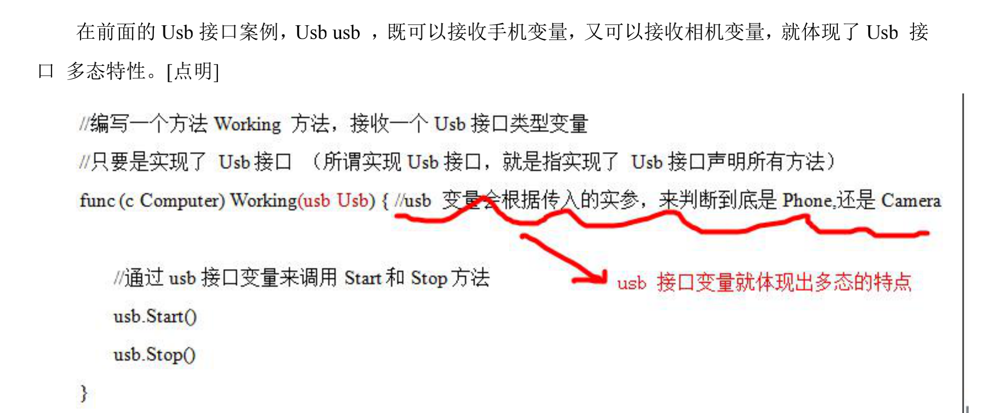

##### 4.3.2 接口体现多态特征

（1）多态参数

​	在前面的Usb接口案例，Usb usb，即可以接收手机变量，又可以接收相机变量，就体现了Usb接口多态。

（2）多态数组
	演示一个案例：给Usb数组中，存放Phone结构体和Camera结构体变量，Phone还有一个特有的call()，请遍历Usb数组，如果是Phone变量，除了调用Usb接口声明的方法外，还需要调用Phone特有方法call --> **类型断言**

​	**实现同一接口的变量可以放在同一数组中，数组中类型要是一致的**

```go
package main

import "fmt"

//声明一个接口
type Usb interface {
	Start()
	Stop()
}

type Phone struct {
	Name string
}

//让Phone 实现 Usb接口的方法
func (p Phone) Start() {
	fmt.Println("手机开始工作。。。")
}
func (p Phone) Stop() {
	fmt.Println("手机停止工作。。。")
}

type Camera struct {
	Name string
}

//让Camera 实现   Usb接口的方法
func (c Camera) Start() {
	fmt.Println("相机开始工作~~~。。。")
}
func (c Camera) Stop() {
	fmt.Println("相机停止工作。。。")
}

func main() {
	// 定义一个Usb接口数组，可以存放Phone和Camera的结构体变量
	// 这里就体现出多态数组
	var usbArr [3]Usb
	fmt.Println("usbArr", usbArr) // usbArr [<nil> <nil> <nil>]
	usbArr[0] = Phone{"vivo"}
	usbArr[1] = Phone{"小米"}
	usbArr[2] = Camera{"索尼"}
	fmt.Println("usbArr", usbArr) // usbArr [{vivo} {小米} {索尼}]
}
```

## 8. 接口

### 1. 接口基本介绍

空接口也就是空类型，可以接收任意类型的变量

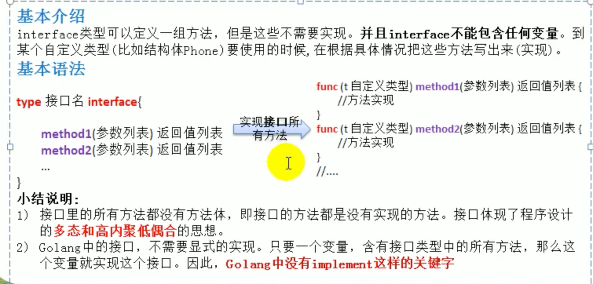

### 2. 示例

```go
// 声明一个接口
type Usb interface {
	// 声明了两个没有实现的方法
	Start()
	Stop()
}

type Phone struct {
}

// 让Phone 实现 Usb接口的方法
func (p Phone) Start() {
	fmt.Println("手机开始工作。。。")
}
func (p Phone) Stop() {
	fmt.Println("手机停止工作。。。")
}

type Camera struct {
}

// 让Camera 实现   Usb接口的方法
func (c Camera) Start() {
	fmt.Println("相机开始工作~~~。。。")
}
func (c Camera) Stop() {
	fmt.Println("相机停止工作。。。")
}

// 计算机
type Computer struct {
}

// 编写一个方法Working 方法，接收一个Usb接口类型变量
// 只要是实现了 Usb接口 （所谓实现Usb接口，就是指实现了 Usb接口声明所有方法）
func (c Computer) Working(usb Usb) {

	// 通过usb接口变量来调用Start和Stop方法
	usb.Start()
	usb.Stop()
}

func main() {
	// 先创建结构体变量
	computer := Computer{}
	phone := Phone{}
	camera := Camera{}

	computer.Working(phone)
	computer.Working(camera) 
}
```

###3. 应用场景

控制项目的管理和规范程序的规则，**高内聚低耦合**

###4. 注意细节

（1）接口本身不能创建实例，也就是不能直接用接口创建一个变量， 但是**可以指向一个实现了该接口的自定义类型的变量（实例）**

```go
type Stu struct {
	Name string
}

func (stu Stu) Say() {
	fmt.Println("Stu Say()")
}

// 接口
type AInterface interface {
	Say()
}

func main() {
	var stu Stu //结构体变量，实现了 Say() 实现了 AInterface
  // 不能这么写 var a AInerface
 	var a AInterface = stu // stu赋值为接口
	a.Say()
}  
```

（2）接口中所有的方法都没有方法体，即都是没有实现的方法

（3）在Golang中，一个自定义类型需要将某个接口的**所有方法都实现**，我们才说这个**自定义类型实现了该接口**

（4）一个自定义类型只有实现了某个接口，才能将该自定义类型的实例（变量）赋给接口类型

（5）只要是**自定义数据类型**，实现了接口的方法，就可以实现接口，不仅仅是结构体类型

```go
type integer int
// 接口
type AInterface interface {
	Say()
}
// integer实现了该接口
func (i integer) Say() {
	fmt.Println("integer Say i =" ,i )
}

func main() {
	var i integer = 10
	var b AInterface = i
	b.Say() // integer Say i = 10
}
```

（6）一个自定义类型可以实现多个接口

```go
type AInterface interface {
	Say()
}

type BInterface interface {
	Hello()
}
type Monster struct {
}

func (m Monster) Hello() {
	fmt.Println("Monster Hello()~~")
}

func (m Monster) Say() {
	fmt.Println("Monster Say()~~")
}

func main() {
	//Monster实现了AInterface 和 BInterface
	var monster Monster
	var a2 AInterface = monster
	var b2 BInterface = monster
	a2.Say()
	b2.Hello()
}
```

（7）接口不能有任何变量

（8）一个接口可以继承多个别的接口，这时如果要实现A接口，也必须将继承的接口的方法全部实现，但是继承到的**多个接口中不能有相同的方法**


（9）接口类型默认是一个指针（**引用类型**），如果没有对接口初始化就使用，那么会输出nil

（10）**空接口interface{}没有任何方法**，所以所有类型都实现了空接口，即我们可以把任何一个变量赋给空接口

```go
type Stu struct {
}
//空接口
type T  interface{
}

func main() {
	var stu Stu
	var t T = stu
	fmt.Println(t) // {}
	var t2 interface{}  = stu
	var num1 float64 = 8.8
	t2 = num1
	t = num1
	fmt.Println(t2, t) // 8.8 8.8
}
```

（11）

```go
import "fmt"
type Usb interface {
	Say()
}
type Stu struct {
}
// 指针实现了接口 Stu没有实现接口
func (this *Stu) Say() {
	fmt.Println("Say()")
}
func main() {
	var stu Stu = Stu{}
	// 错误！ 会报 Stu类型没有实现Usb接口 , 
	// 如果希望通过编译,  var u Usb = &stu
	var u Usb = stu  // 错误
	u.Say()
	fmt.Println("here", u)
}
```

### 5. 接口实践

实现对Hero结构体的排序

```go
package main

import (
	"fmt"
	"math/rand"
	"sort"
)

// 1.声明结构体
type Hero struct {
	Name string
	Age  int
}

// 2.声明一个Hero结构体切片
type HeroSlice []Hero

// 3.实现Interface接口
func (hs HeroSlice) Len() int {
	return len(hs)
}

// Less方法决定 使用什么标准进行排序
// 按照年龄升序排序 
func (hs HeroSlice) Less(i, j int) bool {
	return hs[i].Age < hs[j].Age
}

// 交换
func (hs HeroSlice) Swap(i, j int) {
	hs[i], hs[j] = hs[j], hs[i]
}

func main() {
	var heroes HeroSlice
	for i := 0; i < 5; i++ {
		hero := Hero{
			Name: fmt.Sprintf("英雄~%d", rand.Intn(100)),
			Age:  rand.Intn(100),
		}
		// append
		heroes = append(heroes, hero)
	}
	// 排序前顺序
	for _, v := range heroes {
		fmt.Println(v)
	}
  // {英雄~81 87}
	// {英雄~47 59}
  // {英雄~81 18}
  // {英雄~25 40}
  // {英雄~56 0}

	// 调用sort.Sort
	sort.Sort(heroes)
	// 排序后顺序
	fmt.Println("排序后~~~~~~~~~~~~~~~")
	for _, v := range heroes {
		fmt.Println(v)
	}
  // {英雄~56 0}
	// {英雄~81 18}
	// {英雄~25 40}
	// {英雄~47 59}
	// {英雄~81 87}
}
```

### 6. 接口vs继承

```go
// Monkey结构体
type Monkey struct {
	Name string
}

// 爬树的方法
func (this *Monkey) climbing() {
	fmt.Println(this.Name, "生来会爬树...")
}

// 声明接口
type BirdAble interface {
	Flying()
}
type FishAble interface {
	Swimming()
}
// 让小猴子实现BirdAble接口
func (this *LittleMonkey) Flying() {
	fmt.Println(this.Name, "通过学习可以飞了...")
}
func (this *LittleMonkey) Swmming() {
	fmt.Println(this.Name, "通过学习可以游了...")
}
// 小猴子结构体
type LittleMonkey struct {
	Monkey // 继承猴子
}

func main() {
	// 创建实例
	monkey := LittleMonkey{
		Monkey{
			Name: "悟空",
		},
	}
	monkey.climbing() // 悟空 生来会爬树...
	monkey.Flying() // 悟空 通过学习可以飞了...
	monkey.Swmming() // 悟空 通过学习可以游了...
}
```

对上面代码总结：

（1）当A结构体继承了B结构体，那么A结构体就自动了B结构体的字段和方法（实现的接口），并且可以直接使用

（2）当A结构体需要扩展功能，同时不希望去破坏继承关系，则可以去实现某个接口即可，即接口是对继承的补充

#### 6.1 接口相当于对继承的补充

#### 6.2 接口和继承解决的解决的问题不同

（1）**继承**的价值主要在于：解决代码的**复用性和可维护性**

（2）**接口**的价值主要在于：**设计**，设计好各种规范（方法），让其它自定义类型去实现这些方法。

#### 6.3 接口比继承更加灵活

​	接口比继承更加灵活，继承是满足is-a的关系，而接口只需满足like-a的关系。

#### 6.4 接口在一定程度上实现代码解耦

## 9. 类型断言

### 1. 基本介绍

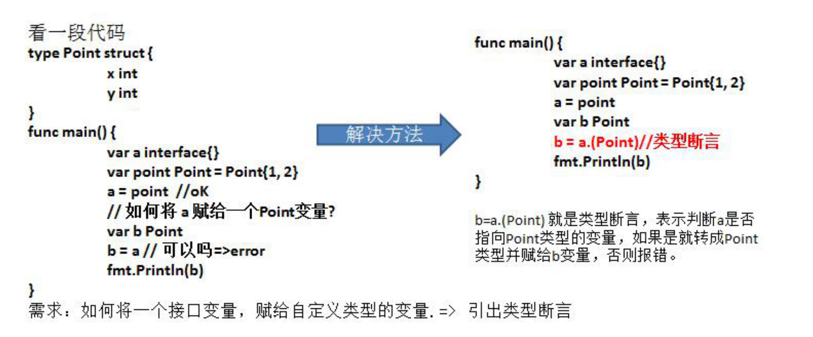

类型断言，由于接口是一般类型，不知道具体类型，如果要转成具体类型，就需要使用类型断言，具体的如下：

```go
var x interface{}
var b2 float32 = 1.1
x = b2  //空接口，可以接收任意类型
// x=>float32 [使用类型断言]
y := x.(float32)
fmt.Printf("y 的类型是 %T 值是=%v", y, y) // y 的类型是 float32 值是=1.1
```

对上面代码的说明：

​	在进行类型断言时，如果类型不匹配，就会报panic，因此进行类型断言时，要确保**类型匹配**原来的**空接口指向的就是断言的类型**

如何在进行断言时，带上检测机制，如果成功就ok，否则也不要报panic

```go
func main() {
	// 带检测的类型断言
	var x interface{}
	var b2 float32 = 1.1
	x = b2 // 空接口可以接收任意类型
  // y := x.(float32)
	if y, ok := x.(float64); !ok {
		fmt.Println("转换失败")
	} else {
		fmt.Printf("y 的类型是%T 值是=%v\n", y, y)
	}
	fmt.Println("over")
}
```

### 2. 类型断言实践

#### 案例1：

​	给Usb数组中，存放Phone结构体和Camera结构体变量，Phone还有一个特有的call()，请遍历Usb数组，如果是Phone变量，除了调用Usb接口声明的方法外，还需要调用Phone特有方法call --> **类型断言**

```go
type Usb2 interface {
	// 声明了两个没有实现的方法
	Start()
	Stop()
}

type Phone2 struct {
	Name string
}
func (p Phone2) Start() {
	fmt.Println("手机开始工作。。。")
}
func (p Phone2) Stop() {
	fmt.Println("手机停止工作。。。")
}
func (p Phone2) Call() {
	fmt.Println("手机在打电话。。。")
}

type Camera2 struct {
	Name string
}
func (c Camera2) Start() {
	fmt.Println("相机开始工作~~~。。。")
}
func (c Camera2) Stop() {
	fmt.Println("相机停止工作。。。")
}

type Computer2 struct {
}
func (c Computer2) Working(usb Usb2) {
	usb.Start()
	//如果usb是指向Phone结构体变量，则还需要调用Call方法
	//类型断言..[注意体会!!!]
	if phone, ok := usb.(Phone2); ok == true { // 返回值是true或者false
		phone.Call()
	}
	usb.Stop()
}

func main() {
	// 定义一个Usb接口数组，可以存放Phone和Camera的结构体变量
	// 这里就体现出多态数组
	var usbArr [3]Usb2
	fmt.Println("usbArr", usbArr) // usbArr [<nil> <nil> <nil>]
	usbArr[0] = Phone2{"vivo"}
	usbArr[1] = Phone2{"小米"}
	usbArr[2] = Camera2{"索尼"}
	fmt.Println("usbArr", usbArr) // usbArr [{} {} {}]

	var computer Computer2
	// 遍历数组
	// Phone还有一个特有的方法call()，请遍历Usb数组，如果是Phone变量，
	// 除了调用Usb 接口声明的方法外，还需要调用Phone 特有方法 call. =》类型断言
	for _, v := range usbArr {
		computer.Working(v)
	}
}
```

#### 案例2：

​	编写一个函数，可以判断输入的参数是什么类型

```go
type Student struct {
}
// 编写一个函数，可以判断输入的参数是什么类型
// 函数接收不确定个数和类型的参数(空接口类型可以接收任意类型参数)
func TypeJudge(items ...interface{}) {
	for index, x := range items {
		index++
		switch x.(type) {
		case bool:
			fmt.Printf("第%v个参数的类型是bool类型，值是%v\n", index, x)
		case float64, float32:
			fmt.Printf("第%v个参数的类型是float类型，值是%v\n", index, x)
		case int, int32, int64:
			fmt.Printf("第%v个参数的类型是int类型，值是%v\n", index, x)
		case string:
			fmt.Printf("第%v个参数的类型是string类型，值是%v\n", index, x)
    case Student: // 可以判定自定义的数据类型
			fmt.Printf("第%v个参数是 Student 类型，值是%v\n", index, x)
    case *Student:
			fmt.Printf("第%v个参数是 *Student 类型，值是%v\n", index, x)
		default:
			fmt.Printf("第%v个参数的类型是不确定，值是%v\n", index, x)
		}
	}
}

func main() {
	var n1 float32 = 1.1
	var n2 float64 = 2.3
	var n3 int32 = 30
	var name string = "tom"
	address := "北京"
	n4 := 300

	stu1 := Student{}
	stu2 := &Student{}
	TypeJudge(n1, n2, n3, name, address, n4, stu1, stu2)
}
```

## 10. 家庭收支记账软件项目

### 1. 项目开发流程

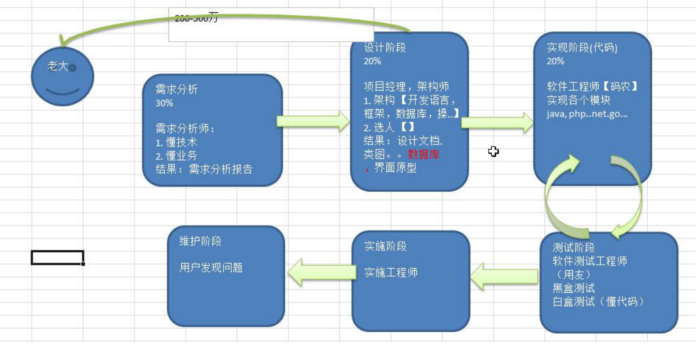

### 2. 项目需求说明

（1）模拟实现基于文本界面的《家庭记账软件》

（2）该软件能够记录家庭的收入、支出，并能够打印收支明细表

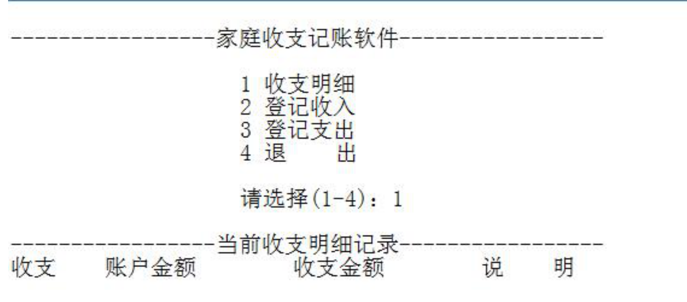

### 3. 面向过程代码

所有的方法和逻辑都写在了一个main函数中

```go
func main() {
	//声明一个变量，保存接收用户输入的选项
	key := ""
	//声明一个变量，控制是否退出for  break只能退出switch
	loop := true
	//定义账户的余额 []
	balance := 10000.0
	//每次收支的金额
	money := 0.0
	//每次收支的说明
	note := ""
	//定义个变量，记录是否有收支的行为
	flag := false
	//收支的详情使用字符串来记录
	//当有收支时，只需要对details 进行拼接处理即可
	details := "收支\t账户金额\t收支金额\t说    明"
	//显示这个主菜单
	for {
		fmt.Println("\n-----------------家庭收支记账软件-----------------")
		fmt.Println("                  1 收支明细")
		fmt.Println("                  2 登记收入")
		fmt.Println("                  3 登记支出")
		fmt.Println("                  4 退出软件")
		fmt.Print("请选择(1-4)：")
		fmt.Scanln(&key)
		switch key {
		case "1":
			if !flag {
				fmt.Println("当前没有收支明细... 来一笔吧!")
			} else {
				fmt.Println("-----------------当前收支明细记录-----------------")
				fmt.Println(details)
			}
		case "2":
			fmt.Println("本次收入金额:")
			fmt.Scanln(&money)
			balance += money
			fmt.Println("本次收入说明:")
			fmt.Scanln(&note)
			// 收入情况 拼接到details变量
			details += fmt.Sprintf("\n收入\t%v    \t%v    \t    %v", balance, money, note)
			flag = true
		case "3":
			fmt.Println("本次支出金额:")
			fmt.Scanln(&money)
			// 需要判断
			if money > balance {
				fmt.Println("余额不足...")
				break
			}
			balance -= money
			fmt.Println("本次支出说明:")
			fmt.Scanln(&note)
			details += fmt.Sprintf("\n收入\t%v    \t%v    \t    %v", balance, money, note)
			flag = true
		case "4":
			fmt.Println("你确定要退出吗? y/n")
			choice := ""
			for {
				fmt.Scanln(&choice)
				if choice == "y" || choice == "n" {
					break
				}
				fmt.Println("你的输入有误 请重新输入 y/n")
			}
			if choice == "y" {
				loop = false
			}
		default:
			fmt.Println("请输入正确的选项...")
		}
		if !loop {
			break
		}
	}
	fmt.Println("你退出家庭记账软件的使用...")
}
```

### 4. 面向对象代码实现

​	将面向过程的代码修改成面向对象的方法，编写myFamilyAccount.go，并使用testMyFamilyAccount.go去完成测试

思路分析：

​	把记账软件的功能，封装到一个结构体中，然后调用该结构体的方法，来实现记账，显示明细。结构体的名字FamilyAccount
在通过在main方法中，创建一个结构体FamilyAccount实例，实现记账即可

```go
type FamilyAccount struct {
	// 声明必须的字段.
	key     string
	loop    bool
	balance float64
	money   float64
	note    string
	flag    bool
	details string
}

// 给结构体绑定相应的方法
// 1.显示主菜单
func (this *FamilyAccount) MainMenu() {
	for {
		fmt.Println("\n-----------------家庭收支记账软件-----------------")
		fmt.Println("                  1 收支明细")
		fmt.Println("                  2 登记收入")
		fmt.Println("                  3 登记支出")
		fmt.Println("                  4 退出软件")
		fmt.Print("请选择(1-4)：")
		fmt.Scanln(&this.key)
		switch this.key {
		case "1":
			this.showDetails()
		case "2":
			this.income()
		case "3":
			this.pay()
		case "4":
			this.exit()
		default:
			fmt.Println("请输入正确的选项..")
		}
		if !this.loop {
			break
		}
	}
}

// 2.收入方法
func (this *FamilyAccount) income() {
	fmt.Println("本次收入金额:")
	fmt.Scanln(&this.money)
	this.balance += this.money
	fmt.Println("本次收入说明:")
	fmt.Scanln(&this.note)
	// 收入情况 拼接到details变量
	this.details += fmt.Sprintf("\n收入\t%v    \t%v    \t    %v", this.balance, this.money, this.note)
	this.flag = true
}

// 3.支出方法
func (this *FamilyAccount) pay() {
	fmt.Println("本次支出金额:")
	fmt.Scanln(&this.money)
	// 需要判断
	if this.money > this.balance {
		fmt.Println("余额不足...")
	}
	this.balance -= this.money
	fmt.Println("本次支出说明:")
	fmt.Scanln(&this.note)
	this.details += fmt.Sprintf("\n收入\t%v    \t%v    \t    %v", this.balance, this.money, this.note)
	this.flag = true
}

// 4.退出方法
func (this *FamilyAccount) exit() {
	fmt.Println("你确定要退出吗? y/n")
	choice := ""
	for {
		fmt.Scanln(&choice)
		if choice == "y" || choice == "n" {
			break
		}
		fmt.Println("你的输入有误 请重新输入 y/n")
	}
	if choice == "y" {
		this.loop = false
	}
}

// 5.显示明细
func (this *FamilyAccount) showDetails() {
	if !this.flag {
		fmt.Println("当前没有收支明细... 来一笔吧!")
	} else {
		fmt.Println("-----------------当前收支明细记录-----------------")
		fmt.Println(this.details)
	}
}

// 编写一个工厂模式的构造方法
func NewFamilyAccount() *FamilyAccount {
	return &FamilyAccount{
		key : "",
		loop : true,
		balance : 10000.0,
		money : 0.0,
		note : "",
		flag : false,
		details : "收支\t账户金额\t收支金额\t说    明",
	}
}

func main() {
  // 面向对象调用
	test := NewFamilyAccount()
	test.MainMenu()
}
```

## 11. 客户信息关系系统项目

### 1. 项目需求分析

（1）模拟实现基于文本界面的《客户信息管理软件》

（2）该软件能够实现对客户对象的插入、修改和删除（用切片实现），并能够打印客户明细表


### 2. 项目框架图

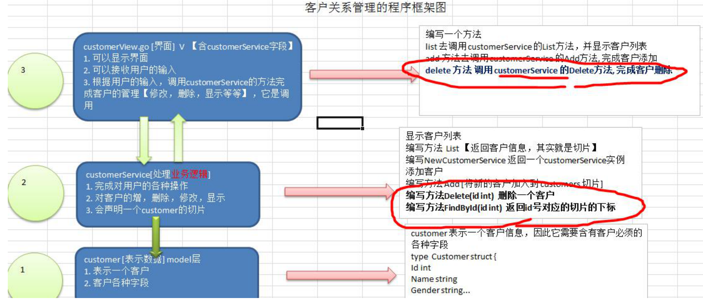

### 3. 代码实现

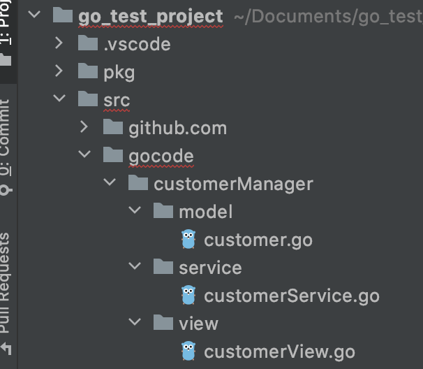

customerView.go

```go
package main

import (
	"fmt"
	"gocode/customerManager/model"
	"gocode/customerManager/service"
)

type customerView struct {
	// 接收用户的收入
	key string
	// 是否循环主菜单
	loop            bool
	customerService *service.CustomerService
}
// 1.得到用户的输入 并完成添加
func (this *customerView) add() {
	fmt.Println("---------------------添加客户---------------------")
	fmt.Println("姓名:")
	name := ""
	fmt.Scanln(&name)
	fmt.Println("性别:")
	gender := ""
	fmt.Scanln(&gender)
	fmt.Println("年龄:")
	age := 0
	fmt.Scanln(&age)
	fmt.Println("电话:")
	phone := ""
	fmt.Scanln(&phone)
	fmt.Println("电邮:")
	email := ""
	fmt.Scanln(&email)
	// 构建一个新的Customer实例
	// 注意: id号，没有让用户输入，id是唯一的，需要系统分配
	customer := model.NewCustomer2(name, gender, age, phone, email)
	//调用
	if this.customerService.Add(customer) {
		fmt.Println("---------------------添加完成---------------------")
	} else {
		fmt.Println("--------------------添加失败---------------------")
	}
}
// 2.修改
func (this *customerView) update() {
	fmt.Println("---------------------修改客户---------------------")
	fmt.Println("请选择待修改客户编号(-1退出)：")
	id := -1
	fmt.Scanln(&id)
	if id == -1 {
		return // 放弃删除操作
	}
	if this.customerService.Update(id) {
		fmt.Println("---------------------修改完成---------------------")
	} else {
		fmt.Println("---------------------修改失败，输入的id号不存在----")
	}
}
// 3.删除该id对应的客户
func (this *customerView) delete() {
	fmt.Println("---------------------删除客户---------------------")
	fmt.Println("请选择待删除客户编号(-1退出)：")
	id := -1
	fmt.Scanln(&id)
	if id == -1 {
		return // 放弃删除操作
	}
	fmt.Println("确认是否删除(Y/N)：")
	// 这里同学们可以加入一个循环判断，直到用户输入 y 或者 n,才退出..
	choice := "y"
	fmt.Scanln(&choice)
	if choice == "Y" || choice == "y" {
		// 调用customerService 的 Delete方法
		if this.customerService.Delete(id) {
			fmt.Println("---------------------删除完成---------------------")
		} else {
			fmt.Println("---------------------删除失败，输入的id号不存在----")
		}
	}
}
// 4.显示所有的客户信息
func (this *customerView) list() {
	// 获取当前所有用户的切片
	customers := this.customerService.List()
	//显示
	fmt.Println("---------------------------客户列表---------------------------")
	fmt.Println("编号\t姓名\t性别\t年龄\t电话\t邮箱")
	for _, customer := range customers {
		fmt.Println(customer.GetInfo())
	}
	fmt.Printf("\n-------------------------客户列表完成-------------------------\n\n")
}
// 5.退出
func (this *customerView) exit() {
	fmt.Println("确认是否退出(Y/N)：")
	for {
		fmt.Scanln(&this.key)
		if this.key == "Y" || this.key == "y" || this.key == "N" || this.key == "n" {
			break
		}

		fmt.Println("你的输入有误，确认是否退出(Y/N)：")
	}

	if this.key == "Y" || this.key == "y" {
		this.loop = false
	}
}

// 显示主菜单
func (this *customerView) mainMenu() {
	for {
		fmt.Println("-----------------客户信息管理软件-----------------")
		fmt.Println("                 1 添 加 客 户")
		fmt.Println("                 2 修 改 客 户")
		fmt.Println("                 3 删 除 客 户")
		fmt.Println("                 4 客 户 列 表")
		fmt.Println("                 5 退      出")
		fmt.Print("请选择(1-5)：")

		fmt.Scanln(&this.key)
		switch this.key {
		case "1":
			this.add()
		case "2":
			this.update()
		case "3":
			this.delete()
		case "4":
			this.list()
		case "5":
			this.exit()
		default:
			fmt.Println("你的输入有误，请重新输入...")
		}

		if !this.loop {
			break
		}
	}
	fmt.Println("你退出了客户关系管理系统...")
}

func main() {
	// 实例化
	c := customerView{
		key:  "",
		loop: true,
	}
	// 完成对customerService的初始化
	c.customerService = service.NewCustomerService()
	// 显示主菜单
	c.mainMenu()
}
```

customerService.go

```go
package service

import (
	"fmt"
	"gocode/customerManager/model"
)

// 该CustomerService， 完成对Customer的操作,包括
// 增删改查
type CustomerService struct {
	// 声明一个字段，表示当前切片含有多少个客户
	customers []*model.Customer
	// 该字段后面，还可以作为新客户的id+1
	customerNum int
}

func NewCustomerService() *CustomerService {
	// 初始化一个客户
	cs := &CustomerService{}
	cs.customerNum = 1
	c := model.NewCustomer(1, "张三", "男", 20, "112", "zs@sohu.com")
	cs.customers = append(cs.customers, c)
	return cs
}

// 返回切片
func (this *CustomerService) List() []*model.Customer {
	return this.customers
}
// 添加客户到customers切片
func (this *CustomerService) Add(customer model.Customer) bool {
	// 确定一个分配id规则
	this.customerNum += 1
	customer.Id = this.customerNum
	this.customers = append(this.customers, &customer)
	return true
}

// 根据id删除客户(从切片中删除)
func (this *CustomerService) Delete(id int) bool {
	i := this.FindById(id)
	if i == -1 {
		// 没有这个客户
		return false
	}
	// 从切片中删除一个元素 采用截取的方式
	this.customers = append(this.customers[:i], this.customers[i+1:]...)
	return true
}

// 根据id修改客户
func (this *CustomerService) Update(id int) bool {
	i := this.FindById(id)
	if i == -1 {
		return false
	}
	customer := this.customers[i]
	fmt.Printf("姓名(%v):", customer.Name)
	name := ""
	fmt.Scanln(&name)
	if name != ""{
		customer.Name = name
	}
	fmt.Printf("性别(%v):", customer.Gender)
	gender := ""
	fmt.Scanln(&gender)
	if gender != ""{
		customer.Gender = gender
	}
	fmt.Printf("年龄(%v):", customer.Age)
	age := 0
	fmt.Scanln(&age)
	if gender != ""{
		customer.Gender = gender
	}
	fmt.Printf("电话:(%v)", customer.Phone)
	phone := ""
	fmt.Scanln(&phone)
	if phone != ""{
		customer.Phone = phone
	}
	fmt.Printf("电邮(%v):", customer.Email)
	email := ""
	fmt.Scanln(&email)
	if email != ""{
		customer.Email = email
	}
	return true
}

// 根据id查找客户在切片中对应下标,如果没有该客户，返回-1
func (this *CustomerService) FindById(id int) int {
	// 遍历切片
	index := -1
	for i, customer := range this.customers {
		if customer.Id == id {
			// 找到
			index = i
			return index
		}
	}
	return index
}
```

customer.go

```go
package model

import "fmt"

//声明一个Customer结构体，表示一个客户信息
type Customer struct {
	Id int
	Name string
	Gender string
	Age int
	Phone string
	Email string
}

// 返回用户的信息
func (this *Customer) GetInfo() string {
	info := fmt.Sprintf("%v\t%v\t%v\t%v\t%v\t%v\t", this.Id,
		this.Name, this.Gender,this.Age, this.Phone, this.Email)
	return info
}

// 工厂模式方法
func NewCustomer(id int, name string, gender string,
	age int, phone string, email string ) *Customer {
	return &Customer{
		Id : id,
		Name : name,
		Gender : gender,
		Age : age,
		Phone : phone,
		Email : email,
	}
}

// 创建customer实例 不带id
func NewCustomer2(name string, gender string,
	age int, phone string, email string ) Customer {
	return Customer{
		Name : name,
		Gender : gender,
		Age : age,
		Phone : phone,
		Email : email,
	}
}
```


