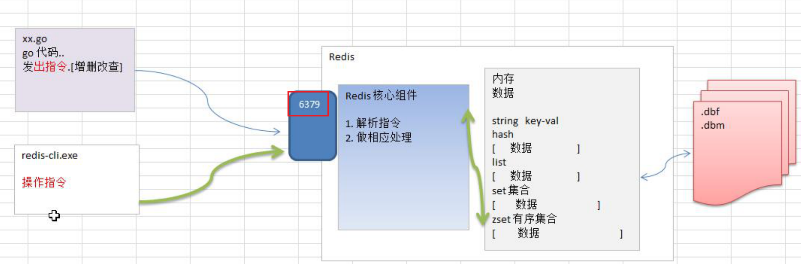
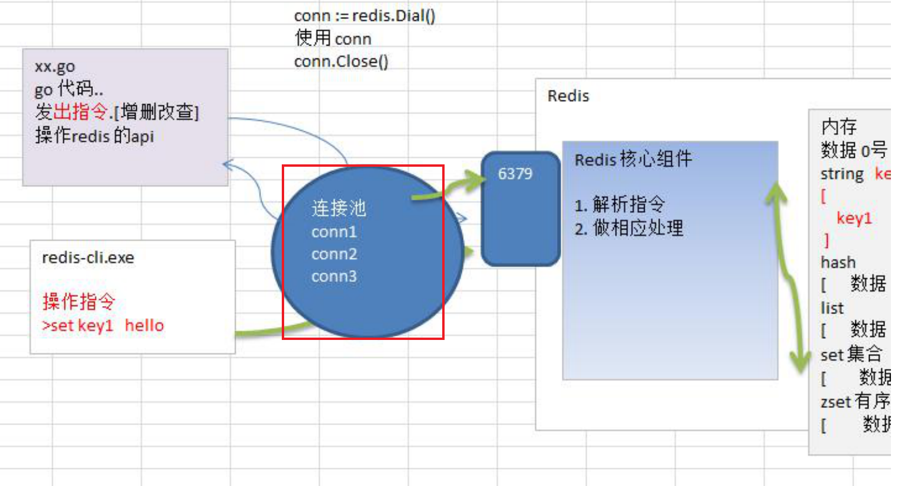

# Redis的使用

## 1.1 Redis基本介绍

（1）Redis是**NoSQL数据库**，不是传统的关系型数据库官网:https://redis.io/和http://www.redis.cn/

（2）Redis：Remote  Dictionary Server（远程字典服务器），Redis性能非常高，单机能够达到15w qps，通常适合做缓存，也可以持久化

（3）是完全开源免费的，高性能的（key/value）分布式内存数据库，基于内存运行并支持持久化的NoSQL数据库，是最热门的NoSql数据库之一，也称为数据结构服务器

## 1.2 Redis操作的基本原理图



## 1.3 安装第三方开源Redis库

（1）使用第三方开源的redis库：github.com/garyburd/redigo/redis
（2）在使用Redis前，先安装第三方Redis库，在GOPATH路径下执行安装指令

```shell
go env # 查看GOPATH
cd /Users/yutang/Documents/go_test_project
go get github.com/garyburd/redigo/redis
```

（3）安装成功后，可以看到github包

特别说明：在安装Redis库前，确保已经安装并配置了Git，因为是从github下载安装Redis库的，需要使用到Git

## 1.4 Go操作redis

### 1.4.1 String操作

Get/Set 操作

```go
package main

import (
	"fmt"
	"github.com/garyburd/redigo/redis"
)

func main() {
	// 通过go 向redis写入数据和读取数据
	// 1.连接redis
	conn, err := redis.Dial("tcp", "127.0.0.1:6379")
	if err != nil {
		fmt.Println("redis连接失败, err>>>", err)
		return
	}
	defer conn.Close() // 关闭
	// 2.写入数据
	_, err = conn.Do("Set", "name", "tomjerry")
	if err != nil {
		fmt.Println("写入数据失败，err>>>", err)
		return
	}
	// 3.获取数据
	// 返回interface 转换成字符串
	r, err := redis.String(conn.Do("Get", "name"))
	// 获取多个键的值
	//r, err := redis.Strings(conn.Do("mget", "name", "address"))
	if err != nil {
		fmt.Println("获取数据失败")
		return
	}
	fmt.Println("操作ok", r)
}
```

批量Set/Get数据

```go
_, err = conn.Do("MSET", "name", "wd","age",22)
res, err := redis.Strings(conn.Do("MGET", "name","age"))
for _, v := range res {
  fmt.Println(v)
}
```

### 1.4.2 Hash操作

```go
package main

import "github.com/garyburd/redigo/redis"
import "fmt"

func main() {
	conn, err := redis.Dial("tcp", "127.0.0.1:6379")
	if err != nil {
		fmt.Println("redis.Dial err=", err)
		return
	}
	defer conn.Close()

	// 写入数据
	_, err = conn.Do("HSet", "user01", "name", "john")
	if err != nil {
		fmt.Println("写入数据失败 err=", err)
		return
	}
	_, err = conn.Do("HSet", "user01", "age", 18)
	if err != nil {
		fmt.Println("写入数据失败 err=", err)
		return
	}
	// 获取数据
	r1, err := redis.String(conn.Do("HGet", "user01", "name"))
	if err != nil {
		fmt.Println("获取数据失败 err=", err)
		return
	}

	r2, err := redis.Int(conn.Do("HGet", "user01", "age"))
	if err != nil {
		fmt.Println("获取数据失败 err=", err)
		return
	}
	fmt.Printf("操作ok r1=%v, r2=%v\n", r1, r2)
}
```

批量操作hash

```go
package main

import "github.com/garyburd/redigo/redis"
import "fmt"

func main() {
	conn, err := redis.Dial("tcp", "127.0.0.1:6379")
	if err != nil {
		fmt.Println("redis.Dial err=", err)
		return
	}
	defer conn.Close()
	// 写入数据
	_, err = conn.Do("HMSet", "user02", "name", "linux", "age", 20)
	if err != nil {
		fmt.Println("写入数据失败 err=", err)
		return
	}

	// 获取多个数据
	r, err := redis.Strings(conn.Do("HMGet", "user02", "name", "age"))
	if err != nil {
		fmt.Println("获取数据失败 err=", err)
		return
	}
	// r是返回切片
	for i, v := range r {
		fmt.Printf("i[%v]=%v\n", i, v)
    // i[0]=linux
		// i[1]=20
	}
}
```

### 1.4.3 设置过期时间

```go
_, err := c.Do("expire", "name", 10)
```

### 1.4.4 List操作

```go
c.Do("lpush", "heroList", "no1:宋江", 30, "no2:卢俊义", 28)
r, err := redis.String(c.Do("rpop", "heroList"))
```

### 1.4.5 练习

1. Monster信息【name，age，skill】
2. 通过终端输入三个monster的信息，使用golang操作redis，存放到redis中
3. 遍历出所有的monster信息，并显示在终端

```go
package main

import (
	"fmt"
	"github.com/garyburd/redigo/redis"
	"strconv"
)

func setMonsterInfo(i int, conn redis.Conn) bool {
	var name string
	fmt.Println("请输入name:")
	fmt.Scanln(&name)
	var age int
	fmt.Println("请输入年龄:")
	fmt.Scanln(&age)
	var skill string
	fmt.Println("请输入技能:")
	fmt.Scanln(&skill)
	_, err := conn.Do("HMSet", "monster"+strconv.Itoa(i), "name", name, "age", age, "skill", skill)
	if err != nil {
		fmt.Println("写入数据失败, err:", err)
		return false
	}
	return true
}
func getMonsterInfo(i int, conn redis.Conn) bool {
	r, err := redis.Strings(conn.Do("HMGet", "monster"+strconv.Itoa(i), "name", "age", "skill"))
	if err != nil {
		fmt.Println("获取数据失败, err:", err)
		return false
	}
	fmt.Println(r)
	return true

}

func main() {
	conn, err := redis.Dial("tcp", "127.0.0.1:6379")
	if err != nil {
		fmt.Println("连接失败, err:", err)
	}
  defer conn.Close()
	for i := 0; i < 3; i++ {
    // 写入数据
		r := setMonsterInfo(i, conn)
		if !r {
			return
		}
	}
	for i := 0; i < 3; i++ {
    // 获取数据
		r := getMonsterInfo(i, conn)
		if !r {
			return
		}
	}
}
```

### 1.4.5 Redis连接池

（1）**事先初始化一定数量的链接**，放入到链接池

（2）当Go需要操作Redis时，**直接从Redis链接池取出链接**即可，用完时返回连接到连接池

（3）这样可以节省临时**获取Redis链接的时间**，从而提高效率



```go
package main

import "github.com/garyburd/redigo/redis"
import "fmt"

// 定义一个全局pool
var pool *redis.Pool

// 当启动程序时，就初始化连接池
func init() {
	pool = &redis.Pool{
		MaxIdle: 8, // 最大空闲数
		MaxActive: 0, // 最大连接数， 0表示没有限制
		IdleTimeout: 100, // 最大空闲时间
		Dial: func() (redis.Conn, error) {
			return redis.Dial("tcp", "127.0.0.1:6379")
		},
	}
}

func main() {
	// 先从pool 取出一个链接
	conn := pool.Get()
	defer conn.Close()
	_, err := conn.Do("Set", "name", "汤姆猫")
	if err != nil {
		fmt.Println("conn.Do err=", err)
		return
	}
	// 取出
	r, err := redis.String(conn.Do("Get", "name"))
	if err != nil {
		fmt.Println("conn.Do err=", err)
		return
	}
	fmt.Println("r=", r)

	// 如果我们要从pool 取出链接，一定保证链接池是没有关闭
	// pool.Close()
}
```

pool.Close() // 关闭连接池，一旦关闭后，就不能从连接池中取出链接


