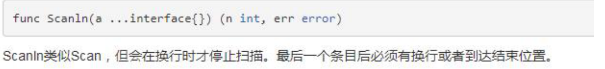

# Golang基础一

B站地址：https://www.bilibili.com/video/BV1pt41127FZ?p=220

百度网盘资料：https://pan.baidu.com/s/1hYja2u-OAw-Q4OpFODBERA 提取码:yxy4

## 1. go简介

### 1.1 优势

​	1.支持大的并发
​	2.计算能力较强，数据处理能力强。
​	3.简洁高效
​	4.既能有c语言的运行速度快，又有脚本语言的开发速度
​	docker就是用go写的

**扩展**
	程序：为了让计算机完成某项任务或解决某个问题而编写的一系列有序指令的集合

### 1.2 特点

​	既能达到**静态语言的安全和性能**，又达到了**动态语言开发维护的高效率**。Go = C + Python

​	1.引用c的指针
​	2.引入包的概念 package，go每个文件都要属于一个包
​	3.垃圾回收机制（类似python），内存自动回收
​	4.**天然并发**，多线程goroutine（重要特点），可实现大并发处理
​	5.管道通信机制channel，可以实现不同的goroute之间的相互通信
​	6.函数支持返回多个值
​	7.切片slice，延迟执行defer

### 1.3 安装

SDK工具包：代码需要编译才能执行（SDK软件开发工具包）
下载网站：https://studygolang.com/dl
或者

```shel
brew install go
```

安装步骤

1. 默认安装的路径为/usr/local/go

2. 添加环境变量

   ```shell
   # 在当前用户的环境变量中进行添加
   cd ~
   # vim .bahs_profile进行编辑
   export GOPATH=/Users/yutang/go_dev/go
   export GOBIN=$GOPATH/bin
   # 在path路径中追加go的执行路径 ：表示追加
   export PATH=$PATH:$GOBIN
   # 退出后重启环境变量
   source .bash_profile
   ```

3. 验证

   ```shell
   go version
   ```

### 1.4 go基本结构说明


```go
// test_01.go
package main

import "fmt"
func main() {
	fmt.Println(" 'hello world' ")
}
```

​	（1）package main

​		表示test_01.go文件所在包是main，在go中每个文件都必须改归属与一个包。

​		一个文件中必须有main函数才能执行。

​	（2）import "fmt"

​		表示引入一个包，包名fmt，引入该包后就可以使用fmt包的函数

​	（3）func main() {

​			}

​			main是函数名，是主函数，即程序的入口	

### 1.5 go编译

```shell
go build test_01.go
```

​	对go代码进行编译，得到**二进制**可执行文件test_01.exe

```sehll
go run test_01.go
```

​	直接运行go代码，类似执行一个脚本文件；执行前计算机会编译在执行。	


两种执行方式区别：

	1. 如果编译生成了可执行文件，那么将该文件拷贝到没有go开发环境的机器上，仍然可以运行
 	2. 如果go run 源代码，那么要在另一台机器上运行，也需要go开发环境，否则无法运行
 	3. 在编译时，编译器会将程序运行依赖的库文件包含在可执行文件中，所以，可执行文件变大很多

编译可以指定生成的可执行文件名，在windows下：

```go
go build -o mytest.exe test.go
```

### 1.6 go开发注意事项

​	（1）go应用程序的执行入口是main函数

​	（2）严格区分大小写

​	（3）行末不用加分号

​	（4）多条语句不能写在同一行，是一行一行的编译

​	（5）代码中import的**包**或者声明的**变量**没有用到，代码编译不能通过

### 1.7 go转义字符

​	（1）\t：制表符

​	（2）\n：换行符

​	（3）\ \：一个 \

​	（4）\ "：一个"

​	（5）\r： 回车,从当前行的最前面开始输出，覆盖掉以前内容

### 1.8 注释

​	被注释的代码不会被执行

​	行注释：

```go
// 这是行注释 两个斜杠
```

​	块注释

```go
/*
	要注释的内容
*/
```

### 1.9 go代码规范

​	（1）格式化代码

```go
// 格式化内容重写到文件
gofmt -w main.go
```

​	（2）一行不能超过80字符

```go
fmt.Println("aaaaaaaaaaaaaaaa" + 
           "aaaaaaaaaaaaaaaa"+
           "aaaaaaaaaaaaaaaaaaaaaaaaa")
```

### 1.10 go官方编程指南

​	https://golang.org

​	网址：https://tour.go-zh.org/welcome/1

可以练习go代码的执行


​	api包：https://golang.org/pkg/

查看某个包，index可以看整个方法的函数


​	go中文标准库文档：https://studygolang.com/pkgdoc

### 1.11 go环境变量设置

```go
go env // 查看go的环境配置
go env -w GOPATH="xxx" // 修改环境配置
```

## 2. 变量

### 2.1 变量的基本使用

​	声明（定义）变量

​	赋值变量

​	使用变量

```go
package main
import "fmt"

func main() {
	//定义变量/声明变量
	var i int
	//给i 赋值
	i = 10
	//使用变量
	fmt.Println("i=", i)
}
```

### 2.2 变量使用细节

​	（1）变量表示内存的一个存储区域

​	（2）该区域有自己的变量名和类型

​	（3）变量的三种使用方式

```go
// 方式1
var i int
i = 10  
fmt.Println("i = ", i) // int默认值是0

// 方式2
var num = 10.11

func main() {
  // 方式3 类型推导 不能省略 表示声明
	name := "tom"
	// 注：赋值语句要放到函数体内
	// 在全局变量不能这么定义
	name := "abc"
}
```

​	（4）多变量声明

```go
func main() {
	
	//该案例演示golang如何一次性声明多个变量
	var n1, n2, n3 int 
	fmt.Println("n1=",n1, "n2=", n2, "n3=", n3)

	//一次性声明多个变量的方式2 
	var n1, name , n3 = 100, "tom", 888
	fmt.Println("n1=",n1, "name=", name, "n3=", n3)

	//一次性声明多个变量的方式3, 同样可以使用类型推导
	n1, name , n3 := 100, "tom~", 888
	fmt.Println("n1=",n1, "name=", name, "n3=", n3)
}
```

​		声明全局变量

```go
//定义全局变量
var n1 = 100
var n2 = 200
var name = "jack"
//上面的声明方式，也可以改成一次性声明
var (
	n3 = 300
	n4 = 900
	name2 = "mary"
)
```

​	（5）该区域的数据值可以在同一类型范围内不断变化

```go
	var i int = 10
	i = 30
	i = 50
	fmt.Println("i=", i)
	//i = 1.2 //int ,原因是不能改变数据类型
```

​	（6）变量在**同一个作用域**（在一个函数或者代码块）内不能重名

​	（7）变量=**变量名+值+数据类型**

​	（8）变量没有赋值，编译器会使用默认值，比如int默认为0，string默认为空字符串，小数默认为0

​	（9）变量的赋值不能在函数外执行

### 2.3 +号的使用

​	（1）当左右两边都是数值型，则做加法运算

​	（2）当左右两边都是字符串，则做字符串拼接

```go
	var i = 1
	var j = 2
	var r = i + j //做加法运算
	fmt.Println("r=", r) // 3
	
	var str1 = "hello "
	var str2 = "world"
	var res = str1 + str2 //做拼接操作
	fmt.Println("res=", res) // hello world
```

### 2.4 数据类型的基本介绍


byte一个字节，8位；只能存字母，不能存汉字，汉字占三个字节

字符型：使用byte来保存，一个字母

rune 类似int32，可以保存字符串

### 2.5 整数类型

```go
int8：-128~127             uint8：0~255
int16：-2^15~2^15-1 				uint16：0~65535
int32：-2^31~2^31-1				uint32：2^32-1
int64：-2^63~2^63-1				uint64：2^64-1
```


使用细节：

​		（1）整型分为有符号和无符号，int uint的大小和系统有关

​		（2）查看变量的字节大小和数据的类型

```go
// 查看某个变量的数据类型
// 查看某个变量占用字节大小
var b int64 = 10
fmt.Printf("b 的类型是 %T, 占用字节大小是 %d \n", b, unsafe.Sizeof(b))
```

​		（3）在保证程序正确的情况下，尽量**选择占用空间较小**的数据类型

```go
// byte 无符号 一字节
var age byte
```

​		（4）bit 计算机最小存储单位，byte 计算机基本存储单元 1byte=8bit

### 2.6 小数类型


（1）浮点数都是有符号的

（2）尾数部分可能丢失，造成精度丢失。精度要想准确适用**float64**

使用细节：

​	（1）浮点型有固定的范围和字段长度，不受os操作系统影响。

​	（2）浮点型默认为float64

​	（3）.123 等价于0.123。一定要有小数点

​	（4）支持科学计数法

```go
num := 5.12e2 // 5.12 * (10**2)
num := 5.12E2 // 5.12 * (10**2)
num := 5.12E-2 // 5.12 / (10**2)
```

​	（5）一般推荐适用float64

### 2.7 字符类型

​	一般0-255的字符可以用byte来保存，字符保存的是数字，byte占一个字节

​	字符串：就是一串固定长度的字符连接起来的字符序列。**Go的字符串由字节组成。**

```go
	var c1 byte = 'a'
	var c2 byte = '0' //字符的0

	//当我们直接输出byte值，就是输出了的对应的字符的码值
	fmt.Println("c1=", c1) //c1= 97
	fmt.Println("c2=", c2) //c2= 48
	//如果我们希望输出对应字符，需要使用格式化输出
	fmt.Printf("c1=%c c2=%c\n", c1, c2) // a 0
```

​	注意字符是单引号，双引号为字符串；**%c表示相应Unicode码点所表示的字符**

```go
	var c3 int = '北'
	fmt.Printf("c3=%c c3对应码值=%d\n", c3, c3) // c3=北 c3对应码值=21271

	//可以直接给某个变量赋一个数字，然后按格式化输出时%c，会输出该数字对应的unicode 字符
	var c4 int = 22269 // 22269 -> '国' 120->'x'
	fmt.Printf("c4=%c\n", c4) //c4=国

	//字符类型是可以进行运算的，相当于一个整数,运算时是按照码值运行
	var n1 = 10 + 'a' //  10 + 97 = 107
	fmt.Println("n1=", n1) //n1= 107
```

使用细节：

​	（1）字符常量是用单引号

​	（2）go使用的uft-8编码。英文一个字节，中文三个字节

​	（3）go中字符的**本质存储的是一个整数**，直接输出时是该字符对应Unicode编码的码值

​	（4）可以直接给某个变量赋一个数字，然后按格式化输出时%c，会输出该数字对应的unicode 字符

​	（5）字符类型是可以进行运算的，相当于一个整数，运算时是按照码值运行

字符本质讨论：

​	存储：字符->对应码值->二进制->存储 
​	读取：二进制->码值->字符->读取

### 2.8 布尔类型

​	bool类型占用一个字节；取值为**ture**或者**false**

```go
package main
import (
	"fmt"
	"unsafe"
)
func main() {
	var b = false
	fmt.Println("b=", b) // false
	//注意事项
	//1. bool类型占用存储空间是1个字节
	fmt.Println("b 的占用空间 =", unsafe.Sizeof(b) )
	//2. bool类型只能取true或者false
}
```

### 2.9 字符串类型

​	字符串就是**一串固定长度的字符**连接起来的字符序列。使用utf-8编码实现。

```go
package main
import (
	"fmt"
)
func main() {
	//string的基本使用
	var address string = "北京长城 110 hello world!"
	fmt.Println(address)
}
```

​	使用细节：

​	（1）字符串一旦赋值了，字符串就不能修改了：在Go中字符串是不可变的

```go
var str = "hello"
str[0] = 'a' //这里就不能去修改str的内容，即go中的字符串是不可变的。
```

​	（2）反引号，以字符串的原生形式输出，包括换行和特殊字符，可以实现防止攻击、输出源代码等效果

```go
str2 := "abc\nabc"
fmt.Println(str2)
// abc
// abc
```

```go
//使用的反引号 `` 以原生字符串输出
str3 := `abc\nabc`
fmt.Println(str3) // abc\nabc
```

​	（3）字符串拼接

```go
var str = "hello " + "world"
str += " haha!"
```

### 2.10 基本数据类型的默认值

​	在go中，数据类型都有一个默认值，当没有被赋值时，就会保留默认值，也叫零值。

```go
var a int // 0
var b float32 // 0
var c float64 // 0
var isMarried bool // false 
var name string // ""
```

### 2.11 数据类型的转换

​	go中数据类型不能自动转换，**需要显示转换**

​	数据转换时，要**注意数据溢出**

```go
package main
import (
	"fmt"
)
func main() {
	var i int32 = 100
	// i 转为 float32类型
	var n1 float32 = float32(i)
  // i 转为 int8类型
	var n2 int8 = int8(i)
  // i 转为 int8类型
	var n3 int64 = int64(i) //低精度 转到 高精度
	
	//被转换的是变量存储的数据(即值)，变量本身的数据类型并没有变化
	fmt.Printf("i type is %T\n", i) // int32

	//在转换中，比如将 int64  转成 int8 【-128---127】 ，编译时不会报错，
	//只是转换的结果是按溢出处理，和我们希望的结果不一样
	var num1 int64 = 999999
	var num2 int8 = int8(num1) // 
	fmt.Println("num2=", num2)

}
```

使用细节：

（1）数据类型的转换可以从**范围小的到范围大**的，也可以从**范围大到范围小**

（2）被转换的是变量存储的数据(即值)，**变量本身的数据类型并没有变化**

```go
var i int32 = 100
var n3 int64 = int64(i)
// n3的type是int64
fmt.Printf("i type is %T\n", i) // int32
```

（3）在转换中，比如将 int64  转成 int8（-128~127）编译时不会报错，只是转换的结果是按溢出处理

```go
var num1 int64 = 999999
var num2 int8 = int8(num1)
// 强制转时结果会溢出 num2的值会不确定
fmt.Println("num2=", num2) // 63
```

#### 基本数据类型转string类型

​	（1）fmt.Sprinf方法

```go
package main
import (
	"fmt"
	_ "unsafe"
	"strconv"
)
func main() {
	var num1 int = 99
	var num2 float64 = 23.456
	var b bool = true
	var myChar byte = 'h'
	var str string //空的str
	
  // 1.整型转字符串
	str = fmt.Sprintf("%d", num1)
  // str type string str="99"
	fmt.Printf("str type %T str=%q\n", str, str)

  // 2.浮点型转字符串
	str = fmt.Sprintf("%f", num2)
  // str type string str="23.456000"
	fmt.Printf("str type %T str=%q\n", str, str)

  // 3.布尔转字符串
	str = fmt.Sprintf("%t", b)
  // str type string str="true"
	fmt.Printf("str type %T str=%q\n", str, str)

  //  4.字符转字符串
	str = fmt.Sprintf("%c", myChar)
  // str type string str="h"
	fmt.Printf("str type %T str=%q\n", str, str)
}
```

​	（2）strconv包

```go
var num3 int = 99
var num4 float64 = 23.456
var b2 bool = true

// 1.将num3 转为十进制
str = strconv.FormatInt(int64(num3), 10)
// str type string str="99"
fmt.Printf("str type %T str=%q\n", str, str)

// 2.浮点型转字符串
// 说明： 'f' 格式 10：表示小数位保留10位 64 :表示这个小数是float64
str = strconv.FormatFloat(num4, 'f', 10, 64)
// str type string str="23.4560000000"
fmt.Printf("str type %T str=%q\n", str, str)

// 3.布尔转字符串
str = strconv.FormatBool(b2)
// str type string str="true"
fmt.Printf("str type %T str=%q\n", str, str)

// 4.strconv包中有一个函数Itoa
var num5 int64 = 4567
// Itoa接收的类型要是int
str = strconv.Itoa(int(num5))
// str type string str="4567"
fmt.Printf("str type %T str=%q\n", str, str)
```

#### string类型转基本数据类型

```go
package main
import (
	"fmt"
	"strconv"
)

func main() {

  // 1.字符串转布尔
	var str string = "true"
	var b bool
	// 1. strconv.ParseBool(str) 函数会返回两个值 (value bool, err error)
	// 2. 因为我只想获取到 value bool ,不想获取 err 所以我使用_忽略
	b , _ = strconv.ParseBool(str)
	fmt.Printf("b type %T  b=%v\n", b, b) // b type bool  b=true
	
  // 2.字符串转整型
	var str2 string = "1234590"
	var n1 int64
	var n2 int
  // ParseInt(s string, base int, bitSize int) (i int64, err error)
  // base转成整型的进制 bitSize转成整型的类型
	n1, _ = strconv.ParseInt(str2, 10, 64)
	n2 = int(n1)
	fmt.Printf("n1 type %T  n1=%v\n", n1, n1) // n1 type int64  n1=1234590
	fmt.Printf("n2 type %T n2=%v\n", n2, n2) // n2 type int n2=1234590

  // 3.浮点数转字符串
	var str3 string = "123.456"
	var f1 float64
	f1, _ = strconv.ParseFloat(str3, 64)
	fmt.Printf("f1 type %T f1=%v\n", f1, f1) // f1 type float64 f1=123.456


	//注意：
	var str4 string = "hello"
	var n3 int64 = 11
	n3, _ = strconv.ParseInt(str4, 10, 64)
	fmt.Printf("n3 type %T n3=%v\n", n3, n3) // n3 type int64 n3=0
}
```

#### 注意

​	在将string类型转为其他数据类型时，要**确保string类型能够转成有效的数据**。

```go
var str4 string = "hello"
n3, err := strconv.ParseInt(str4, 10, 64)
// 转不了时 会转为0
fmt.Printf("n3 type %T n3=%v\n", n3, n3) // n3 type int64 n3=0
fmt.Println(err) // strconv.ParseInt: parsing "hello": invalid syntax
```

### 2.12 指针

#### 	1. 基本介绍

```go
package main
import (
	"fmt"
)

func main() {

	//基本数据类型在内存布局
	var i int = 10
	// i 的地址是什么,&i
	fmt.Println("i的地址=", &i) // i的地址= 0xc000016078
	
	//下面的 var ptr *int = &i
	//1. ptr 是一个指针变量
	//2. ptr 的类型 *int
	//3. ptr 本身的值&i
	var ptr *int = &i 
	fmt.Printf("ptr=%v\n", ptr) // ptr=0xc000016078
	fmt.Printf("ptr 的地址=%v", &ptr) // ptr 的地址=0xc00000e030
	fmt.Printf("ptr 指向的值=%v", *ptr) // ptr 指向的值=10
}
```

​	（1）基本数据类型，变量存的就是值，也叫值类型

​	（2）获取变量的地址，用&

​	（3）指针类型，指针变量存的是一个地址，这个地址指向的空间存的才是值

​	（4）获取指针类型所指向的值，用*；**根据地址获取值**

#### 	2.指针的使用细节

​	（1）**值类型都有对应的指针类型**，形式为 ***数据类型**，比如int的指针类型就是 *int，float的指针类型就是 *float

​	（2）值类型包括：基本数据类型（int、float、bool、string）、数组和结构体

### 2.13 值类型和引用类型

#### 	1. 值类型和引用类型说明

​		值类型：基本数据类型（int、float、bool、string）、数组和结构体

​		引用类型：指针、切片、map、管道channel、interface

#### 	2. 特点

​		值类型：**变量直接存储**，内存通常在栈中分配

​		引用类型：**变量存储的是一个地址**，**这个地址对应的空间才是真正存储数据（值）**，内存通常在堆上分配，当没有任何变量引用这个地址时，该地址对应的数据空间就成为一个垃圾，由GC来回收。


### 2.14 标识符的命名规范

#### 	1.命名规则

​	（1）有字母大小写，0-9，_ 组成

​	（2）不能以数字开头

​	（3）Golang严格区分大小写，字母大小写是不同的变量

​	（4）标识符不能有空格

​	（5）_下划线称为**空标识符**。只能作为占位符去使用，不能直接单独作为标识符使用

​	（6）不能以系统**保留关键字**作为标识符，一共25个如if 、else、break		

#### 	2. 标识符命名注意事项

​	（1）包名：保持package的名字和他所在目录保持一致，但不要和标准库的包名起冲突

​	（2）命名采用小驼峰法

​				var goodPrice

​	（3）如果变量名、函数名、常量名**首字母大写**，则可以被其他的包访问；首字母小写则表示是私有的

### 2.15 系统保留关键字


### 2.16 预定义标识符


## 3.运算符

### 3.1 运算符基本介绍

​	1.算术运算符

​	2.赋值运算符

​	3.比较运算符/关系运算符

​	4.逻辑运算符

​	5.位运算符

​	6.其他运算符

### 3.2 算术运算符


#### 	注意事项

​	（1）整数做除法时，**只保留整数部分**而舍弃小数部分

```go
fmt.Println(10 / 4) // 2
var n1 float32 = 10 / 4
fmt.Println(n1) // 2

//如果我们希望保留小数部分，则需要有浮点数参与运算
var n2 float32 = 10.0 / 4
fmt.Println(n2) // 2.5
```

​	（2）取余的正负有除数决定（第一个数）

```go
// 公式 a % b = a - a / b * b
fmt.Println("10%3=", 10 % 3) // =1
fmt.Println("-10%3=", -10 % 3) // = -10 - (-10) / 3 * 3 = -10 - (-3*3) = -1
fmt.Println("10%-3=", 10 % -3) // =1
fmt.Println("-10%-3=", -10 % -3) // =-1
```

​	（3）goland的自增和自减**只能当做一个独立的语言使用**

```go
i := 10
i++
// 不能这样使用
a = i++
```

### 3.3 关系运算符


#### 	使用细节

​	（1）关系运算符的结果都是bool型，要么是true，要么是false

​	（2）关系运算符组成的表达式，我们成为关系表达式：a > b

### 3.4 逻辑运算符

​	用于连接多个条件（一般来讲就是关系表达式），最终的结果也是一个bool类型


```go
package main
import (
	"fmt" 
)

//声明一个函数(测试)
func test() bool {
	fmt.Println("test....")
	return true
}

func main() {
	//演示逻辑运算符的使用  &&
	var age int = 40
	if age > 30 && age < 50 {
		fmt.Println("ok1")
	}

	//演示逻辑运算符的使用  ||
	if age > 30 || age < 40 {
		fmt.Println("ok2")
	}

	//演示逻辑运算符的使用  !
	if !(age > 30) {
		fmt.Println("ok3")
	}
```

#### 	注意事项

​	（1）&&也叫**短路与**：如果一个条件为false，则第二个条件不会判断，最终结果为false

​	（2）||也叫**短路或**：如果第一个条件为true，则第二个条件不会判断，最终结果为true

```go
package main
import (
	"fmt" 
)

//声明一个函数(测试)
func test() bool {
	fmt.Println("test....")
	return true
}

func main() {
	var i int = 10
	//短路与
	//说明 因为  i < 9 为 false ,因此后面的 test() 就不执行
	if i < 9 && test() {
		fmt.Println("ok...")
	}

  // 也不会去执行test函数
	if i > 9 || test() {
		fmt.Println("hello...")
	}
}
```

### 3.5 赋值运算符

​	赋值运算符就是将某个运算后的值，赋给指定的变量。

#### 	1. 赋值运算符的分类


```go
a := 9
b := 2
b, a = a, b
fmt.Printf("a=%v, b=%v\n", a, b) // a=2, b=9
```

#### 	2. 赋值运算符的特点

​		（1）运算顺序从右向左

​		（2）赋值运算的左边**只能是变量**，右边可以是**变量、表达式、常量值**

​		（3）表达式：任何有值都可以看做表达式

### 3.6 运算符的优先级

​	只有单目运算符和赋值运算符是从右向左的，其他都是从左向右


1. 括号，++ --

2. 单目运算

3. 算术运算符

4. 移位运算符

5. 关系运算符

6. 位运算符

7. 逻辑运算符

8. 赋值运算符

9. 逗号

### 3.7 位运算符


#### 	1. 原码、反码、补码

​		1.二进制的最高位是符号位，0表示整数，1表示负数
​			1  >>> 0000 0001
​		   -1 >>> 1000 0001
​		2.正数的原码、反码、补码都一样
​		3.负数的反码等于它的原码符号位不变，其它取反
​			-1反码：1111 1110
​		4.负数的补码等于它的反码+1
​		5.0的反码，补码都是0
​		6.在计算机运算的时候都是以***补码***的方式来运算的

#### 	2. 位运算

​		& 按位与：两位全为1，则为1，否则为0
​		| 按位或：两位有一个为1，则为1，否则为0
​		^ 按位异或：两位一个为0一个为1，则为1，否则为0


​		左移 << ：符号位不变，低位补0
​		右移 >> ：低位溢出，符号位不变，并用符号位补溢出的高位

### 3.8 其他运算符


```go
// 取址符
a := 100
fmt.Println("a 的地址=", &a) // a 的地址= 0xc0000b2008

var ptr *int = &a
fmt.Println("ptr 指向的值是=", *ptr) // ptr 指向的值是= 100
```

### 3.9 接收键盘输入语句

#### 	fmt.Scanln()



```go
var name string
var age byte
var sal float32
var isPass bool
fmt.Println("请输入姓名 ")
// 当程序执行到 fmt.Scanln(&name),程序会停止在这里，等待用户输入，敲击回车后继续
fmt.Scanln(&name)
fmt.Println("请输入年龄 ")
fmt.Scanln(&age)
fmt.Println("请输入薪水 ")
fmt.Scanln(&sal)
fmt.Println("请输入是否通过考试 ")
fmt.Scanln(&isPass)

fmt.Printf("名字是 %v \n 年龄是 %v \n 薪水是 %v \n 是否通过考试 %v \n", name, age, sal, isPass)
```

#### 	fmt.Scanf()


```go
// fmt.Scanf,可以按指定的格式输入
fmt.Println("请输入你的姓名，年龄，薪水, 是否通过考试， 使用空格隔开")
fmt.Scanf("%s %d %f %t", &name, &age, &sal, &isPass)
fmt.Printf("名字是 %v \n年龄是 %v \n 薪水是 %v \n 是否通过考试 %v \n", name, age, sal, isPass)
```

### 3.10 进制

#### 	1. 介绍

​	（1）二进制：0-1，满二进一

```go
a := 3
fmt.Prinft("a is %b\n", a) // a is 11
```

​	（2）八进制：0-7 ，满8进1. 以数字0开头表示

```go
var j int = 011 
fmt.Println("j=", j) // j=9
```

​	（3）十六进制：0-9及A-F，满16进1. 以0x或0X开头表示

```go
var k int = 0x11 // 0x11=> 16 + 1 = 17
fmt.Println("k=", k) // k=17
```

#### 	2. 其他进制转十进制

​	（1）二进制转十进制

​		

​	（2）八进制转十进制


​	（3）十六进制转十进制


#### 	3. 十进制转其他进制

​	（1）十进制转二进制


​	（2）十进制转八进制


​	（3）十进制转十六进制


#### 	4. 二进制转其他进制

​	（1）二进制转八进制


​	（2）二进制转十六进制


#### 	5. 其他进制转二进制

​	（1）八进制转二进制


​	（2）十六进制转二进制


## 4. 常量

### 4.1 定义

```go
const 常量名 [类型] = 值 // 常量在声明时必须赋值
const num = 10
const b = 9 / 3
const tax int = 0
const (
	a = 1
  b = 2
)
const (
	a = iota // 0 初始值是0 b和c依次加一
  b // 1
  c // 2
) 
const (
	a = iota
  b = iota
  c, d = iota, iota
)
// 0, 1, 2, 2
```

### 4.2 说明

（1）常量在定义时必须赋值，即编译时必须要是确定常量的值

（2）常量一旦定义后不能修改

（3）常量类型只能是bool、数值类型（int、float等）、string类型

