# Golang基础二

## 1. 流程控制

### 1.1 顺序控制

### 1.2 分支控制

​	让程序有选择的执行

#### 	（1）单分支

```go
// 条件表达式为true时，就会执行代码
if 条件表达式 {
  执行代码
}
```

`if` 语句可以在条件表达式前执行一个简单的语句。该语句声明的**变量作用域仅在 `if` 之内**

 ```go
if age := 20; age > 18 {
	fmt.Println("你年龄大于18,要对自己的行为负责!")
}
 ```

#### 	（2）双分支

```go
if age > 18 {
	fmt.Println("你年龄大于18~....")
} else {
	fmt.Println("你的年龄不大这次放过你了")
}
```

#### 	（3）多分支

```go
if 条件表达式 {
  执行代码1
} else if 条件表达式 {
  执行代码2
} 
...
else {
  执行代码3
}
// else 可以省略
```

#### 	（4）嵌套分支

​		在一个分支结构中又完整的嵌套了另一个完成的分支结构，里面的分支结构称为内层分支外面的分支称为外层分支

​		嵌套分支不宜过多，**建议控制在3层内**

```go
if 条件表达式 {
  if 条件表达式 {
  	执行代码
}
```

### 1.3 switch分支

#### 	1.3.1 基本介绍

​		switch语句每一个**case分支都是唯一的，从上到下逐一执行，直到匹配上为止**。

​		匹配项后面也**不需要再加break**

​	（1）switch先执行表达式，得到值，然后和case的表达式进行比较，如果相等就匹配到，然后执行对应的case，然后退出switch控制。

​		（2）如果switch的表达式的值没有和任何的case的表达式的值匹配成功，则执行default的语句块。

​		（3）case语句快不需要加break

​		（4）**case后的表达式可以有多个，使用 逗号 间隔**

#### 	1.3.2 基本语法

```go
switch 表达式{

  case 表达式1，表达式2，...:
  	语句块1
  case 表达式1，表达式2，...:
  	语句块2
  ...
  default:
  	语句块3
}
```

#### 	1.3.3 注意和细节

​	（1）switch/case后是表达式，可以是**变量、常量值、函数返回值**

​	（2）case后的各个表达式的值的数据类型必须和switch的表达式的值数据类型一致。但是确切的值是可以的。

​	（3）case后的表达式如果是常量（字面值），则不能重复

​	（4）default不是必须的

​	（5）switch后可以不带表达式

```go
// switch 后也可以不带表达式，类似 if --else分支来使用
	var age int = 10
	
	switch {
		case age == 10 :
			fmt.Println("age == 10")
		case age == 20 :
			fmt.Println("age == 20")
		default :
			fmt.Println("没有匹配到")
	}
```

​	（6）switch后也可以直接声明定义一个变量，分号结束（不推荐）

```go
switch grade := 90; { 
		case grade > 90 :
			fmt.Println("成绩优秀~..")
		case grade >=70 && grade <= 90 :
			fmt.Println("成绩优良~...")
		case grade >= 60 && grade < 70 :
			fmt.Println("成绩及格~...")
		default :
			fmt.Println("不及格~")
	}
```

​	（7）穿透fallthrought，case语句块增加fallthrought，会执行下一个case。只能穿透一层

```go
// switch 的穿透 fallthrought
	var num int = 10
	switch num {
		case 10:
			fmt.Println("ok1")
			fallthrough //默认只能穿透一层
		case 20:
			fmt.Println("ok2")
			fallthrough
		case 30:
			fmt.Println("ok3")	
		default:
			fmt.Println("没有匹配到..")
	}
```

​	（8）Type Switch： switch 语句还可以被用于type一switch 来判断某个interface 变量中实际指向的变量类型

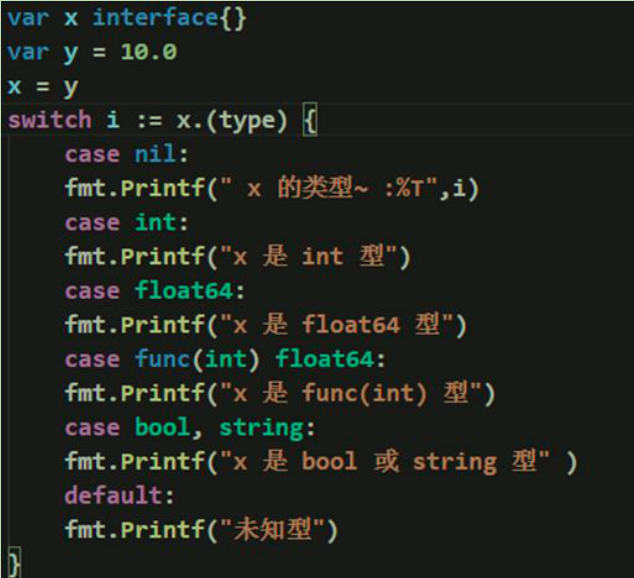

#### 	1.3.4 switch和if的比较

​		1）如果**判断的具体数值不多**，而且符合整数、浮点数、字符、字符串这几种类型。建议使用swtich语句，简洁高效。

​		2）其他情况：对区间判断和结果为bool类型的判断，使用if， **if 的使用范围更广**。

### 1.4 for循环控制

#### 1.4.1 基本介绍

基本的 `for` 循环由三部分组成，它们用分号隔开：

- 初始化语句：在第一次迭代前执行
- 条件表达式：在每次迭代前求值
- 后置语句：在每次迭代的结尾执行

初始化语句通常为一句短变量声明，该变量声明仅在 `for` 语句的作用域中可见。

一旦条件表达式的布尔值为 `false`，循环迭代就会终止。

#### 1.4.2 基本语法

```go
func main()  {
	for 初始化语句; 条件表达式; 后置语句 {
		语句块
	}
}
```

```go
func main()  {
	// for
	for i := 1; i <= 10; i++ {
		fmt.Println(i)
	}
}
```

#### 1.4.3 注意和细节

​	（1）**循环条件**返回的是一个**布尔值的表达式**

​	（2）初始化语句和后置语句可以省略

```go
func main() {
	sum := 1
	for ; sum < 1000; {
		sum += sum
	}
	fmt.Println(sum)
}
```

​	（3）while循环，通常配合break使用

```go
k := 1
for {  // 这里也等价 for ; ; { 
	if k <= 10 {
		fmt.Println("ok~~", k)
	} else {
		break //break就是跳出这个for循环
	}
	k++
}
```

​	（4）for-range 字符串遍历

```go
// 传统方式
var str string = "hello,world"
for i := 0; i < len(str); i++ {
	fmt.Printf("%c \n", str[i]) //使用到下标...
}
```

```go
//字符串遍历方式for-range
str = "abc~ok上海"
for index, val := range str {
	fmt.Printf("index=%d, val=%c \n", index, val)
}
//index=0, val=a 
//index=1, val=b 
//index=2, val=c 
//index=3, val=~ 
//index=4, val=o 
//index=5, val=k 
//index=6, val=上 
//index=9, val=海 
```

​	细节讨论：

​		如果字符串含有中文，那么传统方式遍历是**按照字节进行遍历**，而一个汉字在uft-8编码对应3个字节。

​		解决方案：将str转成[]rune切片

```go
var str string = "hello,world!北京"
str2 := []rune(str) // 就是把 str 转成 []rune
```

​		对应for-range是按照字符方式进行遍历的，**一个中文字符占三个字节**，有中文也是ok的

### 1.5 多重循环控制

#### 	1.5.1 基本介绍

​		（1）将一个循环放在另一个循环体内，就形成了嵌套循环。（一般使用两层，最多不要超过3层）

​		（2）实质上，嵌套循环就是把内层循环当成外层循环的循环体。当只有内层循环的循环条件为false时，才会完全跳出内层循环，才可结束外层的当次循环，开始下一次的循环。

​		（3）外层循环次数为m次，内层为n次，则内层循环体实际上需要执行m*n次

#### 	1.5.2 应用案例

```go
// 打印空心金字塔
/*
		*     
	 * *    
	*****   
	   分析：在我们给每行打印*号时，需要考虑是打印 * 还是打印 空格
	   我们的分析的结果是，每层的第一个和最后一个是打印*, 其它就应该是空的，即输出空格
	   我们还分析到一个例外情况，最后层（底层）是全部打*
*/
	var totalLevel int = 20
	//i 表示层数
	for i := 1; i <= totalLevel; i++ {
		//在打印*前先打印空格
		for k := 1; k <= totalLevel - i; k++ {
			fmt.Print(" ")
		}
		//j 表示每层打印多少*
		for j :=1; j <= 2 * i - 1; j++ {
			if j == 1 || j == 2 * i - 1 || i == totalLevel {
				fmt.Print("*")
			} else {
				fmt.Print(" ")
			}			
		}
		fmt.Println()
	}
```

### 1.6 跳出控制语句-break

#### 	1.6.1 基本介绍

​		break语句用于终止某个语句块的执行，用于中断当前for 循环或跳出switch 语句

#### 	1.6.2 案例

```go
var count int = 0
for {
  // 随机数种子 纳秒
	rand.Seed(time.Now().UnixNano())
	n := rand.Intn(100) + 1
	fmt.Println("n=", n)
	count++
	if (n == 99) {
		break //表示跳出for循环
	}
}
fmt.Println("生成 99 一共使用了 ", count)
```

#### 	1.6.3 break的标签label

​		在多层的嵌套语句中，break的标签，指明终止的是哪一次的循环

```go
// break跳出指定的for循环 lable2
// break默认跳出最近的for循环
func break_label() {
	label2:
	for i := 0; i < 4; i++ {
		for j := 0; j < 10; j++ {
			if j == 2 {
				break label2
			}
			fmt.Println("j = ", j)
		}
	}
}
```

### 1.7 跳转控制语句-continue

#### 	1.7.1 基本介绍

​		continue语句用于**结束本次循环**，继续执行下一次循环

​		continue语句出现在多层嵌套的循环语句体中时，**可以通过标签指明要跳过的是哪一层循环**，这个和前面的break标签的使用的规则一样

#### 	1.7.2 基本语法

```go
for j := 0; j < 10; j++ {
	if j == 2 {
		continue 
	}
	fmt.Println("j=", j) 
}
```

### 1.8 跳转控制语句-goto

#### 	1.8.1 基本介绍

​	（1） Go语言的goto 语句可以无条件地转移到程序中指定的行。

​	（2） goto 语句通常与条件语句配合使用。可用来实现条件转移，跳出循环体等功能。

​	（3）在Go程序设计中**一般不主张使用goto语句**，以免造成程序流程的混乱，使理解和调试程序都产生困难

#### 	1.8.2 基本语法

```go
// 跳转到标签位置处
func main() {
	for i := 1; i < 10; i++ {
		if i == 3 {
			goto label
		}
		fmt.Println("i 是", i)
	}
	label:
		fmt.Println("goto跳转")
}
// i 是 1
// i 是 2
// goto跳转
```

### 1.9 跳转控制语句

#### 	1.9.1 基本介绍

​		return使用在方法或者函数中，表示跳出所在的方法或函数。

#### 	1.9.2 基本语法

```go
func main() {
  n := 2
  if n == 2 {
    return
  }
}
```

## 2. 函数

### 2.1 函数基本语法

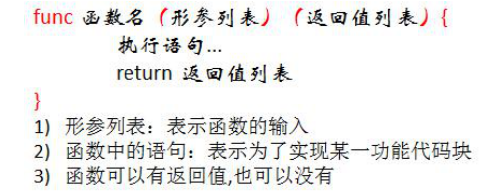

### 2.2 包的原理

​	包的本质就是创建不同的文件来存放程序文件

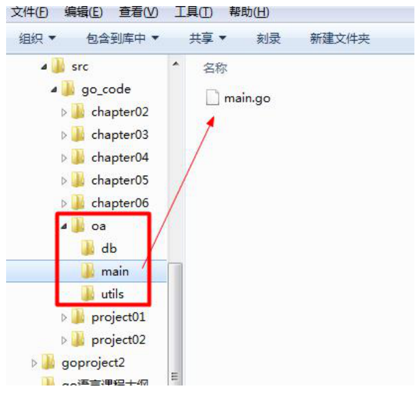

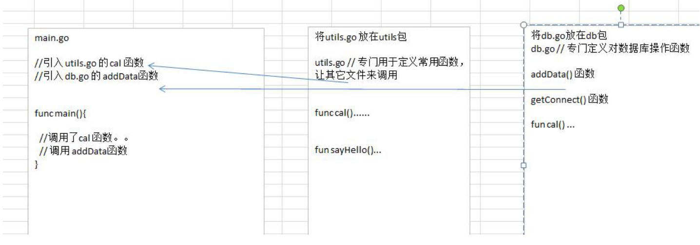

### 2.3 包的基本概念

​	go的每一个文件都属于一个包，也就是说go是以包的形式来管理文件和项目目录结构的。

### 2.4 包的三大作用

​	（1）区分相同名字的函数、变量等标识符

​	（2）当程序文件很多时，可以很好的管理项目

​	（3）控制函数、变量等访问范围，即作用域

### 2.5 包的使用

​	我们将funcCal定义到文件utils.go，将utils.go放到一个包中，当其它文件需要使用到utils.go的方法时，可以import该包，就可以使用了

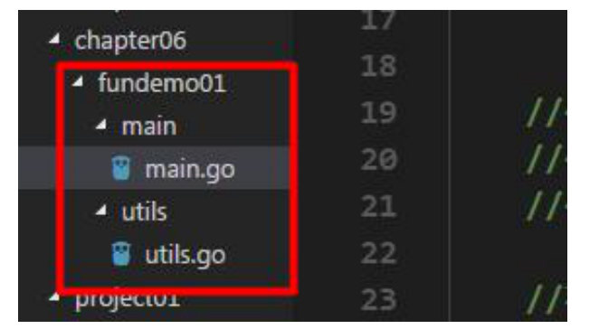

utils.go

```go
package utils 
import (
	"fmt"
)

var Num1 int = 300
//将计算的功能，放到一个函数中，然后在需要使用，调用即可
//为了让其它包的文件使用Cal函数，需要将C大写类似其它语言的public
func Cal(n1 float64, n2 float64, operator byte) float64 {

	var res float64
	switch operator {
		case '+':
			res = n1 + n2
		case '-':
			res = n1 - n2
		case '*':
			res = n1 * n2
		case '/':
			res = n1 / n2
		default:
			fmt.Println("操作符号错误...")
	}
	return res
}
```

main.go

```go
package main
import (
	"fmt"
	"go_code/chapter06/fundemo01/utils" // 导入包
)

func main() {
	fmt.Println("utils.go Num~=", utils.Num1)
	var n1 float64 = 1.2
	var n2 float64 = 2.3
	var operator byte = '+'
	result := utils.Cal(n1, n2 , operator) 
	fmt.Println("result~=", result)
}
```

### 2.6 包的使用细节

（1）在给一个文件打包时，该包对应一个文件夹，比如这里的utils 文件夹对应的包名就是utils，**文件的包名通常和文件所在的文件夹名一致**，一般为小写字母。

（2）当一个文件要使用其它包函数或变量时，需要先引入对应的包
	引入方式 1： import "包名"
	引入方式2：
		import （
			"包名"
			"包名"
		）

​		package 指令在文件第一行，然后是import 指令。

​		在import 包时，路径从$GOPATH的src 下开始，不用带src，编译器会自动从src下开始引入

（3）为了让其它包的文件，可以访问到本包的函数，则该函数名的首字母需要大写，类似其它语言的public，这样才能跨包访问

（4）如果给包取了别名，则需要使用别名来访问该包的函数和变量。取别名后原来的包名不可用

```go
import (
	"fmt"
	util "go_code/chapter06/fundemo01/utils"
)
```

（5）在**同属于一个包下的多个文件**，不能有相同的函数名（也不能有相同的全局变量名），否则报重复定义

（6）如果你要编译成一个可执行程序文件，就需要将这个包声明为main， 即package main 。这个就是一个语法规范，如果你是写一个库，包名可以自定义。只有package main的文件才可以编译和执行，且只用编译main目录即可

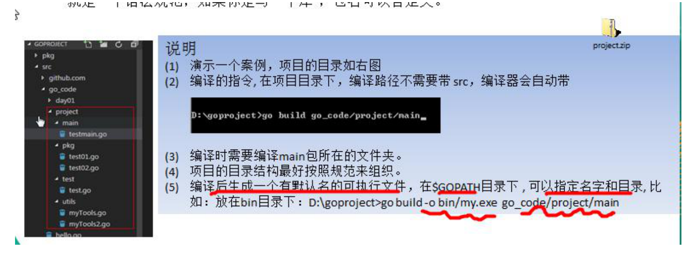

### 2.7 函数调用机制

#### 	2.7.1 调用过程

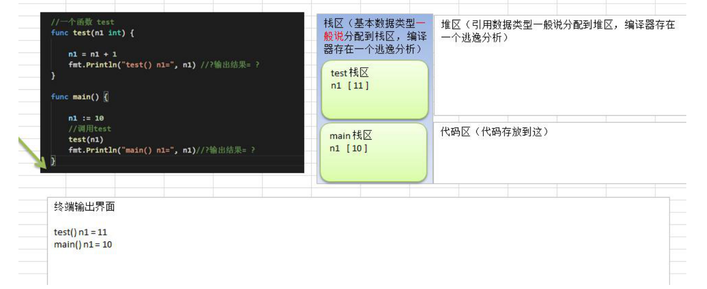

​	（1）在调用一个函数时，会给该函数分配一个新的空间，编译器会通过自身的处理让这个新的空间和其它的栈的空间区分开来

​	（2）在每个函数对应的栈中，数据空间是独立的，不会混淆

​	（3）当一个函数调用完毕（执行完毕）后，程序会销毁这个函数对应的栈空间。

#### 	2.7.2 return


​	（1）如果返回多个值时，在接收时，希望忽略某个返回值，则使用_符号表示占位忽略

​	（2）如果返回值只有一个，（返回值类型列表）可以不写（）

```go
//请编写要给函数，可以计算两个数的和和差，并返回结果
func getSumAndSub(n1 int, n2 int) (sum, sub int) {
	sum = n1 + n2
	sub = n1 - n2
	return
}
```

### 2.8 递归函数

​	一个函数在**函数体内调用了本身**，称为递归函数

```go
func test(n int) {
	if n > 2 {
		n--
		test(n)
	}
	fmt.Println("n=", n)
}
```

​	函数递归需要遵守的重要原则：+

​	1）执行一个函数时，就创建一个新的受保护的独立空间（新函数栈）
​	2）函数的局部变量是独立的，不会相互影响
​	3）**递归必须向退出递归的条件逼近**，否则就是无限递归，死归了：）
​	4）当一个函数执行完毕，或者遇到return，就会返回，遵守谁调用，就将结果返回给谁，同时当函数执行完毕或者返回时，该函数本身也会被系统销毁。

```go
// 菲波那契
func fei(n int) int {
  if n == 1 || n == 2{
    return 1
  } else {
    return fei(n-1) + fei(n-2) 
  }
}
```

### 2.9 函数使用的注意事项和细节讨论

​	1）函数的形参列表可以是多个，返回值列表也可以是多个。

​	2）形参列表和返回值列表的数据类型可以是**值类型和引用类型**。

​	3）函数的命名遵循标识符命名规范，首字母不能是数字，首字母大写该函数可以被本包文件和其它包文件使用，类似public，首字母小写，只能被本包文件使用，其它包文件不能使用，类似privat

​	4）函数中的变量是局部的，函数外不生效

​	5）**基本数据类型**和**数组**都是值传递，即进行值拷贝。在函数内修改，不会影响到原来的值。

​			值类型：基本数据类型int 系列，float 系列，bool， string 、数组和结构体struct
​			引用类型：指针、slice 切片、map、管道chan、interface 等都是引用类型

​	6）如果**函数内的变量能修改函数外的变量**（默认是值传递的数据类型），可以传入变量的地址，函数内以指针的方式操作变量。**引用传递，地址拷贝效率较高**

```go
func main()  {
	num := 1
	qwer(&num)
	fmt.Println("num = ", num) // 10
}
func qwer(num *int) {
	*num = 10
}
```

​	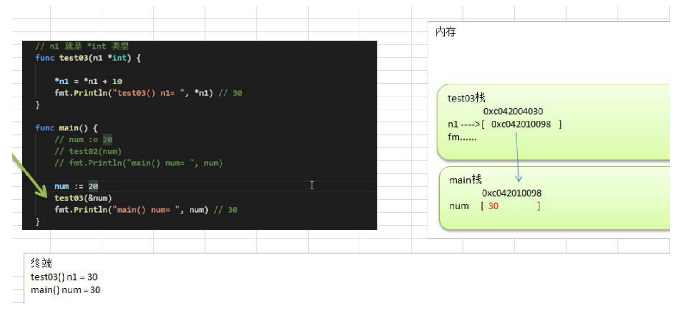

​	7）Go函数不支持函数重载

​	8）在Go中，**函数也是一种数据类型**，可以赋值给一个变量，则该变量就是一个函数类型的变量了。通过**该变量可以对函数调用**	

```go
// 函数数据类型
func(int, int) int
```

​	9）函数既然是一种数据类型，因此在Go中，函数可以作为形参，并且调用	

```go
func myFun(funvar func(int, int) int, num1 int, num2 int ) int {
	return funvar(num1, num2)
}

func main() {
	res2 := myFun(getSum, 50, 60)
}
```

​	10）支持自定义数据类型。相当于起了别名

​		基本语法：type 自定义数据类型名 数据类型

```go
// 示例1
func main() {
	type myInt int
	var num myInt
	var num2 int
	num = 40
	num2 = int(num)
  // num的类型不等于num2的类型
	fmt.Println("num = ", num)
	fmt.Println("num2 = ", num2)
}

// 示例2
func main() {
	res2 := muFun2(getSum, 20, 30)
	fmt.Println("res2 is", res2)
}
// 函数数据类型
type myFunType func(int, int) int
// 使用函数数据类型 简化写法
func muFun2(funvar myFunType, num1 int, num2 int) int {
	return funvar(num1, num2)
}
```

​	11）支持对返回值命名

```GO
func main() {
	sum, sub := cal(20, 10)
	fmt.Println("sum = ", sum, "sub = ", sub)
}

func cal(n1 int, n2 int) (sum int, sub int)  {
  // 不需要再创建sum 和 sub变量
	sum = n1 + n2
	sub = n1 - n2
	return
}
```

​	12）使用 _ 标识符，忽略返回值

​	13）支持可变参数。

​			**args是slice切片**；如果一个函数的形参列表中有可变参数，则**可变参数需要放到形参列表最后**

```go
//支持0到多个参数
func argsFun(args... int) (sum int) {
	// 遍历args args是切片类型
	sum = 0
	for i :=0; i < len(args); i++ {
		sum += args[i]
	}
	return 
}
func main() {
	res4 := argsFun(1,2,3)
	fmt.Println("res4 = ", res4)
}
```

### 2.10 init函数

​	类似python的_ _init _ _

​	（1）**被引入包的初始化**顺序大于本文件中**全局变量定义**

​	（2）**全局变量定义的执行顺序优先于init函数**

​	（3）**init函数优先于main函数的调用**

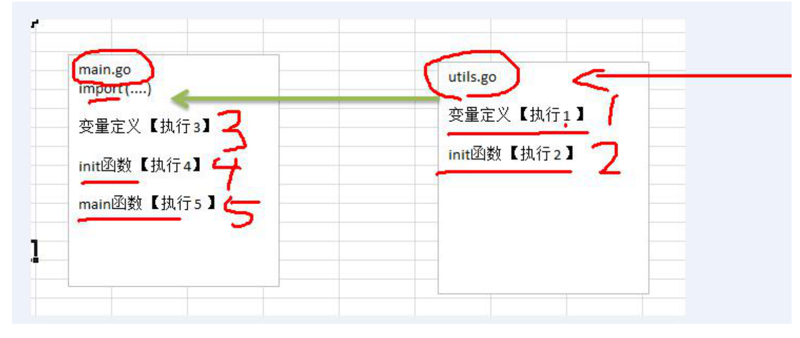

```go
package main
import (
	"fmt"
	"gocode/project_05/demo_function03/utils" // 会初始化init函数
)

var age = test()
//为了看到全局变量是先被初始化的，我们这里先写函数
func test() int {
	fmt.Println("test()") //1
	return 90
}

//init函数,通常可以在init函数中完成初始化工作
func init() {
	fmt.Println("init()...") //2
}

func main() {
	fmt.Println("main()...age=", age) //3
	fmt.Println("Age=", utils.Age, "Name=", utils.Name)
}
```

```go
// 执行结果
utils 的 init // 引入utils包的时候就会执行utils初始化函数
test()
init()...
main()...age= 90
Age= 10 Name= ty
```

### 2.11 匿名函数

​	匿名函数就是没有名字的函数

​	（1）只用一次，定义的时候就直接调用

​	（2）可多次调用

```go
func main()  {
	// 1.只用一次
	res := func (n1 int, n2 int) int { // 定义
		return n1 + n2
	}(10, 20) // 传入参数调用
	fmt.Println("n1 + n2 = ", res)
  
  // 2.将匿名函数赋给sub 多次调用
	sub := func (n1 int, n2 int) int {
		return n1 - n2
	}
	res2 := sub(10, 20)
	fmt.Println("n1 + n2 = ", res2)
}
```

```go
// 全局匿名函数 可在外部调用
var(
	Fun1 = func (n1 int, n2 int) int {
		return n1 * n2
	}
)
func main() {
  // 全局匿名函数的使用
	res := Fun1(4, 9)
	fmt.Println("res=", res)
}
```

### 2.12 闭包

闭包就是**一个函数**和与**其相关的引用环境**组合的一个整体

函数的返回值是一个函数，内部函数引用外部函数的变量

```go
// 闭包
func Addupper() func(int) int {
	n := 10
	return func (x int) int {
		n = n + x
		return n
	}
}

func main()  {
	a := Addupper()
	res := a(1)
	fmt.Println("res = ", res) // 11
	res2 := a(1)
	fmt.Println("res = ", res2) // 12
}
```

说明：

​	（1）Addupper是一个函数，返回的数据类型是 func(int) int函数，但是这个函数引用到函数外的n，因此这个匿名函数就和n形成一个整体，构成闭包。

​	（2）当我们反复调用a函数时，因为n只初始化一次，因此每次调用就进行累加。

strings. HasSuffix判断字符串后缀

```go
func main() {
	f := makeSuffix(".jpg")
	fmt.Println("文件名处理后", f("qwe"))
}

func makeSuffix(suffix string) func(string) string {
	return func (name string) string {
		// 判断name有没有suffix的后缀名
		if !strings.HasSuffix(name, suffix) {
			return name + suffix
		}
		return name
	}
}
```

### 2.10 defer

​	在函数中，程序员经常需要创建资源（比如：数据库连接、文件句柄、锁等），为了在函数执行完毕后，**及时的释放资源**，Go的设计者提供defer（延时机制）。

​	defer栈是先入后出，defer栈只存在当前的函数中

```go
func main()  {
	res := sum(10, 20)
	fmt.Println("res=", res) // 4
}

func sum(n1, n2 int) int {
  //当执行到defer时，暂时不执行，会将defer后面的语句压入到独立的栈(defer栈)
	//当函数执行完毕后，再从defer栈，按照先入后出的方式出栈，执行
	defer fmt.Println("ok1 n1=", n1) // 3
	defer fmt.Println("ok2 n2=", n2) // 2
	res := n1 + n2
	fmt.Println("ok3 res=", res) // 1
	return res
}
// ok3 res= 30
// ok2 n2= 20
// ok1 n1= 10
// res= 30
```

注意：

​	在defer将语句放入栈中，也会将**相关的值拷贝同时入栈**。不会影响到入栈的值。

说明：

​	1）在golang编程中的通常做法是，创建资源后，比如（打开了文件，获取了数据库的链接，或者是锁资源），可以执行

​			defer file.Close() defer connect.Close()

​	2）在defer后，可以继续使用创建资源

​	3）当函数完毕后，系统会依次从defer栈中，取出语句，关闭资源

​	4）这种机制，非常简洁，程序员不用再为在什么时机关闭资源而烦心

### 2.11 函数参数传递方式

#### 	2.11.1 基本介绍

​		值类型：基本数据类型（int、float、bool、string）、数组和结构体。**是值的拷贝**

​		引用类型：指针、切片、map、管道channel、interface。**是地址的拷贝**

​		一般来说，**地址拷贝效率高**，因为数据量小，而值拷贝取决于数据的大小，数据越大，效率越低

#### 	2.11.2 值传递和引用传递特点	

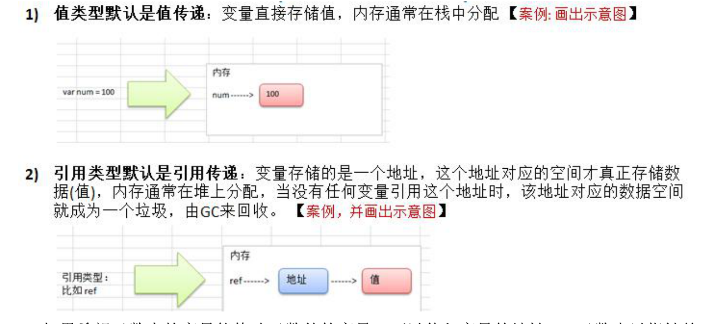	

​	3）如果希望函数内的变量能够修改函数外的变量，可以传入变量的地址&，函数内以指针的方式操作变量。


### 2.12 变量的作用域

1）函数内部声明/定义的变量叫**局部变量，作用域仅限于函数内部**

```go
func test() {
  // age和Name仅在test中使用
  age := 10
  Name := "tom"
}
```

2）函数外部声明/定义的变量叫**全局变量**，作用域在整个包都有效，如果其首字母为大写，则作用域在整个程序有效

```go
package main
//函数外部声明/定义的变量叫全局变量，
//作用域在整个包都有效，如果其首字母为大写，则作用域在整个程序有效
var age int = 50
var Name string = "jack"
```

3）如果变量是在一个代码块，比如for/if中，那么这个变量的的作用域就在该代码块

### 2.13 字符串函数

#### 	（1）长度

```go
import (
	"fmt"
	"strconv"
	"strings"
)

func main() {
	// 1.长度 一个汉字占三个字节
	str := "hello你好"
	fmt.Println("str len=", len(str)) // 11
  // 2.字符长度
  runeLength := utf8.RuneCountInString(str)
	fmt.Println(runeLength) // 7
}
```

#### 	（2）遍历

```go
func main() {
	// 2.按字符遍历 转成切片
  str := "hello你好"
  // rune处理中文，按字符遍历
	r := []rune(str)
  for i := 0; i < len(r); i++ { // len(r) >>> 7
		fmt.Printf("字符%c\n", r[i])
	}
}
```

#### 	（3）转换整数

```go
func main() {
	// 3.字符串转整形
	n, err := strconv.Atoi("123")
	if err != nil {
		fmt.Println("转换错误")
	} else {
		fmt.Println("转成的结果", n)
	}
}
```

#### 	（4）整数转字符串

```go
func main() {
	// 4.整数转字符串
	str = strconv.Itoa(1234)
	fmt.Printf("str=%v, str=%T\n", str, str)
}
```

#### 	（5）转byte

```go
func main() {
	// 5.字符串转byte 切片 （写入二进制文件时需要转换成bytes）
	var bytes = []byte("hello go")
	fmt.Printf("bytes=%v\n", bytes)
}
```

#### 	（6）byte转字符串

```go
func main() {
	// 6.byte转字符串
	str = string([]byte{97, 98, 99})
	fmt.Printf("str=%v\n", str) // a b c
}
```

#### 	（7）十进制转二、八、十六进制

```go
func main() {
	// 7.十进制转 2 8 16 返回字符串
	str = strconv.FormatInt(123, 2)
	fmt.Printf("123对应的二进制是=%v\n", str)
	str = strconv.FormatInt(123, 8)
	fmt.Printf("123对应的8进制是=%v\n", str)
	str = strconv.FormatInt(123, 16)
	fmt.Printf("123对应的16进制是=%v\n", str)
}
```

#### 	（8）查找包含字符串

```go
func main() {
	// 8.查找子串是否在指定的字符串中 返回布尔值
	b := strings.Contains("seafood", "food")
	fmt.Printf("b=%v\n", b) // ture false
}
```

#### 	（9）计数

```go
func main() {
	// 9.统计字符串中有几个指定字符串
	num := strings.Count("chinese", "e")
  fmt.Printf("num=%v\n", num)
}
```

#### 	（10）字符串比较

```go
func main() {
	// 10.字符串比较 不区分大小写 ==比较是区分大小写的
	b = strings.EqualFold("abc", "Abc")
	fmt.Printf("b=%v\n", b)
}
```

#### 	（11）返回index

```go
func main() {
	// 11.返回子串在字符串中第一次出现的index 不存在返回-1
	index := strings.Index("NTL_abc", "bc")
	fmt.Printf("index=%v\n", index) // 5
}
```

#### 	（12）返回最后的index

```go
func main() {
	// 12.得到最后一次的index
	last_index := strings.LastIndex("go golang", "go")
	fmt.Printf("last_index=%v\n", last_index) // 3
}
```

#### 	（13）字符串替换

```go
func main() {
	// 13.指定替换字符串 n=-1表示全部替换 n>=1表示从左到右替换n个
  // str oldStr newStr 替换个数，得到一个新字符串
	str = strings.Replace("go python", "python", "golang", -1)
	fmt.Printf("str=%v\n", str) // go golang
}
```

#### 	（14）字符串分割

```go
func main() {
	// 14.按照某个字符分割 返回数组
	strArr := strings.Split("hello,world,ok", ",")
	fmt.Printf("strArr=%v\n", strArr)
	for i := 0; i < len(strArr); i++ {
		fmt.Printf("str[%v]=%v\n", i, strArr[i])
	}
}
```

#### 	（15）大小写转换

```go
func main() {
	// 15.字符串大小写转换
	str = "goLang Hello"
	lower_str := strings.ToLower(str)
	fmt.Printf("lower_str=%v\n", lower_str)
	upper_str := strings.ToUpper(str)
	fmt.Printf("uper_str=%v\n", uper_str)
}
```

#### 	（16）去掉字符两边空格

```go
func main() {
	// 16.去掉两边空格
	str = strings.TrimSpace(" hello world   ")
	fmt.Printf("str=%v\n", str)
  fmt.Printf("str=%q\n", str)
}
```

#### 	（17）指定去掉两个字符

```go
func main() {
	// 17.去掉两边指定字符串 同时去掉空格 斜杠 感叹号
	str = strings.Trim("/ hello /!", " !/h")
	fmt.Printf("str=%v\n", str) // ello
}
```

#### 	（18）去掉左边字符

```go
func main() {
	// 18.去掉左边
	str = strings.TrimLeft("/ hello /!", " !/")
	fmt.Printf("str=%v\n", str)
}
```

#### 	（19）去掉右边字符

```go
func main() {
	// 19.去掉右边
	str = strings.TrimRight("/ hello /!", " !/")
  fmt.Printf("str=%v\n", str)
}
```

#### 	（20）判断字符串以什么开头

```go
func main() {
	// 20.判断字符串是否以什么开头 返回布尔值
	b = strings.HasPrefix("ftp://192.168.0.100", "ftp")
	fmt.Printf("b=%v\n", b)
}
```

#### 	（21）判断字符串以什么结尾

```go
func main() {
	// 21.判断字符串是否以什么结尾 返回布尔值
	b = strings.HasSuffix("ftp://192.168.0.100", "100")
	fmt.Printf("b=%v\n", b)
}
```

#### （22）字符串拼接

```go
// 1.+号 效率低 不建议
// 2.效率高一些
dataList := []string{"hello", "world"}
result := strings.Join(dataList, " ")
fmt.Println(result) // hello world

// 3.效率更高一些 go 1.10之前建议使用
var buffer bytes.Buffer
buffer.WriteString("hello")
buffer.WriteString(" world")
data := buffer.String()
fmt.Println(data)

// 4.效率更更高 go 1.10之后建议使用
var builder strings.Builder
builder.WriteString("hello")
builder.WriteString(" world")
value := builder.String()
fmt.Println(value)
```

#### （23）字符串转为reader

```go
func main() {
	reader := strings.NewReader("hello world\nxiaoming")
	scanner := bufio.NewScanner(reader)
	//scanner.Split(split)
	for scanner.Scan() {
		fmt.Println(scanner.Text())
	}
}
// hello world
// xiaoming
```

#### （24）字符串空白分割

​	返回将字符串按照空白（unicode.IsSpace确定，可以是一到多个连续的空白字符）分割的多个字符串。如果字符串全部是空白或者是空字符串的话，会返回空切片。

```go
fmt.Printf("Fields are: %q", strings.Fields("  foo bar  baz   "))
// ["foo" "bar" "baz"]
```

### 2.14 时间函数

#### 	（1）获取当前时间

```go
import (
	"fmt"
	"time"
)

func main() {
	// 1.获取当前时间 返回结构体
	now := time.Now()
	fmt.Printf("now=%v, now type=%T\n", now, now)
  // now=2021-01-27 23:35:36.104123 +0800 CST m=+0.000095837 now type=time.Time
}
```

#### 	（2）获取年月日时分秒

```go
func main() {
  now := time.Now()
	// 2.通过now 获取年月日时分秒
	fmt.Printf("年=%v\n", now.Year()) // 年=2021
	fmt.Printf("月=%v\n", now.Month()) // 月=January
	fmt.Printf("月=%v\n", int(now.Month())) // 月=1
	fmt.Printf("日=%v\n", now.Day()) // 日=27
	fmt.Printf("时=%v\n", now.Hour()) // 时=23
	fmt.Printf("分=%v\n", now.Minute()) // 分=42
	fmt.Printf("秒=%v\n", now.Second()) // 秒=20 type=int
}
```

#### 	（3）格式化日期时间方式一

```go
func main() {
  now := time.Now()
	// 3.格式化日期时间  Sprintf将转换的赋值给字符串 Printf直接输出
  fmt.Printf("当前年月日 %d-%d-%d %d:%d:%d \n", now.Year(), 
	now.Month(), now.Day(), now.Hour(), now.Minute(), now.Second())
  
	dataStr := fmt.Sprintf("当前年月日时分秒 %02d-%02d-%02d %02d:%02d:%02d",
		now.Year(), now.Month(), now.Day(), now.Hour(), now.Minute(), now.Second())
	fmt.Println(dataStr) // 当前年月日时分秒 2021-1-27 23:42:20 
}
```

#### 	（4）格式化日期时间方式二

```go
func main() {
  now := time.Now()
	// 4.格式化日期时间的第二种方式 数字不能修改
	dataStr = fmt.Sprintf(now.Format("2006-01-02 15:04:05"))
	fmt.Println(dataStr) // 2021-01-27 23:42:20
	fmt.Printf("年月日 %v\n", now.Format("2006-01-02")) // 2021-01-27
	fmt.Printf("时分秒 %v\n", now.Format("15:04:05")) // 23:42:20
}
```

#### 	（5）sleep

​				const(
​							Nanosecond Duration=1//纳秒
​							Microsecond = 1000 * Nanosecond //微秒
​							Millisecond = 1000 * Microsecond //毫秒
​							Second = 1000 * Millisecond //秒
​							Minute = 60 * Second //分钟
​							Hour = 60 * Minute//小时
​				)

```go
func main() {
	// 5.时间常量 结合sleep
	time.Sleep(time.Second) //休眠1秒
	for i := 0; i <= 2; i++ {
		// 0.1秒 100毫秒
		time.Sleep(time.Millisecond * 100)
		fmt.Println(i)
	}
}
```

#### 	（6）随机数种子

```go
func main() {
  now := time.Now()
	// 6.当前时间戳 Unix秒数和纳秒 作用是获取随机数字的种子
	fmt.Printf("Unix秒数=%v Unixnano时间戳=%v\n", now.Unix(), now.UnixNano())
  // unix时间戳=1611762140 unixnano时间戳=1611762140903658000
}
```

### 2.15 内置函数

#### 	（1）len()

​				用来求长度，比如string、 array、slice、map、channel

#### 	（2）new()

​				用来分配内存，主要用来分配**值类型**，比如int、float32，struct 返回的是指针

​				分配一个空存储数值，再分配一个空间存储数值的地址，返回的是地址

​		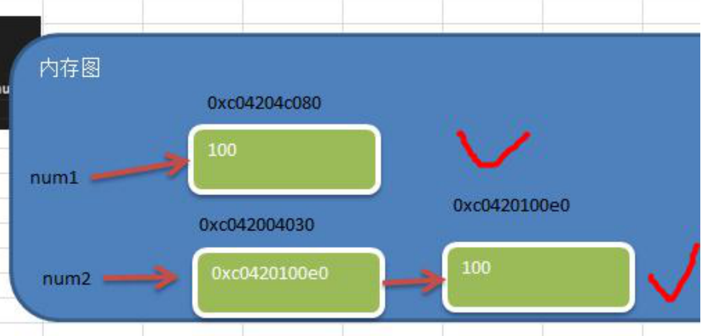

```go
func main() {
  // 2.new() 返回的是指针 返回的是指向的值的地址
	num1 := 100
	fmt.Printf("num1的类型%T, num1的值=%v, num1的地址=%v\n", num1, num1, &num1)
	num2 := new(int) //指针类型 值是个地址 地址  默认指向的值是0
	fmt.Printf("num2的类型%T, num2的值=%v, num2的地址=%v, 指向的值=%v\n", num2, num2, &num2, *num2)
  //num2的类型%T => *int
	//num2的值 = 地址 0xc04204c098 （这个地址是系统分配）
	//num2的地址%v = 地址 0xc04206a020  (这个地址是系统分配)
	//num2指向的值 = 0
  *num2 = 200
}
```

#### 	（3）make()

​				用来分配内存，主要用来分配**引用类型**，比如 channel、map、slice。

### 2.16 错误处理

### 2.16.1 捕获异常

​	**defer+recover**

```go
func main()  {
	test()
	fmt.Println("test")
}

func test()  {
	// defer和recover处理异常
	defer func() {
		// recover可以捕获异常
    // 写法1
		err := recover()
		if err != nil {
			fmt.Println("错误是", err)
		}
    // 写法2
		if err := recover(); err != nil {
			fmt.Println("错误是", err)
		}
	}() // 匿名函数
	num1 := 10
	num2 := 0
	fmt.Println("num1/num2=", num1/num2)
}
// 错误是 runtime error: integer divide by zero
// test
```

#### 2.16.2 抛出异常

​	panic接收error类型的变量，输出错误信息，并退出程序

```go
func readConf(name string) (err error) {
	// 自定义错误信息 类似python的raise
	// errors.New() 和 panic
	// 读取配置文件信息init.conf信息
	if name == "init.conf" {
		// 读取。。。
		return nil
	} else {
		// 返回自定义错误
		return errors.New("panic 读取文件错误！！！")
	}
}

func test02()  {
	err := readConf("init.conf")
	if err != nil {
		// panic抛出异常 并终止函数
		panic(err)
	}
	fmt.Println("test02继续执行")
}
```


