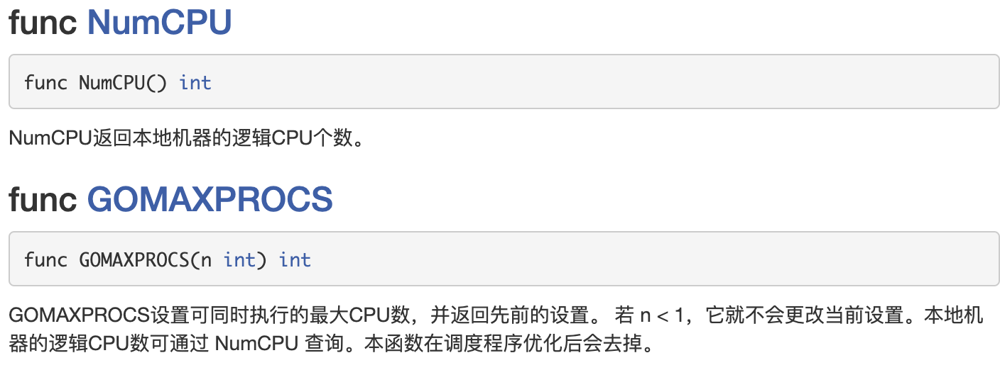

# Golang基础五

## 1. goroutine

### 1.1 进程和线程

1）进程就是程序在操作系统中的一次执行过程，是**系统进行资源分配和调度的基本单位**

2）线程是进程的一个执行实例，是**程序执行的最小单元**，它是比进程更小的能独立运行的基本单位，是**cpu调度的最小单位**

3）一个进程可以创建核销毁多个线程，同一个进程中的多个线程可以**并发执行**

4）一个程序至少有一个进程，一个进程至少有一个线程

5）进程的状态：初始化、就绪态、运行态、挂起态和终止态

进程、线程、协程

稳定性强（追求稳定性）、节省资源（节省系统资源）、效率高（提高程序的利用率，大量时间访问网络 ）

### 1.2 并发和并行

1）多线程程序在**单核**上运行，就是并发

2）多线程程序在**多核**上运行，利用计算机的多核，就是并行


并发：

​	因为是在一个cpu上，比如有10个线程，每个线程执行10毫秒（进行轮询操作），从人的角度看，好像这10个线程都在运行，但是从微观上看，**在某一个时间点看，其实只有一个线程在执行**，这就是并发

并行：

​	因为是在多个cpu上（比如有10个cpu），比如有10个线程，每个线程执行10毫秒（各自在不同cpu上执行），从人的角度看，这10个线程都在运行，但是从微观上看，**在某一个时间点看，也同时有10个线程在执行**，这就是并行

### 1.3 Go协程和Go主线程

Go主线程（有程序员直接称为线程/也可以理解成进程）：

一个Go线程上，可以**起多个协程**，你可以这样理解，协程是轻量级的线程【编译器做优化】。

#### 1.3.1 Go协程的特点

1）有独立的栈空间

2）共享程序堆空间

3）调度由用户控制

4）协程是轻量级的线程

5）主goroutine退出，那么子goroutine也会退出


#### 1.3.2 案例

在主线程(可以理解成进程)中，开启一个goroutine, 该协程每隔1秒输出 "hello,world"
在主线程中也每隔一秒输出"hello,golang", 输出10次后，退出程序
要求主线程和goroutine同时执行

```go
func test() {
	for i := 1; i <= 10; i++ {
		fmt.Println("hello world" + strconv.Itoa(i))
		time.Sleep(time.Second)
	}
}

func main() {
	go test() // 开启协程
	// 主函数和test一起执行 
	for i := 1; i <= 10; i++ {
		fmt.Println("main hello world" + strconv.Itoa(i))
		time.Sleep(time.Second)
	}
}
// hello world8
// main hello world8
// hello world9
// main hello world9
// main hello world10
// hello world10
```

主线程和协程执行图


#### 1.3.3 案例小结

1）主线程是一个物理线程，直接作用在cpu上的。是重量级的，非常耗费cpu资源。

2）协程从主线程开启的，是轻量级的线程，是逻辑态，**在应用层上执行**。对资源消耗相对小。

3） Golang的协程机制是重要的特点，可以轻松的**开启上万个协程**。其它编程语言的并发机制是一般基于线程的，开启过多的线程，资源耗费大，这里就突显Golang在并发上的优势了

### 1.4 goroutine的调度模式

#### 1.4.1 MPG模式

（1）M：Machine 操作系统的主线程

（2）P：Processor 上下文环境（运行时所需要的资源、内存、状态等）

（3）G：Goroutine 协程

M主线程可以执行在一个cpu上，也可以执行在多个cpu上；当有一个G阻塞时，会来回切换其他的G协程去执行，充分利用cpu的资源

### 1.5 runtime 

#### 1.5.1 设置Golang运行的cpu数



```go
func main()  {
	cpuNum := runtime.NumCPU()
	fmt.Println("cpu num >>>", cpuNum) // 12
	// 可以自己设置使用的cpu核数
	runtime.GOMAXPROCS(cpuNum - 2)
	fmt.Println("ok")
}
```

#### 1.5.2 出让当前go程所占用的cpu时间片

Gosched

go程能获取大量的cpu占用时间，main则获得较少的机会。cpu是随机调度的。

当再次获得cpu时，从出让位置继续回复执行。

```go
func main() {
	go func() {
		for {
			fmt.Println("this is goroutine test")
			//time.Sleep(100*time.Microsecond)
		}
	}()

	for {
		runtime.Gosched() // 出让当前cpu时间片
		fmt.Println("this is a main")
		//time.Sleep(100*time.Microsecond)
	}
}
```

#### 1.5.3 退出goroutine

Goexit 结束调用该函数的**当前go程**，Goexit之前注册的defer都生效。

return 返回当前函数调用到调用者那里去，return之前的defer注册生效。

```go
func test() {
	defer fmt.Println("ccccccccccc")
	runtime.Goexit() // 退出go程
	fmt.Println("ddddddddd")
}

func main() {
	go func() {
		fmt.Println("aaaaaaaaaaa")
		test()
		fmt.Println("ddddddddddd")
	}()
	// 不想主go程结束 保证子go程执行
	for {
		;
	}
}
// aaaaaaaaaaa
// ccccccccccc
```

## 2. channel

### 2.1 案例

需求：现在要计算 1-200 的各个数的阶乘，并且把各个数的阶乘放入到map中。最后显示出来。要求使用goroutine完成

```go
// 1. 编写一个函数，来计算各个数的阶乘，并放入到 map中.
// 2. 我们启动的协程多个，统计的将结果放入到 map中
// 3. map 应该做出一个全局的.
var (
	myMap = make(map[int]int, 10)
)

// 计算n的阶乘 并将结果放入到map中
func test1(n int) {
	res := 1
	for i := 1; i <= n; i++ {
		res *= i
	}
	// 将res放入myMap中
	myMap[n] = res
}

func main() {
	// 开启多个协程
	for i := 1; i <= 200; i++ {
		go test1(i)
	}
  time.Sleep(time.Second * 10)
	// 输出结果
	for i, v := range myMap {
		fmt.Printf("map[%v]=%v\n", i, v)
	}
}
```

**问题：**执行时会报错 fatal error: concurrent map writes 原因是多个test1协程，同一时刻操作map空间进行写入操作


### 2.2 sync

#### package sync

```
import "sync"
```

sync包提供了基本的同步基元，如互斥锁。除了Once和WaitGroup类型，**大部分都是适用于低水平程序线程，高水平的同步使用channel通信更好一些。**


**使用全局变量加锁同步优化**

```go
var (
	myMap = make(map[int]int, 10)
	// 声明一个全局的互斥锁
	// Mutex : 是互斥
	lock sync.Mutex
)

// 计算n的阶乘 并将结果放入到map中
func test1(n int) {
	res := 1
	for i := 1; i <= n; i++ {
		res *= i
	}
	// 将res放入myMap中
	lock.Lock() //  加锁
	myMap[n] = res
	lock.Unlock() // 解锁
}

func main() {
	// 开启多个协程
	for i := 1; i <= 20; i++ {
		// 报错 fatal error: concurrent map writes 同一时刻操作map空间进行写入操作
		go test1(i)
	}
	time.Sleep(time.Second * 10)
	// 输出结果
	lock.Lock() // 读的时候加锁
	for i, v := range myMap {
		fmt.Printf("map[%v]=%v\n", i, v)
	}
	lock.Unlock()
}
```

### 2.3 不同goroutine协程通信方式

（1）全局变量的互斥锁 sync.Mutex.lock/unlock

（2）使用管道channel

### 2.4 为什么需要使用channel

1）前面使用全局变量加锁同步来解决goroutine的通讯，但不完美

2）主线程在等待所有goroutine全部完成的时间很难确定，我们这里设置10秒，仅仅是估算。

3）如果主线程休眠时间长了，会加长等待时间，如果等待时间短了，可能还有goroutine处于工作状态，这时也会随主线程的退出而销毁

4）通过全局变量加锁同步来实现通讯，也并不利用多个协程对全局变量的读写操作。

5）上面种种分析都在呼唤一个新的通讯机制-channel

### 2.5 管道channel基本介绍

1） channle本质就是一个数据结构-队列


2）管道的数据是**先进先出**【FIFO： first in first out】**栈：先进后出**

3）线程安全，多goroutine访问时，**无需加锁**，底层是用锁的机制维护的，就是说channel本身就是线程安全的

4） **channel是有类型的**，一个string的channel只能存放string类型数据。

5）channel主要用来解决go程的同步问题以及协程之间的数据共享问题。

6）goroutine奉行**通过通信来共享内存，而不是共享内存来通信**。

### 2.6 定义/声明channel

var 管道名 chan 数据类型

```go
var intChan chan int
var mapChan chan map[int]string
var perChan Person
```

说明：

**channel是引用类型，需要make进行初始化**

容量=0 无缓冲channel

容量>0 有缓冲channel

```go
// 全局定义channel 用来完成数据同步操作
var channel = make(chan int)

// 定义一台打印机
func printer(s string) {
	for _, ch := range s{
		fmt.Printf("%c", ch) // 共享资源屏幕 stdout
		time.Sleep(time.Millisecond * 300)
	}
}

// 定义2个人使用打印机
func person1() {
	printer("hello")
	channel <- 8
}

func person2() {
	_ = <- channel // 阻塞等待管道写入数据
	printer("world")
}

func main() {
	go person1()
	go person2()
	for {
		;
	}
}
```

len：管道未读取完的数据

cap：管道的容量

```go
func main() {
	// 演示管道的使用
	var intChan chan int
	intChan = make(chan int, 3)
	fmt.Println("intChan>>>", intChan)
	// intChan>>> 0xc000102000
	fmt.Printf("intChan本身的地址%p\n", &intChan)
	// intChan本身的地址0xc0000ae018

	// 向管道写入数据
	intChan <- 10
	num := 20
	intChan <- num
	// 管道的长度和容量 管道不可以扩容 写入超过容量的数据库会报错
	fmt.Printf("len=%v cap=%v\n", len(intChan), cap(intChan))
	// len=2 cap=3

	// 从管道取出数据 如果管道没数据 取出时会报错deadlock
	n1 := <-intChan
	fmt.Println("n1 >>> ", n1) // 10
	fmt.Printf("len=%v cap=%v\n", len(intChan), cap(intChan))
	// len=1 cap=3
}
```

### 2.7 channel使用注意事项

1） channel中只能存放指定的数据类型

2） channle的数据放满后，就不能再放入了，不能动态扩容

3）如果从channel取出数据后，可以继续放入

4）**在没有使用协程的情况下**，如果channel数据取完了，再取，就会报dead lock死锁

5） 写端：如果没有读端在读，写端阻塞；读端：没有写端在写，读端阻塞。

```go
func main()  {
	// 定义一个可以存放任意类型的管道
	//var allChan chan interface{}
	allChan := make(chan interface{}, 3)
	allChan <- 10
	allChan <- "tangyu"
	cat := Cat{"汤姆猫", 4}
	allChan <- cat
	<-allChan
	<-allChan
	// 获取对列第三个 要先将前2个推出
	newCat := <-allChan
	fmt.Printf("newCat=%T, newCat=%v\n", newCat, newCat)
  // newCat=main.Cat, newCat={汤姆猫 4}
	a := newCat.(Cat) // 类型断言 因为从interface的channel取出的值认为是空接口类型 需要类型断言进行转换
	fmt.Printf("newCat.Name=%v\n", a.Name)
	// newCat.Name=汤姆猫
}
```

补充知识点：

每当有一个进程启动时，系统会自动打开三个文件：标准输入（stdin）、标准输出（stdout）、标准错误（stderr）

当进程运行结束，操作系统自动关闭。

### 2.8 channel的遍历和关闭

#### 2.8.1 channel的关闭

使用内置的close函数可以关闭channel，当channel**关闭后**，就**不能在向channel写数据了**，但是仍然**可以读出该channel的数据**

```go
func main() {
	intChan := make(chan int, 10)
	intChan <- 10
	intChan <- 100
	close(intChan)
	// close后不能再写入数据到channel
	intChan <- 200
	// 报错 panic: send on closed channel
}
```

#### 2.8.2 channel的遍历

1）在遍历时，如果channel没有关闭，则回出现**deadlock的错误**
2）在遍历时，如果channel已经关闭，则会正常遍历数据，遍历完后，就会退出遍历

```go
func main() {
	intChan2 := make(chan int, 100)
	for i := 0; i < 100; i++ {
		intChan2 <- i * 2
	}
	close(intChan2)
	// 遍历管道时不能用for循环 要用range
	for v := range intChan2 {
		fmt.Println("v=", v)
	}
}
```

### 2.9 channel的数据传递

```go
func main(){
	ch := make(chan bool)
	go func() {
		for i :=0; i < 2; i ++ {
			fmt.Println("i = ", i)
		}
		// 通知主go 打印完毕
		ch <- true
	}()
	// 阻塞等待管道写入
	_ = <- ch
	fmt.Println("over")
}
```

## 3. goroutine和channel

### 3.1 应用案例一

开启一个writeData协程，向管道intChan中写入50个整数
开启一个readData协程，从管道intChan中读取writeData写入的数据
注意：writeData和readDate操作的是同一个管道
主线程需要等待writeData和readDate协程都完成工作才能退出


```go
func writeData(intChan chan int)  {
	for i:=1; i <= 50 ; i++{
		// 写入数据
		intChan <- i
	}
	close(intChan) // 关闭管道
}

func readData(intChan chan int, exitChan chan bool)  {
	for {
    // 读取不到数据库 会阻塞
		v, ok:=<-intChan
		// ok 为false时管道无数据
		if !ok {
			break
		}
		fmt.Println("读取到数据 >>> ", v)
	}
	// 读取完数据 任务完成
	exitChan <- true
	close(exitChan)
}

func main()  {
	// 创建两个管道
	intChan := make(chan int, 50)
	exitChan := make(chan bool, 1)
	go writeData(intChan)
	go readData(intChan, exitChan)
	for {
		_, ok := <-exitChan
		fmt.Println("ok>>>", ok)
		if !ok {
			break
		}
	}
}
```

### 3.2 阻塞

协程写的快读的慢会，写的时候会阻塞，不会报deadlock，但是如果编译器发现只有写没有读取数据的协程，编译器阻塞后会报错deadlock

读写协程的频率不一致，不会发生死锁

### 3.3 求素数


```go
func putNum(intChan chan int) {
	for i := 0; i < 1000; i++ {
		intChan <- i
	}
	close(intChan)
	fmt.Println("put over!!!")
}

func primeNum(intChan chan int, primeChan chan int, exitChan chan bool)  {
	var flag bool
	for {
		num, ok := <-intChan
		if !ok {
			break // 取不到数据退出
		}
		flag = true
		// 判断素数
		for i :=2 ; i < num; i++ {
			if num % i == 0 {
				// 不是素数
				flag = false
				break
			}
		}
		if flag {
			// 是素数 方式到primeChan
			primeChan <- num
		}
	}
	fmt.Println("有一个primeNum 协程因为取不到数据，退出")
	// 这里我们还不能关闭 primeChan
	// 向 exitChan 写入true
	exitChan<- true
}

func main() {
	intChan := make(chan int, 1000)
	primeChan := make(chan int, 2000) // 放入素数结果
	// 标识管道退出
	exitChan := make(chan bool, 4)

	// 放入数字
	go putNum(intChan)
	// 开启4个协程 判断是否为素数 如果是就放入到primeChan
	for i := 0; i < 4; i ++ {
		go primeNum(intChan, primeChan, exitChan)
	}
	go func() {
		for i := 0; i < 4; i ++ {
      // 不是range遍历 可以不用close管道
			<-exitChan
		}
		// 4个线程结束后 素数取完 关闭管道
		close(primeChan)
	}()
	for {
		res, ok := <- primeChan
		// primeChan管道关闭 ，素数判断完成
		if !ok{
			break
		}
		fmt.Printf("素数=%d\n", res)
	}
	fmt.Println("main线程退出")
}
```

注：使用range遍历管道时要使用close关闭数组，不然会包deadlock错误

### 3.4 channel使用细节

（1）channel可以只声明为只读或者只写

```go
func main() {
	// 默认情况下 管道是双向的 可读可写
	// 1.声明为只写
	var chan1 chan<- int
	chan1 = make(chan int, 3)
	chan1 <- 10

	// 2.声明为只读
	var chan2 <-chan int
}
```


（2）使用select可以解决管道读取数据的阻塞问题

```go
func main() {
	// 使用select解决管道取数据的阻塞问题
	intChan := make(chan int, 10)
	for i := 0; i < 10; i++ {
		intChan <- i
	}

	stringChan := make(chan string, 5)
	for i := 0; i < 10; i++ {
		stringChan <- "hello" + fmt.Sprintf("%d", i)
	}

	// 传统方式在遍历管道时 如果不关闭就会阻塞而导致deadlock
	// 在实际开发中 不好确实确定什么时候关闭管道
	// 使用select解决
	lable: //跳出for循环
	for {
		select {
		// 如果intChan一直没有关闭 不会一直阻塞而deadlock 会自动向下一个case
		case v := <-intChan:
			fmt.Println("从intChan读取的数据>>>", v)
		case v := <-stringChan:
			fmt.Println("从stringChan读取的数据>>>", v)
		default:
			fmt.Println("都取不到...")
			break lable // return
		}
	}
}
```

（3）goroutine中使用recover，解决协程中出现的panic，这样不会影响到主线程和其他协程执行

```go
func sayHello() {
	for i := 0; i < 10; i++ {
		time.Sleep(time.Second)
		fmt.Println("i>>>", i)
	}
}

func test() {
	// defer + recover
	defer func() {
		// 捕获panic
		if err := recover(); err != nil {
			fmt.Println("test发生错误", err)
		}
	}()
	var myMap map[int]string
	// 没有make 就赋值发生错误
	myMap[0] = "tangyu"
}

func main() {
	go sayHello()
	go test()
	for i := 0; i < 10; i++ {
		fmt.Println("main() ok=", i)
		time.Sleep(time.Second)
	}
}
```

## 4. 反射

### 4.1 应用场景

（1）json的序列化

（2）适配器（桥连接）

### 4.2 基本介绍

1）反射可以在运行时动态获取变量的各种信息，比如变量的类型（type），类别（kind）

2）如果是结构体变量，还可以获取到结构体本身的信息（包括结构体的字段、方法）

3）通过反射，可以修改变量的值，可以调用关联的方法

4）使用反射，需要import （“reflect”）


package reflect

```go
import "reflect"
```

reflect包**实现了运行时反射**，允许程序操作任意类型的对象。典型用法是用静态类型interface{}保存一个值，通过调用TypeOf获取其动态类型信息，该函数返回一个Type类型值。调用ValueOf函数返回一个Value类型值，该值代表运行时的数据。Zero接受一个Type类型参数并返回一个代表该类型零值的Value类型值

### 4.3 反射重要的函数和概念

1）reflect. TypeOf(变量名)，获取变量的类型，返回 reflect.Type类型

2）reflect. ValueOf(变量名)，获取变量的值，返回 reflect. Value类型reflect. Value是一个结构体类型。【看文档】,通过 reflect.vlue可以获取到关于该变量的很多信息

3）变量、interface{}和reflect.Value是可以相互转换的，这点在实际开发中，会经常使用到


### 4.4 应用场景

（1）不知道接口调用哪个函数，根据传入参数在运行时确定调用的具体接口，这种需要对函数或方法反射。例如以下这种桥接模式

```go
func bridge(funcPtr interface{}，args...interface{})
```


第一个参数funcPtr以接口的形式传入函数指针，函数参数args以可变参数的形式传入，bridge函数中可以用反射来动态执行funcPtr函数

（2）对结构体序列化时，如果结构体有指定Tag，也会使用到反射生成对应的字符串

### 4.5 快速入门案例

#### 4.5.1 基本类型（int）的反射

```go
// 专门用于反射
func reflectTest01(b interface{})  {
	// 通过发射获取变量的type kind值
	// 获取到reflect.Type
	rType := reflect.TypeOf(b)
	fmt.Println("rType>>>", rType) // int
	fmt.Printf("rType>>>%T\n", rType) // *reflect.rtype
	fmt.Println("rType>>>", rType.Name()) // int
	fmt.Println("rType>>>", rType.Kind()) // int

	// 获取reflect.Value
	rValue := reflect.ValueOf(b)
	fmt.Println("vType>>>", rValue) // 100但不是真正的int 100
	fmt.Printf("vType>>>%T\n", rValue) // reflect.Value

	// 将rValue转成interface{}
	iv := rValue.Interface()
	// 将interface{}转成num
	num := iv.(int)
	fmt.Println("num>>>", num)
}

func main() {
	var num int = 100
	// 通过num获取num的信息
	reflectTest01(num)
}
```

#### 4.5.2 结构体的反射

```go
type Student struct {
	Name string
	Age  int
}

func reflectStruct(b interface{}) {
	// 获取reflect.type类型
	rTyp := reflect.TypeOf(b)
	fmt.Println("rTyp>>>", rTyp) // main.Student
	// 获取reflect.Value
	rVal := reflect.ValueOf(b)
	fmt.Println("rVal>>>", rVal) // {ty 18}

	iv := rVal.Interface()
	fmt.Printf("iv>>>%T\n", iv) // main.Student
	fmt.Printf("iv>>>%v\n", iv) // {ty 18}
	// iv是接口类型 需要断言转为Student类型
	stu, ok := iv.(Student)
	if ok{
		fmt.Println("name", stu.Name) // ty
	}
}

func main() {
	stu := Student{
		"ty", 18,
	}
	reflectStruct(stu)
}
```

### 4.6 反射使用细节

（1）获取Kind 变量的类型，返回的是常量

```go
rTyp := reflect.TypeOf(b)
rVal := reflect.ValueOf(b)
// 获取 变量对应的Kind
//(1) rVal.Kind() ==>
kind1 := rVal.Kind()
//(2) rTyp.Kind() ==>
kind2 := rTyp.Kind()
fmt.Printf("kind =%v kind=%v\n", kind1, kind2) // kind =struct kind=struct
```

（2） Type和Kind的区别

Type是类型，Kind是类别，Type和Kind可能是相同的，也可能是不同的

```go
var num int= 10 // num的Type是int，Kind也是int
var stu Student // stu的Type是main.Student，Kind是struct
```

（3）通过反射可以让变量在 interface{} 和 reflect.Value 之间相互转换

```go
func reflectStruct(b interface{}) {
	// 获取reflect.Value
	rVal := reflect.ValueOf(b) // 变量 -> reflect.value
  iv := rVal.Interface() // reflect.value -> interface{}
  rVal02 := reflect.ValueOf(iv) // interface{} -> reflect.value
}
```

（4）使用反射的方式来获取变量的值（并返回对应的类型），要求数据类型匹配，比如x是int，那么就应该用Int()，否则报panic

```go
func reflectTest01(b interface{})  {
	// 获取reflect.Value
	rValue := reflect.ValueOf(b)
  nun := rValue.Int()
}
```

（5）通过反射来修改变量，注意当使用SetXxx方法来设置，需要**通过对应的指针类型**来完成，这样才能改变传入的变量的值，同时需要使用到reflect.Value.Elem()方法

```go
func (v Value) Elem() Value // 获取指针指向变量的值
```

Elem**返回v持有的接口保管的值的Value封装，或者v持有的指针指向的值的Value封装**。如果v的Kind不是Interface或Ptr会panic；如果v持有的值为nil，会返回Value零值。

```go
// 通过反射修改值
func reflect01(b interface{})  {
	// 获取reflect.Value
	rVal := reflect.ValueOf(b)
	fmt.Printf("rVal kind=%v\n", rVal.Kind())
	// Elem返回指针指向的值
	rVal.Elem().SetInt(20)
}

func main()  {
	var num int = 10
	reflect01(&num)
	fmt.Println("num >>>", num)
}
```

### 4.7 反射实践

（1）使用反射来遍历结构体的字段，调用结构体的方法，并获取结构体标签的值

```go
type Monster struct {
	Name  string `json:"name"`
	Age   int    `json:"monster_age"`
	Score float32
	Sex   string
}

func (s Monster) Print() {
	fmt.Println("---start---")
	fmt.Println(s)
	fmt.Println("---end---")
}

func (s Monster) GetSum(n1, n2 int) int {
	return n1 + n2
}

func (s Monster) Set(name string, age int, score float32, sex string) {
	s.Name = name
	s.Age = age
	s.Score = score
	s.Sex = sex
}

func TestStruct(a interface{}) {
	typ := reflect.TypeOf(a)
	val := reflect.ValueOf(a)
	// 获取a的类别
	kd := val.Kind()
	if kd != reflect.Struct {
		// 不是结构体 退出
		return
	}
	// 获取该及结构体有几个字段
	num := val.NumField() // 4
	fmt.Printf("struct has %d fields\n", num)
	// 遍历结构体的所有字段
	for i := 0; i < num; i++ {
		fmt.Printf("Field字段值是: %v\n", val.Field(i)) // 黄鼠狼精 400 30.8
		// 获取struct标签 注意需要通过reflect.Type来获取tag标签值
		tagVal := typ.Field(i).Tag.Get("json")
		if tagVal != "" {
			fmt.Printf("Field %d tag是:%v\n", i, tagVal)
			// name  monster_age
		}
	}

	// 获取该结构体有多少个方法
	numOfMethod := val.NumMethod()
	fmt.Printf("struct has %d methods\n", numOfMethod)
	// 获取第二个方法 并调用
	// 函数顺序是按照编码排序
	val.Method(1).Call(nil) // {黄鼠狼精 400 30.8 }
	// Call参数需要value切片 返回结果也是value切片
	var params []reflect.Value
	params = append(params, reflect.ValueOf(10))
	params = append(params, reflect.ValueOf(20))
	res := val.Method(0).Call(params) // []reflect.Value
	fmt.Println("res=", res[0].Int()) // 30
}

func main() {
	//创建了一个Monster实例
	var a Monster = Monster{
		Name:  "黄鼠狼精",
		Age:   400,
		Score: 30.8,
	}
	//将Monster实例传递给TestStruct函数
	TestStruct(a)
}
```

（2）修改字段值

```go
num := val.Elem().Numfield()
val.Elem().Field(0).SetString("白象精")
```

（3）适配器

```go
func TestReflectFunc(t *testing.T) {
	cal1 := func(v1 int, v2 int) {
		t.Log(v1, v2)
	}
	call2 := func(v1 int, v2 int, s string) {
		t.Log(v1, v2, s)
	}
	var (
		function reflect.Value
		inValue  []reflect.Value
		n        int
	)
	bridge := func(call interface{}, args ...interface{}) {
		n = len(args)
		inValue = make([]reflect.Value, n)
		for i := 0; i < n; i++ {
			inValue[i] = reflect.ValueOf(args[i])
		}
		function = reflect.ValueOf(call)
		function.Call(inValue)

	}
	bridge(cal1, 1, 2)
	bridge(call2, 1, 2, "test2")
}
```

（4）使用反射操作任意结构体类型

```go
type user struct {
	UserId string
	Name   string
}

func TestReflectStruct(t *testing.T) {
	var (
		model *user
		sv    reflect.Value
	)
	model = &user{}
	sv = reflect.ValueOf(model)
	t.Log("reflect.ValueOf", sv.Kind().String())
	sv = sv.Elem()
	t.Log("reflect.ValueOf.Elem", sv.Kind().String())
	sv.FieldByName("UserId").SetString("12345678")
	sv.FieldByName("Name").SetString("nickname")
	t.Log("model", model)
}
```

（5）使用反射创建并操作结构体

```go
type user struct {
	Userld string
	Name   string
}

func TestReflectStructPtr(t *testing.T) {
	var (
		model *user
		st    reflect.Type
		elem  reflect.Value
	)
	st = reflect.TypeOf(model) //获取类型*user
	t.Log("reflect.TypeOf", st.Kind().String()) //.ptr
	st = st.Elem() //st指向的类型
	t.Log("reflect.TypeOf.Elem", st.Kind().String()) //struct
	elem = reflect.New(st)  // New返回一个value类型值，该值持有一个指向类型为typ的新申请的零值的指针t.Log("reflect.New", elem.Kind().string())//ptr
	t.Log("reflect.New.Elem", elem.Elem().Kind().String()) //struct
	// model就是创建的user结构体变量（实例）
	model = elem.Interface().(*user) // model是*user它的指向和elem是一样的.
	elem = elem.Elem() // 取得elem指向的值
	elem.FieldByName("UserId").SetString("12345678") // 赋值..
	elem.FieldByName("Name").SetString("nickname")
	t.Log("model model.Name", model, model.Name)
}
```

### 4.8 练习

（1）编写一个Cal结构体，有两个字段Num1，和Num2。
（2）方法GetSub（name string）
（3）使用反射遍历Cal结构体所有的字段信息
（4）使用反射机制完成对GetSub的调用，输出形式为'tom完成了减法运行，8-3=5"

```go
type Cal struct {
	Num1 int
	Num2 int
}

func (cal Cal) GetSub(name string) {
	res := cal.Num1 - cal.Num2
	fmt.Printf("%v完成了减法运行 %d-%d=%d\n",
		name, cal.Num1, cal.Num2, res)
}

func ReflectCal(c interface{})  {
	typ := reflect.TypeOf(c)
	val :=  reflect.ValueOf(c)
	num := val.Elem().NumField()
	// 遍历Cal的字段信息
	for i:= 0; i < num; i ++ {
		FieldName := typ.Elem().Field(i).Name
		fmt.Println("字段名是", FieldName) 
		// 	字段名是 Num1
		// 	字段名是 Num2
	}
	// 设置值
	val.Elem().Field(0).SetInt(8) 
	val.Elem().Field(1).SetInt(3)
	// 调用GetSub方法 参数是value切片
	name := []reflect.Value{reflect.ValueOf("tom")}
	val.Elem().Method(0).Call(name)
	// tangyu完成了减法运行 8-3=5
}

func main() {
	var c Cal
	ReflectCal(&c)
}
```


