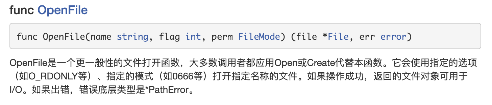

# Golang基础四

## 1. 文件操作

### 1.1 文件的概念

#### 1.1.1 输入、输出流


流：数据在数据源（文件）和程序（内存）之间经历的路径

输入流：数据从数据源（文件）到程序（内存）的路径

输出流：数据从程序（内存）到数据源（文件）的路径

#### 1.1.2 os.File

封装所有文件相关操作，File是一个结构体

### 1.2 打开文件和关闭文件


```go
package main
import (
	"fmt"
	"os"
)
func main()  {
	// 返回file指针
	file, err := os.Open("test.txt")
	if err != nil {
		fmt.Println("open file err:", err)
		return
	}
	// 输出file
	fmt.Printf("file=%v\n", file)
	// 关闭文件
	err = file.Close()
	if err != nil {
		fmt.Println("close file err:", err)

	}
}
```

### 1.3 读文件操作

#### 1.3.1 读取大文件

**os.Open(filename) 只适用于读取文件**

读取文件的内容并显示在终端（**带缓冲区的方式**），适合读取大文件

使用os.Open，file.Close，bufo.NewReader（），reader.ReadString函数和方法

```go
func main() {
	// 返回file指针
	file, err := os.Open("../filedemo/test.txt")
	if err != nil {
		fmt.Println("open file err:", err)
		return
	}

	// 当函数结束时 及时的关闭文件 否则会有内存泄露
	defer func() {
		err = file.Close()
		if err != nil {
			fmt.Println("close file err:", err)
		}
	}()

	// 创建一个 *Reader，是带缓冲的
	/*
		const (
		defaultBufSize = 4096 //默认的缓冲区为4096
		)
	*/
	reader := bufio.NewReader(file)
	// 循环读文件内容
	for {
		str, err := reader.ReadString('\n') // 接收byte 读到换行就结束
		if err == io.EOF { // 表示读到文件末尾
			fmt.Println("err>>>", err)
			break
		}
		// 输出内容 内容有换行符
		fmt.Print(str)
	}
	fmt.Println("文件读取结束")
}
```

#### 1.3.2 读取小文件

读取文件的内容并显示在终端（使用ioutil**一次性将整个文件读入到内存中**），这种方式适用于文件不大的情况。相关方法和函数（ioutil.ReadFile）

```go
func main()  {
	file := "../filedemo/test.txt"
	// 因为没有显示的open文件，所以不需要close文件 因为文件的open和close被封装到ReadFile函数中
	// 返回byte切片
	content, err := ioutil.ReadFile(file)
	if err != nil{
		fmt.Println("read file err", err)
	}
	// []byte
	fmt.Println("content", content)
	fmt.Println(string(content))
}
```

### 1.4 写文件操作

os.OpenFile



操作文件模式 flag


创建写文件对象

bufio.NewWriter


写文件


#### 1.4.1 案例一

```go
func main()  {
	filePath:= "test.txt"
	// 返回文件对象 error
	file, err := os.OpenFile(filePath, os.O_CREATE| os.O_WRONLY, 0666)
	if err != nil {
		fmt.Println("open file err", err)
		return
	}
	// 关闭文件
	defer func() {
		err = file.Close()
		if err != nil {
			fmt.Println("close file err", err)
		}
	}()
	// 写入
	str := "hello world\n"
	// 带缓存写入
	writer := bufio.NewWriter(file)
	for i := 0 ; i < 5 ; i++ {
		writer.WriteString(str)
	}
	//因为writer是带缓存，因此在调用WriterString方法时，其实
	//内容是先写入到缓存的,所以需要调用Flush方法，将缓冲的数据
	//真正写入到文件中， 否则文件中会没有数据!!!
	writer.Flush()
}
```

#### 1.4.2 案例二

覆盖写os.O_TRUNC，打开文件后就清空文件

```go
func main() {
	filePath := "test.txt"
	// 返回文件对象 error
	file, err := os.OpenFile(filePath, os.O_WRONLY| os.O_TRUNC, 0666)
	if err != nil {
		fmt.Println("open file err", err)
		return
	}
	// 关闭文件
	defer func() {
		err = file.Close()
		if err != nil {
			fmt.Println("close file err", err)
		}
	}()
	// 写入
	str := "hello world 你好世界\r\n"
	// 带缓存写入
	writer := bufio.NewWriter(file)
	for i := 0; i < 5; i++ {
		writer.WriteString(str)
	}
	writer.Flush()
}
```

#### 1.4.3 案例三

追加写 os.O_RDWR|os.O_APPEND

```go
func main() {
	filePath := "test.txt"
	// 返回文件对象 error
	file, err := os.OpenFile(filePath, os.O_RDWR|os.O_APPEND, 0666)
	if err != nil {
		fmt.Println("open file err", err)
		return
	}
	// 关闭文件
	defer func() {
		err = file.Close()
		if err != nil {
			fmt.Println("close file err", err)
		}
	}()
	// 写入
	str := "abcd\r\n"
	// 带缓存写入
	writer := bufio.NewWriter(file)
	for i := 0; i < 5; i++ {
		writer.WriteString(str)
	}
	// 写入
	writer.Flush()
}
```

#### 1.4.4 案例四

读写并追加 os.O_RDWR|os.O_APPEND

```go
func main() {
	filePath := "test.txt"
	// 返回文件对象 error
	file, err := os.OpenFile(filePath, os.O_RDWR|os.O_APPEND, 0666)
	if err != nil {
		fmt.Println("open file err", err)
		return
	}
	// 关闭文件
	defer func() {
		err = file.Close()
		if err != nil {
			fmt.Println("close file err", err)
		}
	}()
	// 读取
	reader := bufio.NewReader(file)
	for {
		str, err := reader.ReadString('\n')
		if err == io.EOF { // 读取到文件末尾
			break
		}
		// 显示到终端
		fmt.Print(str)
	}
	// 写入
	str := "追加写...\r\n"
	// 带缓存写入
	writer := bufio.NewWriter(file)
	for i := 0; i < 5; i++ {
		writer.WriteString(str)
	}
	writer.Flush()
}
```

### 1.5 文件操作案例

#### 1.5.1 读写文件

```go
func main()  {
	// 将test.txt文件内容导入到../下
	//1. 首先将test.txt内容读取到内存
	//2. 将读取到的内容写入 ../test.txt.bak
	file1Path := "test.txt"
	file2Path := "../test.txt.bak"
	// 返回byte切片
	data, err := ioutil.ReadFile(file1Path)
	if err != nil {
		fmt.Println("read file err", err)
		return
	}
	err = ioutil.WriteFile(file2Path, data, 0666)
	if err != nil {
		fmt.Println("write file err", err)
	}
}
```

#### 1.5.2 判断文件是否存在

os.Stat


golang判断文件或文件夹是否存在的方法为使用os.Stat（）函数返回的错误值进行判断：

（1）如果返回的错误为nil，说明文件或文件夹存在

（2）如果返回的错误类型使用os.lsNotExist（）判断为true，说明文件或文件夹不存在

（3）如果返回的错误为其它类型，则不确定是否在存在

```go
func main()  {
	filePath := "../test.txt.bak1"
	res, _ := PathExists(filePath)
	if res {
		fmt.Printf("%v file is exits\n", filePath)
	} else {
		fmt.Printf("%v file is not exits\n", filePath)
	}
}

func PathExists(path string) (bool, error) {
	// 返回文件信息
	fileInfo, err := os.Stat(path)
	if err == nil {
		fmt.Println(fileInfo.Name())
		// 文件存在
		return true, nil
	}
	if os.IsNotExist(err) {
		// 文件不存在
		return false, nil
	}
	return false, err
}
```

#### 1.5.3 拷贝图片

io.Copy


```go
package main

import (
	"bufio"
	"fmt"
	"io"
	"os"
)

func closeFile(file *os.File) {
	err := file.Close()
	if err != nil {
		fmt.Println("close file error", err)
	}
}

func copyFile(dst, src string) (written int64, err error) {
	// 只读打开
	srcFile, err := os.Open(src)
	if err != nil {
		fmt.Println("open file error", err)
		return 0, err
	}
  // defer先入后出
	defer closeFile(srcFile)
	// 获取reader
	reader := bufio.NewReader(srcFile)
	dstFile, err := os.OpenFile(dst, os.O_WRONLY|os.O_CREATE, 0666)
	if err != nil {
		fmt.Println("open file error", err)
		return 0, err
	}
	defer closeFile(dstFile)
	// 获取writer
	writer := bufio.NewWriter(dstFile)
	return io.Copy(writer, reader)
}

func main() {
	dstFile := "batman.jpg"
	srcFile := "/Users/yutang/Desktop/u=341846223,272013109&fm=26&gp=0.jpg"
	_, err := copyFile(dstFile, srcFile)
	if err == nil {
		fmt.Println("copy over")
	} else {
		fmt.Println("copy error", err)
	}
}
```

#### 1.5.4 统计该行有多少个 英文、数字、空格和其他字符

```go
package main

import (
	"bufio"
	"fmt"
	"io"
	"os"
)

// 定义一个结构体，用于保存统计结果
type CharCount struct {
	ChCount    int // 记录英文个数
	NumCount   int // 记录数字的个数
	SpaceCount int // 记录空格的个数
	OtherCount int // 记录其它字符的个数
}

func main() {
	// 思路: 打开一个文件, 创一个Reader
	// 每读取一行，就去统计该行有多少个 英文、数字、空格和其他字符
	// 然后将结果保存到一个结构体
	fileName := "charfile.txt"
	file, err := os.Open(fileName)
	if err != nil {
		fmt.Printf("open file(%v) error(%v)\n", file.Name(), err)
		return
	}
	defer func() {
		err = file.Close()
		if err != nil {
			fmt.Printf("close file(%v) error(%v)\n", file.Name(), err)
			return
		}
	}()

	var count CharCount
	// 创建一个reader
	reader := bufio.NewReader(file)
	for {
		str, err := reader.ReadString('\n')
		if err == io.EOF {
			break
		}
		// 遍历str（byte 数组） 进行统计 
    str:= []rune(str)
		for _, v := range str {
			fmt.Println(string(v))
			switch {
				case v >= 'a' && v <= 'z':
					fallthrough // 穿透
				case v >= 'A' && v <= 'Z':
					count.ChCount++
				case v == ' ' || v == '\t' || v == '\n':
					count.SpaceCount++
				case v >= '0' && v <= '9':
					count.NumCount++
				default:
					count.OtherCount++
			}
		}
	}
	//输出统计的结果看看是否正确
	fmt.Printf("字符的个数为=%v 数字的个数为=%v 空格的个数为=%v 其它字符个数=%v\n", 
		count.ChCount, count.NumCount, count.SpaceCount, count.OtherCount)
}
```

### 1.6 文件操作总结

#### 1.6.1 Create

文件不存在创建，文件存在会将文件内容清空

参数：name，打开文件的路径：绝对路径、相对路径

####1.6.2 Open

以只读的方式打开文件。文件不存在则打开失败

参数：name，打开文件的路径：绝对路径、相对路径

#### 1.6.3 OpenFile

以只读、只写、读写方式打开文件。文件不存在则打开失败

参数1：name，打开文件的路径：绝对路径、相对路径

参数2：打开文件权限：O_RDONLY、O_WRONLY、O_REWR

参数3：模式。0表示8进制

#### 1.6.4 按字符串写 WriteString

```go
func main() {
	f, err := os.OpenFile("file.txt", os.O_RDWR, 0666)
	if err != nil {
		fmt.Println("open file err", err)
		return
	}
	defer f.Close()
	n, err := f.WriteString("123") // 3
}
```

####1.6.5 按位置写 Seek

参数1：偏移量。正：向文件尾偏，负：向文件头偏

参数2：偏移起始位置

​			io.SeekStart 文件起始位置

​			io.SeekCurrent 文件的当前位置

​			io.SeekEnd 文件结尾位置

​			返回值：表示**从文件起始位置**，到当前文件读写指针位置的偏移量

#### 1.6.6 按字节写 WriteAt

在文件指定偏移位置，写入[]byte。通常搭配Seek使用

```go
func (f *File) WriteAt(b []byte, off int64) (n int, err error)
```

#### 1.6.7 按行读文件

1.创建一个带有缓冲区的Reader

```go
reader := bufio.NewReader(打开的文件指针)
```

2.读取数据

```go
str, err := reader.ReadString('\n')
if err == io.EOF // 到达文件结尾
```

#### 1.6.8 大文件拷贝

```go
package main

import (
	"bufio"
	"fmt"
	"io"
	"os"
)

func main() {
	fileR, err := os.Open("/Users/yutang/Documents/golang/GoNote/Golang基础一.md")
	if err != err {
		fmt.Println("open read file error", err)
	}
	defer fileR.Close()
	fileW, err := os.OpenFile("test.md", os.O_WRONLY|os.O_CREATE, 0666)
	defer fileW.Close()
 	// 创建读文件对象
	reader := bufio.NewReader(fileR)
	// 创建切片 存放读取数据
	buf := make([]byte, 1024)
	for {
		n, err := reader.Read(buf)
		if err == io.EOF {
			break
		} else if err != nil {
			fmt.Println("read file error", err)
      return
		}
    // 按字节写入
		fileW.Write(buf[:n]) // 注意这里 读多少 写多少
	}
	fmt.Println("write over")
}
```

### 1.7 目录操作

```go
// 1.
f, err:= os.Open(path)
// 2.
f, err := os.OpenFile(path, os.O_RDONLY, os.ModeDir) // 只能以只读方式打开
// 3.
f, err := ioutil.ReadDir(path) // 直接返回FileInfo切片

func (f *File) Readdir(n int) ([]FileInfo, error) 
// 参数：n 表示目录成员的各式。通常传-1，表示读取目录下所有对象
// 返回值：当前目录下的文件（包括目录等）切片

type FileInfo interface {
	Name() string       // base name of the file
	Size() int64        // length in bytes for regular files; system-dependent for others
	Mode() FileMode     // file mode bits
	ModTime() time.Time // modification time
	IsDir() bool        // abbreviation for Mode().IsDir()
	Sys() interface{}   // underlying data source (can return nil)
}
```

目录操作练习：

```go
func main() {
	fmt.Println("请求输入待查询的目录:")
	var path string
	fmt.Scan(&path)
	// 打开目录
	//f, err := ioutil.ReadDir(path)
	f, err := os.Open(path)
	if err != nil {
		fmt.Println("OpenFile error", err)
	}
	defer f.Close()
	// 读目录项
	fileInfo, err := f.Readdir(-1) // -1读取所有文件
	// 遍历返回的切片
	for _, info := range fileInfo {
		if info.IsDir() {
			fmt.Printf("%s 是一个目录\n", info.Name())
		} else {
			fmt.Printf("%s 是一个文件\n", info.Name())
		}
	}
}
```

判断目录文件是否以md结尾，并copy到当前目录下

```go
package main

import (
	"bufio"
	"fmt"
	"io"
	"io/ioutil"
	"os"
	"strings"
)

/**
 * @Description
 * @Author TagYu
 * @Date 2021/6/1 11:17 下午
 **/

func copyMd2Dir(filePath string, dstPath string) {
	fR, err := os.Open(filePath)
	if err != nil {
		fmt.Println("open read file error", err)
	}
	defer fR.Close()
	fW, err := os.OpenFile(dstPath, os.O_WRONLY|os.O_CREATE, 0666)
	if err != nil {
		fmt.Println("open write file error", err)
	}
	defer fW.Close()
	// 创建读对象
	reader := bufio.NewReader(fR)
	buf := make([]byte, 1024)
	writer := bufio.NewWriter(fW)
	for {
		// 按字节读取
		n, err := reader.Read(buf)
		if err == io.EOF {
			break
		} else if err != nil {
			fmt.Println("read file error", err)
			return
		}
		// 读多少写多少 按字节写入
		writer.Write(buf[:n])
	}
	fmt.Printf("%v copy to %v over\n", filePath, dstPath)
}

func main() {
	fmt.Println("请输入目录名:")
	var path string
	fmt.Scan(&path)
	fileList, err := ioutil.ReadDir(path)
	if err != nil {
		fmt.Println("readDir err", err)
	}
	for _, file := range fileList {
		if file.IsDir() {
			continue
		}
		fileName := file.Name()
		if strings.HasSuffix(fileName, ".md") {
			fmt.Println("file is ", fileName)
		}
		filePath := path + "/" + fileName
		dstPath := "./" + fileName
		copyMd2Dir(filePath, dstPath)
	}
}
```

## 2. 命令行参数

### 2.1 基本介绍

os.Args 是一个string的切片，用来存储所有的命令行参数。第一个是文件名。

### 2.2 案例

```go
func main()  {
	fmt.Println("命令行的参数有", len(os.Args))
	// 返回切片
	for i, v := range os.Args {
		fmt.Printf("args[%v]=%v\n", i, v)
	}
}
// ./main
// 命令行的参数有 1
// args[0]=./main
```

### 2.3 flag包解析命令行参数

说明：前面的方式是比较原生的方式，对解析参数不是特别的方便，特别是带有指定参数形式的命令行。

比如：

```shell
main.exe -f /aa.txt -p 200 -u root
```

这样的形式命令行，go设计者给我们提供了flag包，可以方便的解析命令行参数，而且**参数顺序可以随意**


```go
func main() {
	var user string
	var pwd string
	var host string
	var port int
	
	// &user 就是接收用户命令行中输入的 -u 后面的参数值
	// "u" ,就是 -u 指定参数
	// "" , 默认值
	// "用户名,默认为空" 说明
	flag.StringVar(&user, "u", "", "用户名，默认为空")
	flag.StringVar(&pwd, "p", "", "密码,默认为空")
	flag.StringVar(&host, "h", "127.0.0.1", "主机名,默认为localhost")
	flag.IntVar(&port, "P", 3306, "端口号，默认为3306")

	// 这里有一个非常重要的操作,转换， 必须调用该方法
	flag.Parse()
	// 输出结果
	fmt.Printf("user=%v pwd=%v host=%v port=%v\n", 
		user, pwd, host, port)

}
// go run mian.go -u ty -p 123 -P 3306 -h 192.168.0.1
// user=ty pwd=123 host=192.168.0.1 port=3306
```

## 3. json

### 3.1 基本介绍

JSON（JavaScript Object Notation）是一种**轻量级的数据交换格式**。易于人阅读和编写。同时也易于机器解析和生成 **key-val**

JSON是在2001年开始推广使用的数据格式，目前已经成为**主流的数据格式**

JSON**易于机器解析和生成，并有效地提升网络传输效率**，通常程序在网络传输时会先**将数据（结构体、map等）序列化成json字符串**，

到接收方得到json字符串时，**在反序列化恢复成原来的数据类型（结构体、map等）**。这种方式已然成为各个语言的标准


### 3.2 json数据格式说明


### 3.3 json序列化

json序列化是指，将有key-value结构的数据类型（比如**结构体、map、切片**）序列化成json字符串的操作。

#### 3.3.1 结构体序列化

结构体支持反射机制，指定tag标签，可以使得序列化后的key的名字，重新自定义

**注：json序列化时字段名要大写，否则json跨包不能访问该字段，序列化失败**

```go
package main

import (
	"encoding/json"
	"fmt"
)

type Monstor struct {
	Name     string `json:"monster_name"` //反射机制
	Age      int    `json:"monster_age"`
	Birthday string //....
	Sal      float64
	Skill    string
}

// 结构体序列化
func testStruct() {
	monstor := Monstor{
		Name:     "牛魔王",
		Age:      500,
		Birthday: "1000-11-11",
		Sal:      100,
		Skill:    "牛魔拳",
	}
	// 返回byte切片
	data, err := json.Marshal(&monstor)
	if err != nil {
		fmt.Println("序列化错误 err=", err)
	}
	// 序列化的结果
	fmt.Println("序列化的结果>>>", string(data))
	// {"monster_name":"牛魔王","monster_age":500,"Birthday":"1000-11-11","Sal":100,"Skill":"牛魔拳"}
}
```

#### 3.3.2 map序列化

```go
func testMap() {
	// 键是字符串 值是任意类型
	var a map[string]interface{}
	// map 需要make
	a = make(map[string]interface{})
	a["name"] = "红孩儿"
	a["age"] = 8
	a["address"] = "洪崖洞"
	// 返回byte切片a
	data, err := json.Marshal(&a)
	if err != nil {
		fmt.Println("序列化错误 err=", err)
	}
	// 序列化的结果
	fmt.Println("序列化的结果>>>", string(data))
	// {"address":"洪崖洞","age":8,"name":"红孩儿"} map是无序的
}
```

#### 3.3.3 切片序列化

```go
// 演示对切片进行序列化, 我们这个切片 []map[string]interface{}
func testSlice()  {
	var slice[]map[string]interface{}
	var m1 map[string]interface{}
	m1 = make(map[string]interface{})
	m1["name"] = "jack"
	m1["age"] = 7
	m1["address"] = "北京"
	slice = append(slice, m1)

	var m2 map[string]interface{}
	m2 = make(map[string]interface{})
	m2["name"] = "ty"
	m2["age"] = 18
  m2["address"] = [2]string{"墨西哥", "夏威夷"}
	slice = append(slice, m2)
	data, err := json.Marshal(&slice)
	if err != nil {
		fmt.Println("序列化错误 err=", err)
	}
	// 序列化的结果
	fmt.Println("序列化的结果>>>", string(data))
	// [{"address":"北京","age":7,"name":"jack"},{"address":["墨西哥","夏威夷"],"age":18,"name":"ty"}]
}
```

#### 3.3.4 基本类型序列化

```go
// 基本类型序列化 对基本数据类型进行序列化意义不大
func testFloat()  {
	var num1 float64 = 1234.56
	data, err := json.Marshal(num1)
	if err != nil {
		fmt.Println("序列化错误 err=", err)
	}
	// 序列化的结果
	fmt.Println("序列化的结果>>>", string(data)) // 1234.56
}
```

### 3.4 json反序列化

json反序列化是指，将**json字符串**反序列化成**对应的数据类型**（比如结构体、map、切片）的操作

#### 3.4.1 json反序列化成struct

```go
type Monstor struct {
	Name     string `json:"monster_name"` //反射机制
	Age      int    `json:"monster_age"`
	Birthday string
	Sal      float64
	Skill    string
}


// json反序列化成struct
func unmarshalStruct()  {
	str := "{\"monster_name\":\"牛魔王\",\"monster_age\":500,\"Birthday\":\"1000-11-11\"," +
		"\"Sal\":100,\"Skill\":\"牛魔拳\"}"
	var monster Monstor
	err := json.Unmarshal([]byte(str), &monster)
	if err != nil {
		fmt.Println("反序列化失败 error>>>", err)
	}
	fmt.Println("反序列化的结果>>>", monster)
	// {牛魔王 500 1000-11-11 100 牛魔拳}
}
```

#### 3.4.2 json反序列化成map

```go
// json反序列化成map
func unmarshalMap()  {
	str := "{\"address\":\"洪崖洞\",\"age\":8,\"name\":\"红孩儿\"}"
	var a map[string]interface{}
	// 反序列化是不需要make 因为make的操作被封装到unmarshal函数
	err := json.Unmarshal([]byte(str), &a)
	if err != nil {
		fmt.Println("反序列化失败 error>>>", err)
	}
	fmt.Println("反序列化的结果>>>", a)
	//  map[address:洪崖洞 age:8 name:红孩儿]
}
```

#### 3.4.3 json反序列化成slice

```go
// json反序列化成slice
func unmarshalSlice()  {
	str := "[{\"address\":\"北京\",\"age\":7,\"name\":\"jack\"},{\"address\":[\"墨西哥\",\"夏威夷\"]," +
		"\"age\":18,\"name\":\"ty\"}]"
	var slice []map[string]interface{}
	err := json.Unmarshal([]byte(str), &slice)
	if err != nil {
		fmt.Println("反序列化失败 error>>>", err)
	}
	fmt.Println("反序列化的结果>>>", slice)
	// [map[address:北京 age:7 name:jack] map[address:[墨西哥 夏威夷] age:18 name:ty]]
}
```

#### 3.4.4 小结

（1）在反序列化一个json字符串时，要确保**反序列化后的数据类型**和**原来序列化前数据类型保持一致**

（2）json字符串通过程序获得，则不需要对""进行转义

## 4. 单元测试

### 4.1 单元测试作用

去确认一个函数，或者一个模块的结果是否正确

### 4.2 传统的方法

#### 4.2.1 传统的方式进行测试

```go
func addUpper(n int) int {
	res := 0
	for i := 1; i <= n; i++ {
		res += i
	}
	return res
}

func main() {
	res := addUpper(10) // 1.+ 10 = 55
	if res != 55 {
		fmt.Printf("addUpper错误 返回值=%v 期望值=%v\n", res, 55)
	} else {
		fmt.Printf("addUpper正确 返回值=%v 期望值=%v\n", res, 55)
	}
}
```

#### 4.2.2 传统方式缺点

（1）不方便，我们需要在main函数中去调用，这样就需要去修改main函数，如果现在项目正在运行，就可能去停止项目。

（2）不利于管理，因为当我们测试多个函数或者多个模块时，都需要写在main函数，不利于我们管理和清晰我们思路

（3）引出单元测试 ---> testing测试框架可以很好解决问题。

### 4.3 单元测试基本介绍

Go语言中自带有一个轻量级的测试框架testing和自带的go test命令来实现单元测试和性能测试，

testing框架和其他语言中的测试框架类似，可以基于这个框架写针对相应函数的测试用例，也可以基于该框架写相应的压力测试用例。通

过单元测试，可以解决如下问题

（1）确保每个函数是可运行，并且运行结果是正确的

（2）确保写出来的代码性能是好的，

（3）单元测试能及时的发现程序设计或实现的逻辑错误，使问题及早暴露，便于问题的定位解决，而性能测试的重点在于发现程序设计

上的一些问题，让程序能够在高并发的情况下还能保持稳定


### 4.4 快速入门

cal.go

```go
package cal

func addUpper(n int) int {
	res := 0
	for i := 1; i <= n; i++ {
		res += i
	}
	return res
}
```

cal_test.go

```go
package cal

import (
	"testing"
)

// 测试addUpper是否正确
func TestAddUpper(t *testing.T)  {
	// 调用
	res := addUpper(10)
	if res != 55 {
		//fmt.Printf("addUpper(10) 执行错误，期望值=%v 实际值=%v\n", 55, res)
		t.Fatalf("addUpper(10) 执行错误，期望值=%v 实际值=%v\n", 55, res)
	}
	// 正确
	t.Logf("执行正确")
}
```

### 4.5 小结

1）测试用例文件名必须以_test.go结尾。比如cal_test.go，cal不是固定的。

2）测试用例函数必须以Test开头，一般来说就是Test+被测试的函数名，比如TestAddUpper

3） TestAddUppr（t *tesing.T）的形参类型必须是*testing.T【看一下手册】

4）一个测试用例文件中，可以有多个测试用例函数，比如TestAddUpper、 TestSub

5）运行测试用例指令
（1）go test【如果运行正确，无日志，错误时，会输出日志】
（2）**go test -v**【运行正确或是错误，都输出日志】

6）当出现错误时，可以使用t.Fatalf来格式化输出错误信息，并退出程序

7）**t.Logf**方法可以输出相应的日志

8）测试用例函数，并没有放在main函数中，也执行了，这就是测试用例的方便之处

9）PASS表示测试用例运行成功，FAIL表示测试用例运行失败

10）测试单个文件，一定要带上被测试的原文件

```shell
go test -v cal_test.go cal.go
```

11）测试单个方法

```shell
go test -v -test.run TestAddUpper ## 带上测试的函数名TestAddUpper
```

### 4.6 案例

单元测试综合案例要求：

1）编写一个Monster结构体，字段Name，Age，Skill

2）给Monster绑定方法Store，可以将一个Monster变量（对象），序列化后保存到文件中

3）给Monster绑定方法ReStore，可以将一个序列化的Monster，从文件中读取，并反序列化为Monster对象，检查反序列化，名字正确

4）编程测试用例文件store_test.go，编写测试用例函数TestStore和TestRestore进行测试

monstor.go

```go
package main

import (
	"encoding/json"
	"fmt"
	"io/ioutil"
)
var filePath = "monster.ser"
//1）编写一个Monster结构体，字段Name，Age，Skill
type Monster struct {
	Name string
	Age int
	Skill string
}

//2）给Monster绑定方法Store，可以将一个Monster变量（对象），序列化后保存到文件中
func (this *Monster) Store() bool {
	// 先序列化
	data, err := json.Marshal(this)
	if err != nil {
		fmt.Println("序列化失败>>>", err)
		return false
	}
	// 保存到文件中

	err = ioutil.WriteFile(filePath, data, 0666)
	if err != nil {
		fmt.Println("写入文件失败>>>", err)
		return false
	}
	return true
}
//3）给Monster绑定方法ReStore，可以将一个序列化的Monster，从文件中读取，并反序列化为Monster对象，检查反序列化，名字正确
func (this *Monster) ReStore() bool {
	// 先读取文件 得到序列化的字符串
	data, err := ioutil.ReadFile(filePath)
	if err != nil {
		fmt.Println("读取文件失败>>>", err)
		return false
	}
	// 反序列化
	json.Unmarshal(data, this)
	if err != nil {
		fmt.Println("反序列化失败>>>", err)
		return false
	}
	return true
}
```

monster_test.go

```go
package main

import "testing"

// 编程测试用例文件store_test.go，编写测试用例函数TestStore和TestRestore进行测试
func TestStore(t *testing.T)  {
	// 创建monster结构体
	monster := &Monster{
		Name : "红孩儿",
		Age : 10,
		Skill : "吐火",
	}
	res := monster.Store()
	if !res {
		t.Fatalf("monster.Store() 错误，希望为=%v 实际为=%v", true, res)
	}
	t.Logf("monstor Store() 测试成功")
}

func TestReStore(t *testing.T)  {
	var monster = &Monster{}
	res := monster.ReStore()
	if !res {
		t.Fatalf("monster.ReStore() 错误，希望为=%v 实际为=%v", true, res)
	}
	if monster.Name != "红孩儿" {
		t.Fatalf("monster.ReStore() 错误，希望为=%v 实际为=%v", "红孩儿", monster.Name)

	}
	t.Logf("monstor ReStore() 测试成功")
}
```


