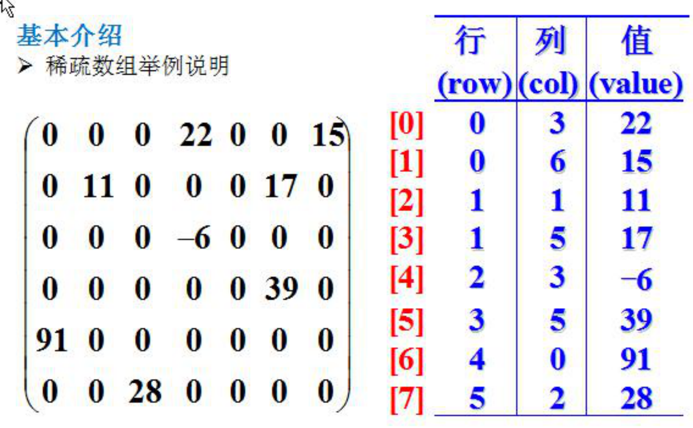
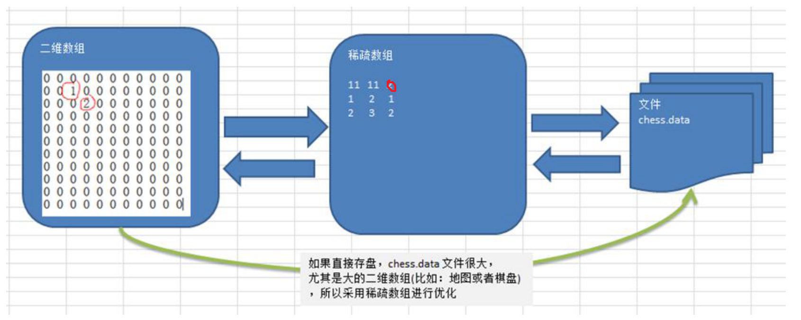
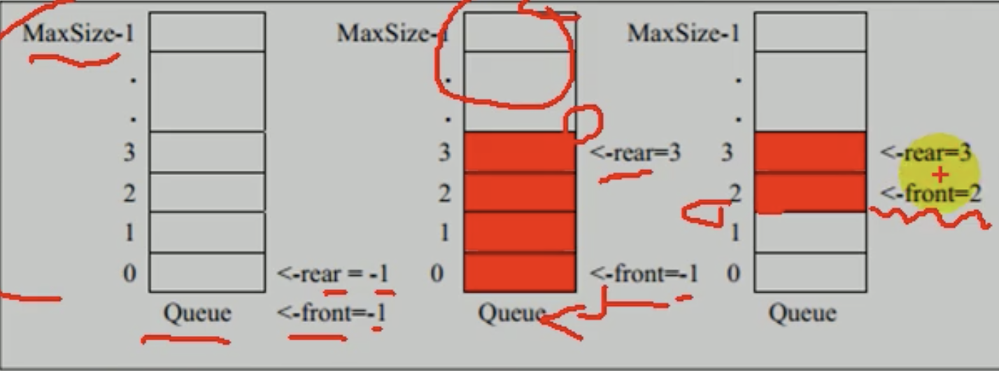
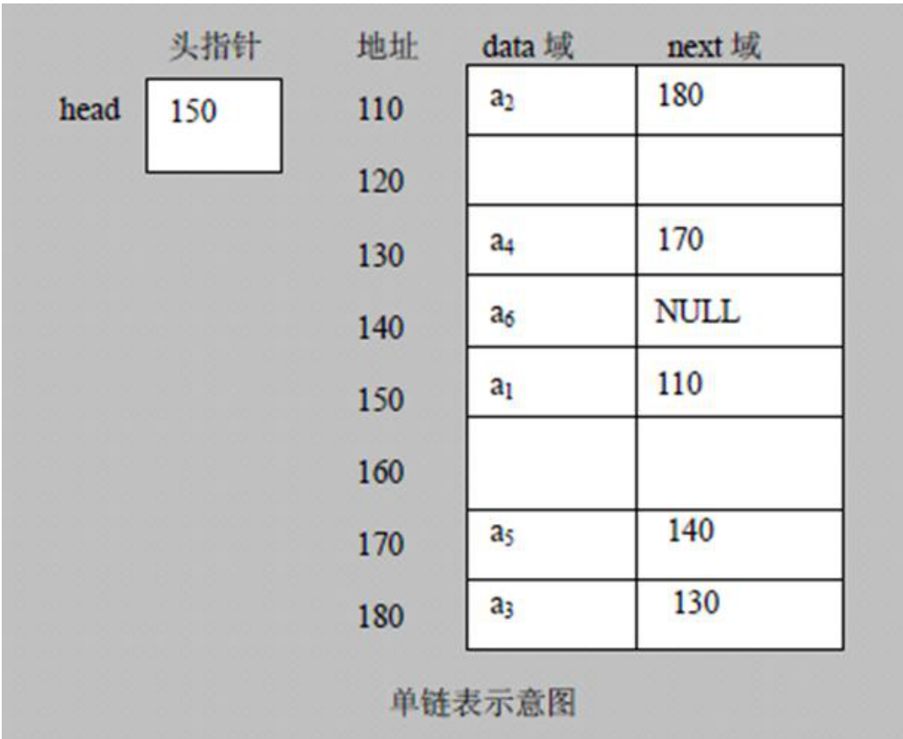
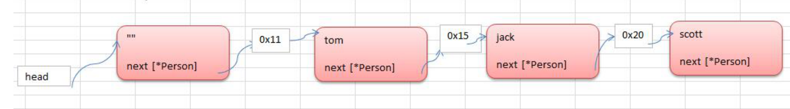
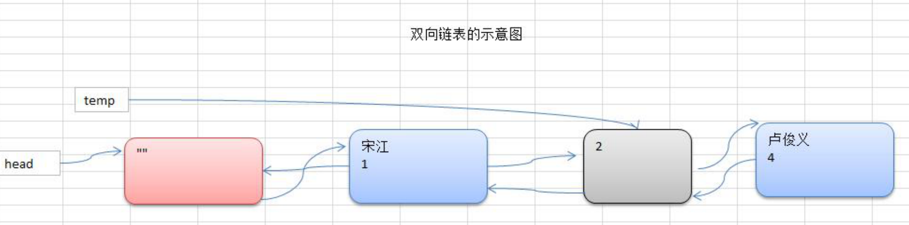

# 数据结构

编译原理

数据结构

数值分析

## 1. 稀疏数组sparsearry

（散列表）

### 1.1 基本介绍

当一个数组中大部分元素为0，或者为统一个值的数组时，可以使用稀疏数组来保存该数组

稀疏数组的处理方法是：
1）记录数组一共有几行几列，有多少个不同的值
2）思想：把具有不同值的元素的行列及值记录在一个小规模的数组中，从而**缩小程序的规模**



### 1.2 应用实例

1）使用稀疏数组，来保留类似前面的二维数组（棋盘、地图等等）

2）把稀疏数组存盘，并且可以从新恢复原来的二维数组数



```go
package main

import "fmt"

type ValNode struct {
	row int
	col int
	val int
}

func main() {
	// 1.先创建个数组
	var chessMap [11][11]int
	chessMap[1][2] = 1 // 黑子
	chessMap[2][3] = 2 // 蓝子

	// 2.输出看看原始的数组
	for _, v := range chessMap {
		//fmt.Println(v)
		for _, v2 := range v {
			fmt.Printf("%v ", v2)
		}
		fmt.Println()
	}

	// 3.转成稀疏数组
	// (1)遍历 chessMap, 如果我们发现有一个元素的值不为0，创建一个node结构体
	// (2)将其放入到对应的切片即可
	var sparseArr []ValNode
	// 标准的一个稀疏数组应该还有一个 记录元素的二维数组的规模(行和列，默认值)
	// 创建一个ValNode 值结点
	valNode := ValNode{
		row: 11,
		col: 11,
		val: 0,
	}
	sparseArr = append(sparseArr, valNode)

	for i, v := range chessMap {
		for j, v2 := range v {
			if v2 != 0 {
				valNode = ValNode{
					row: i,
					col: j,
					val: v2,
				}
				sparseArr = append(sparseArr, valNode)
			}
		}
	}
	// 输出稀疏数组
  // 0: 11 11 0
  // 1: 1 2 1
  // 2: 2 3 2
	fmt.Println("当前的稀疏数组是:::::")
	for i, valNode := range sparseArr {
		fmt.Printf("%d: %d %d %d\n", i, valNode.row, valNode.col, valNode.val)
	}

	// 恢复
	// 1.先创建一个原始数组
	var chessMap2 [11][11]int
	// 2.遍历
	for i, valNode := range sparseArr{
		if i == 0 {
			// 跳过确定二维数组的规格
			continue
		}
		chessMap2[valNode.row][valNode.col] = valNode.val
	}
	fmt.Println("恢复后的原始数据......")
	for _, v := range chessMap2 {
		for _, v2 := range v {
			fmt.Printf("%v ", v2)
		}
		fmt.Println()
	}
}
```

## 2. 队列queue

### 2.1 队列介绍

（1）队列是一个有序列表，可以用**数组或是链表**来实现

（2）遵循**先入先出**的原则。即：先存入队列的数据，要先取出。后存入的要后取出

### 2.2 数组模拟队列

（1）队列本身是有序列表，若使用数组的结构来存储队列的数据，则队列数组的声明如下。其中maxSize是该队列的最大容量。

（2）因为队列的输出、输入是分别从前后端来处理，因此需要两个变量front及rear分别记录队列前后端的下标，front会随着数据输出而改变，而rear则是随着数据输入而改变



###  2.3 非环形队列

当我们将数据存入队列时称为”addqueue"，addqueue的处理需要有两个步骤：

（1）将尾指针往后移：rear+1，当front ==rear表示空队列

（2）若尾指引rear小于等于队列的最大下标MaxSize-1，则将数据存入rear所指的数组元素中，否则无法存入数据。rear == MaxSize-1表示队列已满

```go
package main

import (
	"github.com/pkg/errors"
	"os"
)
import "fmt"

// 使用一个结构体管理队列
type Queue struct {
	maxSize int
	array   [5]int // 数组=>模拟队列
	front   int    // 表示指向队列首
	rear    int    // 表示指向队列的尾部
}

// 添加数据到队列
func (this *Queue) AddQueue(val int) (err error) {
	// 先判断队列是否已满
	if this.rear == this.maxSize-1 { //重要重要的提示; rear 是队列尾部(含最后元素)
		return errors.New("queue full")
	}

	this.rear++ // rear后移
	this.array[this.rear] = val
	return
}

// 从队列中取出数据
func (this *Queue) GetQueue() (val int, err error) {
	// 先判断队列是否为空
	if this.rear == this.front {
		return -1, errors.New("queue empty")
	}
	this.front++
	val = this.array[this.front]
	return val, err
}

// 显示队列 找到首位 遍历到队尾
func (this *Queue) ShowQueue() {
	fmt.Println("队列当前的情况是:")
	// this.front 不包含队首的元素
	for i := this.front + 1; i <= this.rear; i++ {
		fmt.Printf("array[%d]=%d\n", i, this.array[i])
	}
	fmt.Println()
}

func main() {
	// 创建一个队列
	queue := Queue{
		maxSize: 5,
		front:   -1,
		rear:    -1,
	}
	var key string
	var val int
	for {
		fmt.Println("1. 输入add 表示添加数据到队列")
		fmt.Println("2. 输入get 表示从队列获取数据")
		fmt.Println("3. 输入show 表示显示队列")
		fmt.Println("4. 输入exit 表示显示队列")

		fmt.Scanln(&key)
		switch key {
		case "add":
			fmt.Println("输入你要入队列数")
			fmt.Scanln(&val)
			err := queue.AddQueue(val)
			if err != nil {
				fmt.Println(err.Error())
			} else {
				fmt.Println("加入队列ok")
			}
		case "get":
			val, err := queue.GetQueue()
			if err != nil {
				fmt.Println(err.Error())
			} else {
				fmt.Println("从队列中取出了一个数=", val)
			}
		case "show":
			queue.ShowQueue()

		case "exit":
			os.Exit(0)
		}
	}
}
```

### 2.4 环形队列

```go
package main

import "fmt"
import "errors"
import "os"

type CircleQueue struct {
	maxSize int    // 4
	array   [5]int // 数组
	head    int    // 指向队列队首 0
	tail    int    // 指向队尾 0
}

// 入队列
func (this *CircleQueue) Push(val int) (err error) {
	if this.IsFull() {
		return errors.New("queue full")
	}
	// 分析出this.tail 在队列尾部，但是包含最后的元素
	this.array[this.tail] = val
	this.tail = (this.tail + 1) % this.maxSize
	return
}

// 出队列
func (this *CircleQueue) Pop() (val int, err error) {
	if this.IsEmpty() {
		return 0, errors.New("queue empty")
	}
	// 取出,head 是指向队首，并且含队首元素
	val = this.array[this.head]
	this.head = (this.head + 1) % this.maxSize
	return
}

// 显示队列
func (this *CircleQueue) ListQueue() {
	fmt.Println("环形队列情况如下：")
	// 取出当前队列有多少个元素
	// 判断队列是否为空
	size := this.Size()
	if size == 0 {
		fmt.Println("队列为空")
	}
	// 设计一个辅助的变量，指向head
	tempHead := this.head
	for i := 0; i < size; i++ {
		fmt.Printf("arr[%d]=%d\n", tempHead, this.array[tempHead])
		tempHead = (tempHead + 1) % this.maxSize
	}
}

// 判断环形队列是否已满
func (this *CircleQueue) IsFull() bool {
	return (this.tail+1)%this.maxSize == this.head
}

// 判断环形队列是空
func (this *CircleQueue) IsEmpty() bool {
	return this.tail == this.head
}

// 取出环形队列有多少个元素
func (this *CircleQueue) Size() int {
	return (this.tail + this.maxSize - this.head) % this.maxSize
}

func main() {
	// 初始化一个环形队列
	queue := &CircleQueue{
		maxSize: 5,
		head:    0,
		tail:    0,
	}

	var key string
	var val int
	for {
		fmt.Println("1. 输入add 表示添加数据到队列")
		fmt.Println("2. 输入get 表示从队列获取数据")
		fmt.Println("3. 输入show 表示显示队列")
		fmt.Println("4. 输入exit 表示显示队列")

		fmt.Scanln(&key)
		switch key {
		case "add":
			fmt.Println("输入你要入队列数")
			fmt.Scanln(&val)
			err := queue.Push(val)
			if err != nil {
				fmt.Println(err.Error())
			} else {
				fmt.Println("加入队列ok")
			}
		case "get":
			val, err := queue.Pop()
			if err != nil {
				fmt.Println(err.Error())
			} else {
				fmt.Println("从队列中取出了一个数=", val)
			}
		case "show":
			queue.ListQueue()

		case "exit":
			os.Exit(0)
		}
	}
}
```

## 3. 链表

### 3.1 链表介绍

链表是有序的列表



### 3.2 单链表介绍



**节点指向的是一个地址，再由地址指向下一个节点**

指针的是先指向地址，再由地址指向真正的值

### 3.3 单链表应用

**使用链表可以实现自己的内存型的数据库**

```go
 package main

import (
	"fmt"
)

// 定义结构体
type HeroNode struct {
	no       int
	name     string
	nickname string
	next     *HeroNode // 这个表示指向下一个节点
}

// 链表尾部插入
func InsertHeroNode(head *HeroNode, newHeroNode *HeroNode) {
	// 1.先找到该链表的最后这个结点
	// 2.创建一个辅助结点[跑龙套, 帮忙]
	temp := head
	for {
		if temp.next == nil { //表示找到最后
			break
		}
		temp = temp.next // 让temp不断的指向下一个节点
	}
	// 3.将newHeroNode加入到链表的最后
	temp.next = newHeroNode
}

// 给链表插入一个结点
// 编写第2种插入方法，根据no 的编号从小到大插入..【实用】
func InsertHeroNode2(head *HeroNode, newHeroNode *HeroNode) {
	// 1.找到适当的结点
	// 2.创建一个辅助结点[跑龙套, 帮忙]
	temp := head
	flag := true
	// 让插入的结点的no，和temp的下一个结点的比较
	for {
		if temp.next == nil { // 说明到链表的最后
			break
		} else if temp.next.no > newHeroNode.no {
			// 说明newHeroNode 就应该插入到temp后面
			break
		} else if temp.next.no == newHeroNode.no {
			// 说明我们额链表中已经有这个no,就不然插入.
			flag = false
			break
		}
		temp = temp.next
	}
	if !flag {
		fmt.Println("对不起，已经存在no=", newHeroNode.no)
		return
	} else {
		newHeroNode.next = temp.next
		temp.next = newHeroNode
	}
}

// 删除一个节点
func DelHerNode(head *HeroNode, id int) {
	temp := head
	flag := false
	// 找到要删除结点的no，和temp的下一个结点的no比较
	for {
		if temp.next == nil { //说明到链表的最后
			break
		} else if temp.next.no == id {
			// 说明我们找到了.
			flag = true
			break
		}
		temp = temp.next
	}
	if flag { // 找到, 删除

		temp.next = temp.next.next
	} else {
		fmt.Println("sorry, 要删除的id不存在")
	}
}

// 显示链表的所有结点信息
func ListHeroNode(head *HeroNode) {
	// 1.创建辅助节点
	temp := head
	// 判断是否是空链表
	if temp.next == nil {
		fmt.Println("空空如也。。。。")
		return
	}
	// 2.遍历
	for {
		fmt.Printf("[%d, %s, %s]\n", temp.next.no, temp.next.name, temp.next.nickname)
		// 判断是否链表后
		temp = temp.next
		if temp.next == nil {
			break
		}
	}
}

func main() {
	// 1.先创建一个头结点
	head := &HeroNode{}

	// 2.穿甲你一个新的节点
	hero1 := &HeroNode{
		no:       1,
		name:     "宋江",
		nickname: "及时雨",
	}

	hero2 := &HeroNode{
		no:       2,
		name:     "卢俊义",
		nickname: "玉麒麟",
	}
	hero3 := &HeroNode{
		no:       3,
		name:     "林冲",
		nickname: "豹子头",
	}

	// 3.加入
	InsertHeroNode2(head, hero1)
	InsertHeroNode2(head, hero3)
	InsertHeroNode2(head, hero2)
	// 4.显示
	ListHeroNode(head)
	DelHerNode(head, 3)
	ListHeroNode(head)
}
```

### 3.4 双向链表

（1）单向链表，查找的方向只能是一个方向，而**双向链表可以向前或者向后查找**

（2）单向链表不能自我删除，需要靠辅助节点，而双向链表，则可以自我删除，所以前面我们单链表删除时节点，总是找到temp的下一个节点来删除的



```go
package main

import (
	"fmt"
)

// 定义结构体
type HeroNode struct {
	no       int
	name     string
	nickname string
	pre      *HeroNode // 指向前一个节点
	next     *HeroNode // 这个表示指向下一个节点
}

// 链表尾部插入
func InsertHeroNode(head *HeroNode, newHeroNode *HeroNode) {
	// 1.先找到该链表的最后这个结点
	temp := head
	for {
		if temp.next == nil { //表示找到最后
			break
		}
		temp = temp.next // 让temp不断的指向下一个节点
	}
	// 2.将newHeroNode加入到链表的最后
	temp.next = newHeroNode
	newHeroNode.pre = temp
}

// 给链表插入一个结点
// 编写第2种插入方法，根据no 的编号从小到大插入..【实用】
func InsertHeroNode2(head *HeroNode, newHeroNode *HeroNode) {
	// 1.找到适当的结点
	// 2.创建一个辅助结点[跑龙套, 帮忙]
	temp := head
	flag := true
	// 让插入的结点的no，和temp的下一个结点的比较
	for {
		if temp.next == nil { // 说明到链表的最后
			break
		} else if temp.next.no > newHeroNode.no {
			// 说明newHeroNode 就应该插入到temp后面
			break
		} else if temp.next.no == newHeroNode.no {
			// 说明我们额链表中已经有这个no,就不然插入.
			flag = false
			break
		}
		temp = temp.next
	}
	if !flag {
		fmt.Println("对不起，已经存在no=", newHeroNode.no)
		return
	} else {
		newHeroNode.next = temp.next
		newHeroNode.pre = temp
		// 不是最后一个节点
		if temp.next.pre != nil {
			temp.next.pre = newHeroNode
		}
		temp.next = newHeroNode
	}
}

// 删除一个节点
func DelHerNode(head *HeroNode, id int) {
	temp := head
	flag := false
	// 找到要删除结点的no，和temp的下一个结点的no比较
	for {
		if temp.next == nil { //说明到链表的最后
			break
		} else if temp.next.no == id {
			// 说明我们找到了.
			flag = true
			break
		}
		temp = temp.next
	}
	if flag { // 找到, 删除
		temp.next = temp.next.next
		if temp.next != nil {
			temp.next.pre = temp
		}
	} else {
		fmt.Println("sorry, 要删除的id不存在")
	}
}

// 显示链表的所有结点信息
func ListHeroNode(head *HeroNode) {
	// 1.创建辅助节点
	temp := head
	// 判断是否是空链表
	if temp.next == nil {
		fmt.Println("空空如也。。。。")
		return
	}
	// 2.遍历
	for {
		fmt.Printf("[%d, %s, %s]\n", temp.next.no, temp.next.name, temp.next.nickname)
		// 判断是否链表后
		temp = temp.next
		if temp.next == nil {
			break
		}
	}
}

// 逆序显示链表的所有结点信息
func ListHeroNode2(head *HeroNode) {
	// 1.创建辅助节点
	temp := head
	// 判断是否是空链表
	if temp.next == nil {
		fmt.Println("空空如也。。。。")
		return
	}
	// 2.让temp定位到双向链表的最后结点
	for {
		if temp.next == nil {
			break
		}
		temp = temp.next
	}

	// 3.遍历
	for {
		fmt.Printf("[%d, %s, %s]\n", temp.no, temp.name, temp.nickname)
		// 判断是否链表后
		temp = temp.pre
		if temp.pre == nil {
			break
		}
	}
}

func main() {
	// 1.先创建一个头结点
	head := &HeroNode{}

	// 2.穿甲你一个新的节点
	hero1 := &HeroNode{
		no:       1,
		name:     "宋江",
		nickname: "及时雨",
	}

	hero2 := &HeroNode{
		no:       2,
		name:     "卢俊义",
		nickname: "玉麒麟",
	}
	hero3 := &HeroNode{
		no:       3,
		name:     "林冲",
		nickname: "豹子头",
	}

	// 3.加入
	InsertHeroNode(head, hero1)
	InsertHeroNode(head, hero3)
	InsertHeroNode(head, hero2)
	// 4.显示
	ListHeroNode(head)
	ListHeroNode2(head)
	//DelHerNode(head, 3)
	//ListHeroNode(head)
}
```


