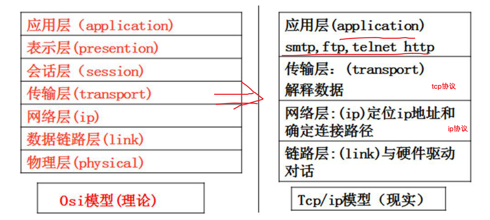
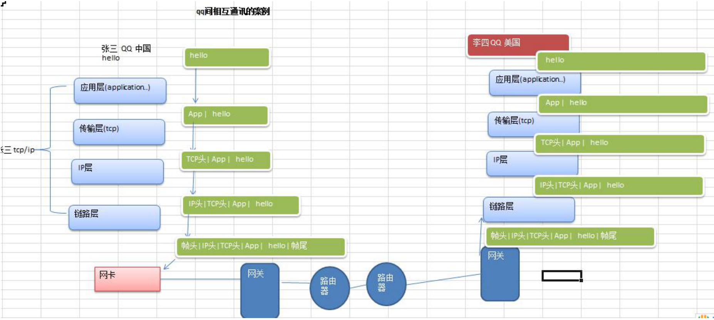
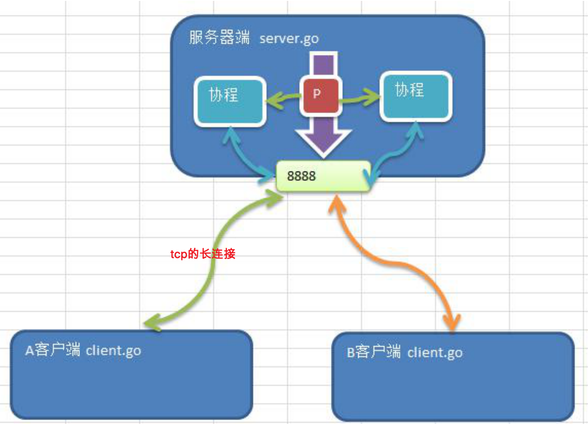
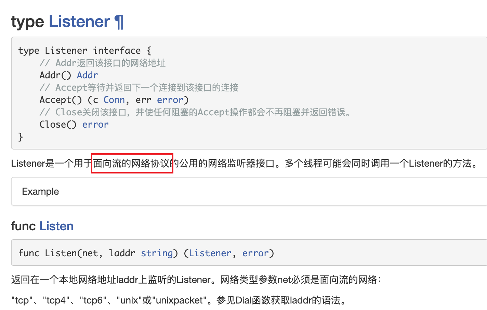
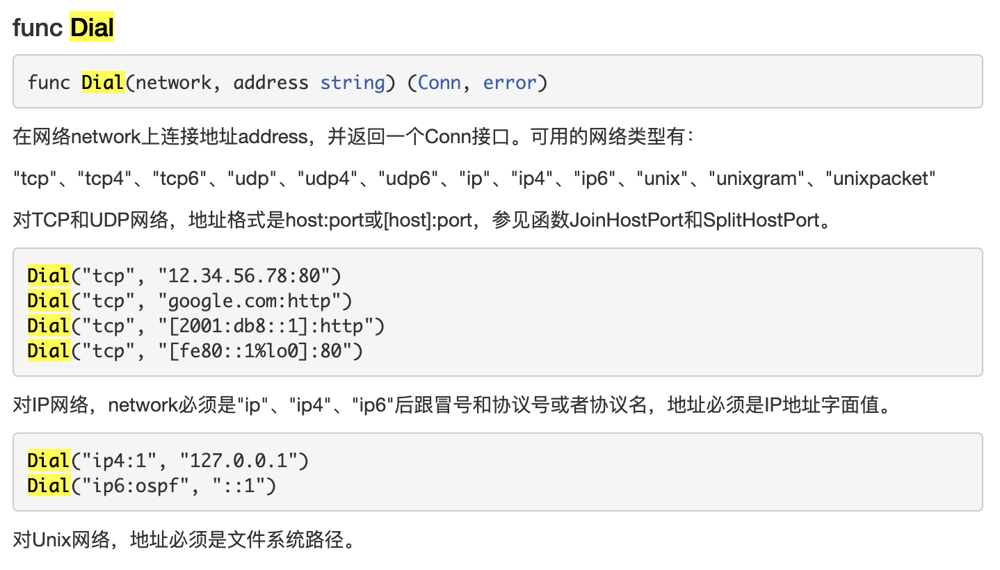
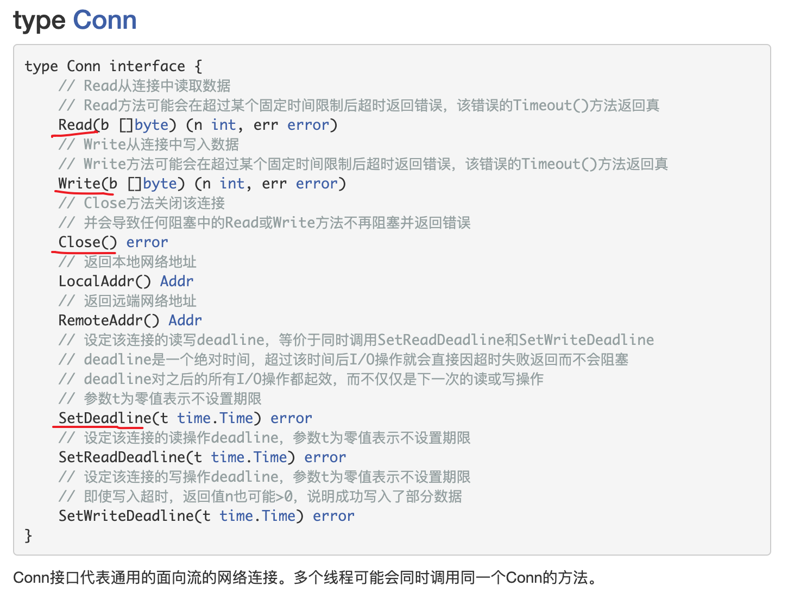
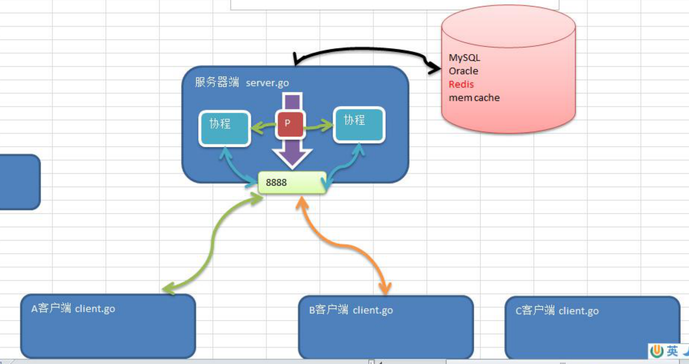
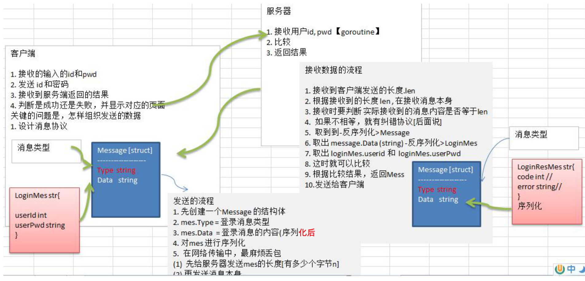
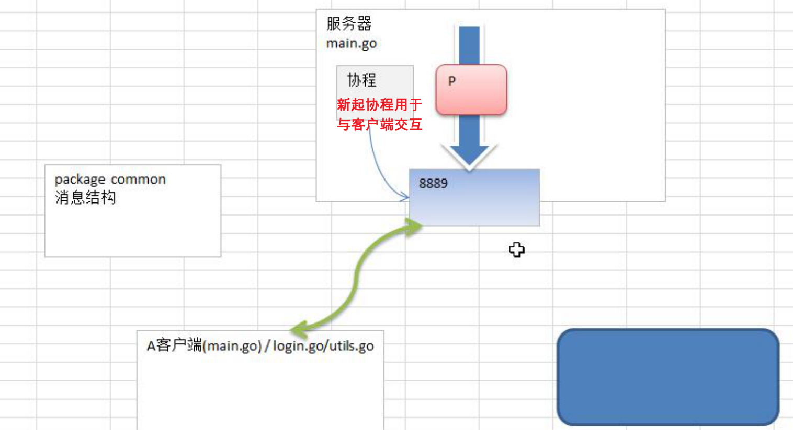

# Golang网络编程

## 1. tcp编程

### 1.1 基本介绍

网络编程有两种：

（1）TCPsocket编程，是网络编程的主流。之所以叫Tcp socket编程，是因为底层是基于Tcp/ip协议的，比如：QQ聊天

（2）b/s结构的http编程，我们使用浏览器去访问服务器时，使用的就是http协议，而http底层依旧是用**tcp socket**实现的。比如：京东商城【这属于go web开发范畴】

**http是建立在tcp基础之上的**

网络编程电子书：资料中的tcp-ip-illustrated

#### 1.1.1 协议（tcp/ip）

**TCP/IP （Transmission Control Protocol/Internet Protocol）**的简写，中文译名为传输控制协议/因特网互联协议，又叫网络通讯协议，这个协议是Internet最基本的协议、Internet国际互联网络的基础，简单地说，就是由网络层的IP协议和传输层的TCP协议组成的。

#### 1.1.2 OSI与Tcp/ip参考模型





#### 1.1.3 端口port

只要是做服务程序，都必须监听一个短口

该端口就是其他程序和该服务通讯的通道

##### 端口（port）分类

（1）0号是保留端口

（2）1-1024是固定端口（程序员不要使用）又叫**有名端口**，即被某些程序固定使用，一般程序员不使用

​	22：SSH远程登录协议

​	23：telnet使用

​	21：ftp使用

​	25：smtp服务使用

​	80：iis使用

​	7：echo服务

（3）1025-65535是动态端口，这些端口，程序员可以使用

##### 使用注意

（1）尽量少开端口

（2）一个端口只能被一个程序监听

（3）查看本机有哪些端口在监听

```shell
netstat -an
```

（4）查看本机是否有端口开启

```shell
lsof -i:port
```

### 1.2 tcp socket编程的客户端和服务器端

#### 1.2.1 入门案例



服务端处理流程

（1）监听端口8888

（2）接收客户端tcp链接，建立客户端和服务端的链接

（3）创建goroutine处理链接请求




客户端处理流程

（1）建立与服务端的链接

（2）发送请求数据，接收服务器返回的结果数据

（3）关闭链接





client.go

```go
package main

import (
	"bufio"
	"fmt"
	"net"
	"os"
	"strings"
)

func main() {
	conn, err := net.Dial("tcp", "127.0.0.1:8888")
	if err != nil {
		fmt.Println("client dial err", err)
	}
	defer conn.Close()
	fmt.Println("client success")
	// os.Stdin表示终端的标准输入
	reader := bufio.NewReader(os.Stdin)
	for {
		// 从终端读取一行用户输入，并准备发送给服务器
		line, err := reader.ReadString('\n')
		if err != nil {
			fmt.Println("readString error", err)
		}
		line = strings.Trim(line, " \r\n")
    // 用户输入exit就退出
		if line == "exit" {
			fmt.Println("客户端退出")
			break
		}
		// 将输入内容发送给服务器
		_, err = conn.Write([]byte(line + "\n"))
		if err != nil {
			fmt.Println("conn.Write err=", err)
		}
	}
}
```

server.go

```go
package main

import (
	"fmt"
	"net"
)

func process(conn net.Conn)  {
	//这里我们循环的接收客户端发送的数据
	defer conn.Close() //关闭conn
	fmt.Printf("服务器在等待客户端%s 发送信息\n", conn.RemoteAddr().String())
	for {
		// 创建一个新的切片
		buf := make([]byte, 1024)
		// 等待客户端通过conn发送信息
		// 如果客户端没有wrtie[发送]，那么协程就阻塞在这里
		n, err := conn.Read(buf)
		if err != nil {
			fmt.Printf("客户端退出 err=%v", err)
			return
		}
		// 显示客户端发送的内容到服务器的终端
		// 将buf转为字符串 并显示实际读到内容
		fmt.Print(string(buf[:n]))
	}
}

func main(){
	fmt.Println("服务器开始监听....")
	// tcp表示使用面向数据流的网络协议 监控本地8888端口
	listen, err := net.Listen("tcp", "0.0.0.0:8888")
	if err != nil{
		fmt.Println("服务器监听失败")
		return
	}
	defer listen.Close()
	// 循环等待客户端连接
	for {
		// Accept返回连接对象
		conn, err := listen.Accept()
		if err != nil {
			fmt.Println("Accept() err=", err)
			return
		} else {
			fmt.Println("Accept() success", conn)
			fmt.Println("客户端的ip:", conn.RemoteAddr().String())
		}
		// 这里起一个协程 为客户端服务
		go process(conn)
	}
	fmt.Printf("listen >>> %v\n", listen)
}
```

## 2. 海量用户及时通讯项目

### 2.1 需求分析

1）用户注册
2）用户登录
3）显示在线用户列表4）群聊（广播）
5）点对点聊天
6）离线留言

### 2.2 技术准备

redis数据库



### 2.3 显示客户端登录菜单

----------------欢迎登陆多人聊天系统------------
                 		1 登陆聊天室
                 		2 注册用户
                		 3 退出系统
                 		请选择(1-3):

### 2.4 实现用户登录

要求：完成指定用户的验证，用户id=100，密码pwd=123456可以登录，其他用户不能登录



2.4.1 **完成客户端可以发送消息长度**，服务器可以正常收到该长度值

（1）先确定消息Message的格式和结构



2.4.2 完成客户端可以发送消息本身，服务器端可以正常接收到消息，并根据客户端发送的消息（LoginMes），判断用户的合法性，并返回相应的LoginResMes
思路分析：
（1）让客户端发送消息本身
（2）服务器端接受到消息，然后反序列化成对应的消息结构体
（3）服务器端根据反序列化成对应的消息，判断是否登录用户是合法，返回LoginResMes
（4）客户端解析返回的LoginResMes，显示对应界面
（5）这里我们需要做函数的封装


